---
## Front matter
title: "Отчет по лабораторной работе №1"
subtitle: "Дисциплина: Операционные системы"
author: "Иванов Сергей Владимирович"

## Generic otions
lang: ru-RU
toc-title: "Содержание"

## Bibliography
bibliography: bib/cite.bib
csl: pandoc/csl/gost-r-7-0-5-2008-numeric.csl

## Pdf output format
toc: true # Table of contents
toc-depth: 2
lof: true # List of figures
fontsize: 12pt
linestretch: 1.5
papersize: a4
documentclass: scrreprt
## I18n polyglossia
polyglossia-lang:
  name: russian
  options:
	- spelling=modern
	- babelshorthands=true
polyglossia-otherlangs:
  name: english
## I18n babel
babel-lang: russian
babel-otherlangs: english
## Fonts
mainfont: PT Serif
romanfont: PT Serif
sansfont: PT Sans
monofont: PT Mono
mainfontoptions: Ligatures=TeX
romanfontoptions: Ligatures=TeX
sansfontoptions: Ligatures=TeX,Scale=MatchLowercase
monofontoptions: Scale=MatchLowercase,Scale=0.9
## Biblatex
biblatex: true
biblio-style: "gost-numeric"
biblatexoptions:
  - parentracker=true
  - backend=biber
  - hyperref=auto
  - language=auto
  - autolang=other*
  - citestyle=gost-numeric
## Pandoc-crossref LaTeX customization
figureTitle: "Рис."
listingTitle: "Листинг"
lofTitle: "Список иллюстраций"
lolTitle: "Листинги"
## Misc options
indent: true
header-includes:
  - \usepackage{indentfirst}
  - \usepackage{float} # keep figures where there are in the text
  - \floatplacement{figure}{H} # keep figures where there are in the text
---

# Цель работы

Целью данной работы является приобретение практических навыков установки операционной системы на виртуальную машину, настройки минимально необходимых для дальнейшей работы сервисов.

# Выполнение лабораторной работы

Для начала нам нужно скачать дистрибутив Linux Fedora-Sway 39 воспользовавшись сайтом: https://fedoraproject.org/spins/sway/download/index.html (рис. 1).

{#fig:001 width=70%}

Далее создадим виртуальную машину. Укажем имя машины согласно соглашению о именовании и подключим наш скачанный образ Linux Sway. (рис. 2).

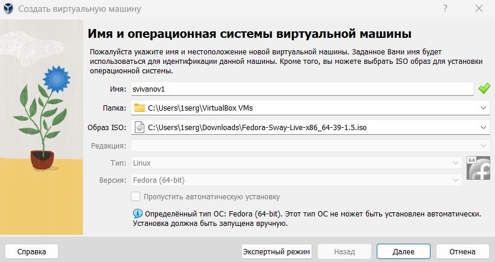{#fig:002 width=70%}

Далее нужно указать объём памяти и количество виртуальных процессоров. Я указал 4096 мб оперативной памяти и 2 ЦП. (рис. 3).

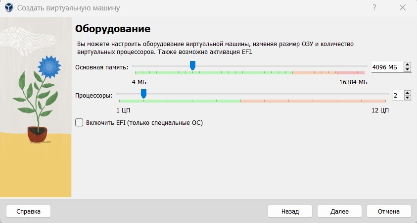{#fig:003 width=70%}

В конце указываем объем памяти виртуального жесткого диска и указываем 80 гб. (рис. 4).

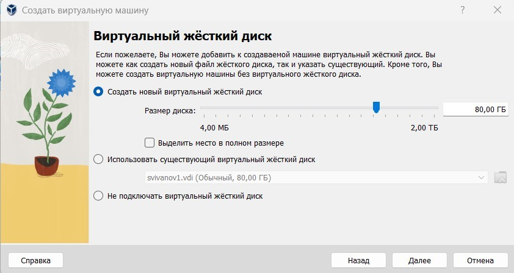{#fig:004 width=70%}

После выставления всех параметров запускаем виртуальную машину. (рис. 5). 

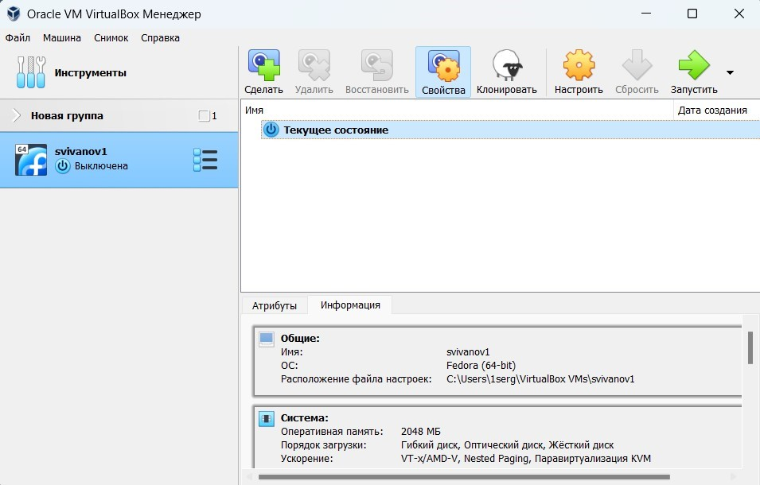{#fig:005 width=70%}

На этом этапе выбираем диск для установки операционной системы, создаем учетную запись и начинаем установку. (рис. 6). 

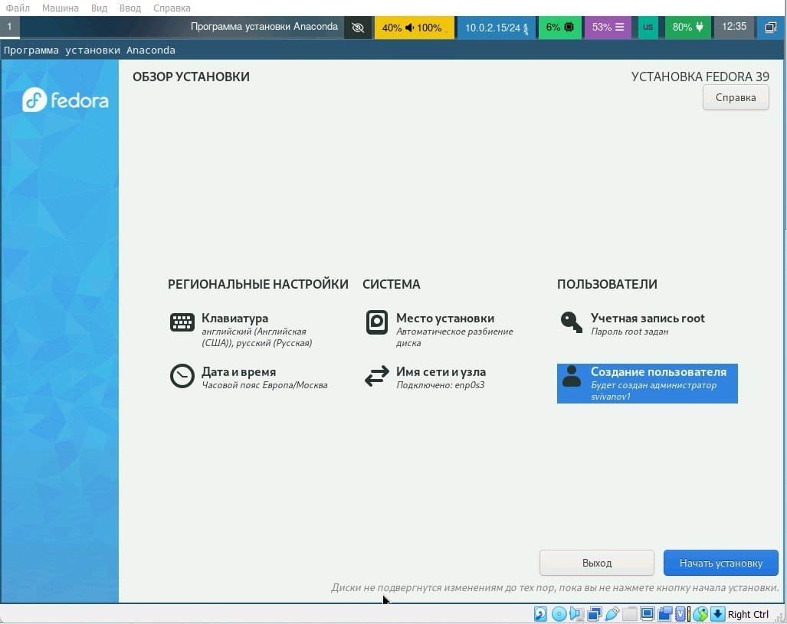{#fig:006 width=70%}

Дожидаемся загрузки, перезагружаем виртуальную машину, вводим пароль и оказываемся на рабочем столе нашей системы. (рис. 7). 

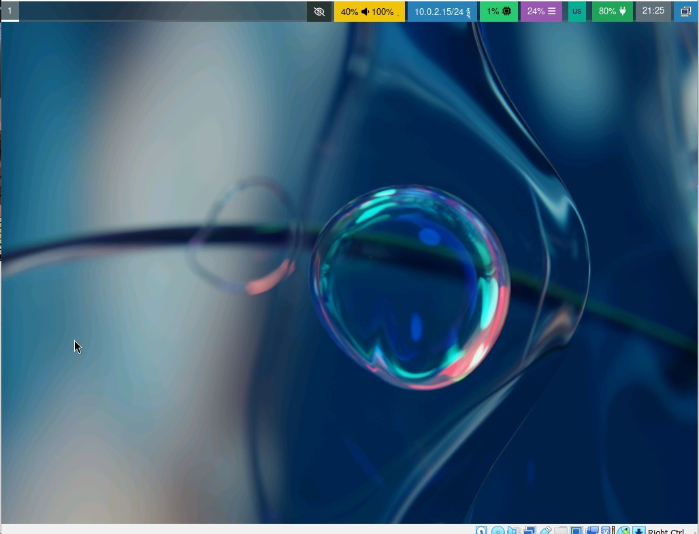{#fig:007 width=70%}

Далее нам необходимо запустить терминал комбинацией Win+Enter, переключимся на роль супер-пользователя и обновим все пакеты командой ‘dnf –y update’ (рис. 8).

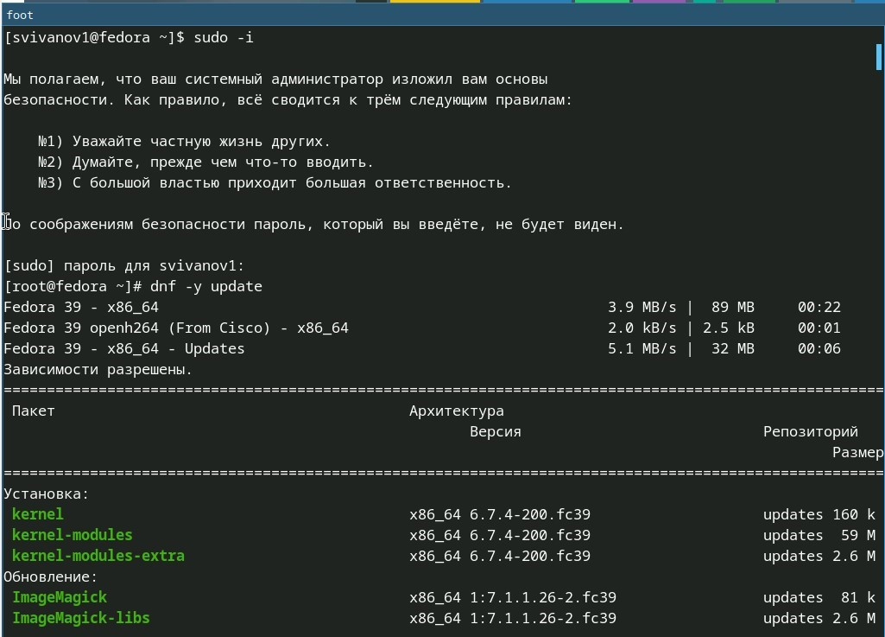{#fig:008 width=70%}

Установим программы для удобства работы в консоли командой ‘dnf install tmux mc’ (рис. 9).

{#fig:009 width=70%}

Используем автоматическое обновление. Для этого необходимо установить программное обеспечение воспользовавшись командой ‘dnf install dnf-automatic’ (рис. 10).

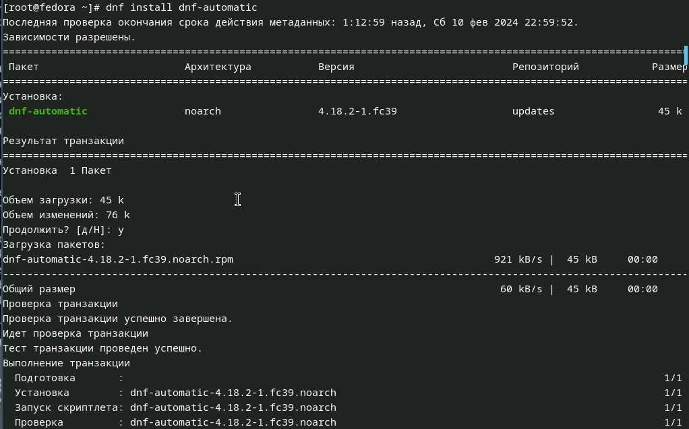{#fig:010 width=70%}

И запустим таймер командой ‘systemctl enable --now dnf-automatic.timer’ (рис. 11). 

{#fig:011 width=70%}

Далее нам необходимо отключить SELinux. В файле /etc/selinux/config заменим значение SELINUX=enforcing на значение SELINUX=permissive.(рис. 12). 

{#fig:012 width=70%}

Перезагружаем виртуальную машину. Установим драйвера для VirtualBox.  Войдём в ОС под заданной нами при установке учётной записи. Нажмем комбинацию Win+Enter для запуска терминала. Запустим терминальный мультиплексор tmux, переключимся на роль супер-пользователя. Установим средства разработки ‘dnf -y group install "Development Tools"’ (рис. 13). 

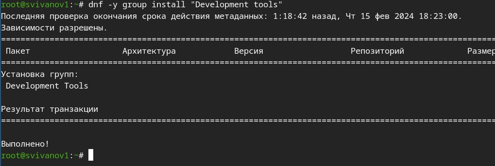{#fig:013 width=70%}

И установим пакет DKMS используя команду ‘dnf -y install dkms’ (рис. 14). 

{#fig:014 width=70%}

В меню виртуальной машины подключим образ диска дополнений гостевой ОС.(рис. 15). 

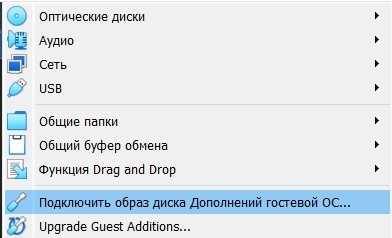{#fig:015 width=70%}

Подмонтируем диск командой ‘mount /dev/sr0 /media’(рис. 16).

{#fig:016 width=70%}

После чего установим драйвера ‘/media/VBoxLinuxAdditions.run’(рис. 17).

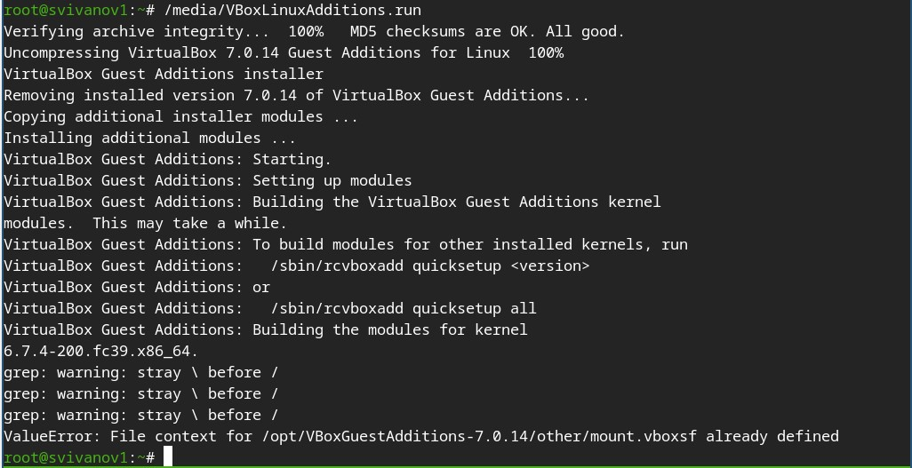{#fig:017 width=70%}

Настроим раскладку клавиатуры. Запустим терминальный мультиплексор tmux, переключимся на роль супер-пользователя. Создадим конфигурационный файл ~/.config/sway/config.d/95-system-keyboard-config.conf. Отредактируем его. (рис. 18).

{#fig:018 width=70%}

Отредактируем конфигурационный файл /etc/X11/xorg.conf.d/00-keyboard.conf (рис. 19).

{#fig:019 width=70%}

Необходимо установить имя хоста ‘hostnamectl set-hostname username’. Проверим что имя хоста установлено верно, после чего перезагрузим систему. (рис. 20).

{#fig:020 width=70%}

Подключим общую папку. (рис. 21).

{#fig:021 width=70%}

Установим программное обеспечение для создания документации. Нажмем комбинацию Win+Enter для запуска терминала. Запустим терминальный мультиплексор tmux, установим pandoc с помощью менеджера пакетов ‘dnf -y install pandoc’ (рис. 22).

{#fig:022 width=70%}

Установим pandoc-crossref. Скачаем необходимую версию pandoc-crossref (https://github.com/lierdakil/pandoc-crossref/releases). Распакуем архив и поместим их в каталог /usr/local/bin. (рис. 23).

{#fig:023 width=70%}

Установим дистрибутив TeXlive ‘dnf -y install texlive-scheme-full’(рис. 24).

{#fig:024 width=70%}

**Домашнее задание**

1) Версия ядра Linux (Linux version).
Чтобы посмотреть версию ядра, можно воспользоваться командой dmesg | grep -i ‘linux version’. (Рис. 25)
Версия ядра: 6.7.4-200. (рис. 25).

{#fig:025 width=70%}

2) Частота процессора (Detected Mhz processor).
Частоту процессора можно узнать командой dmesg | grep -I “MHz”.
Частота процессора: 2688.004 MHz. (рис. 26).

{#fig:026 width=70%}

3) Модель процессора (CPU0).
Модель процессора можно посмотреть командой cat /proc/cpuinfo | grep “model name”. (рис. 27).

{#fig:027 width=70%}

4) Объем доступной оперативной памяти (Memory available).
Объём доступной оперативной памяти можно посмотреть командой free -m.
В моём случае: 
Всего – 3894 Мб.
Используется – 779 Мб.
Свободно – 3115 Мб. (рис. 28).

{#fig:028 width=70%}

5) Тип обнаруженного гипервизора (Hypervisor detected).
Тип обнаруженного гипервизора можно посмотреть командой dmesg | grep -I “hypervisor detected”.
В моём случае: KVM. (рис. 29).

{#fig:029 width=70%}

6) Тип файловой системы корневого раздела.
Тип файловой системы корневого раздела можно посмотреть командой findmnt.
Тип файловой системы корневого раздела: ext4. (рис. 30).

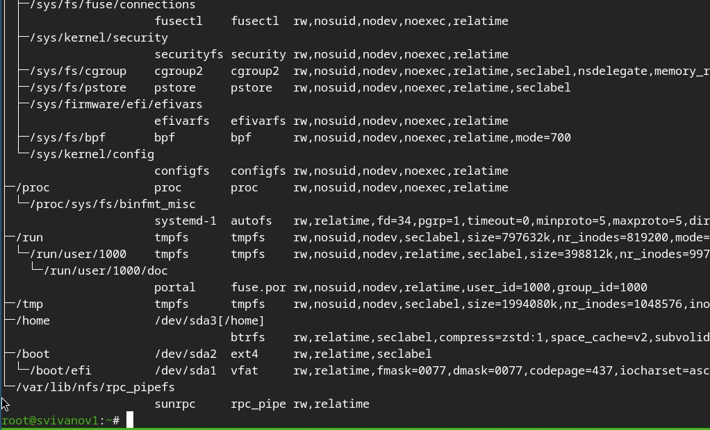{#fig:030 width=70%}

7) Последовательность монтирования файловых систем.
Последовательность монтирования файловых систем можно посмотреть командой dmesg | grep -i “mount”.(рис. 31).

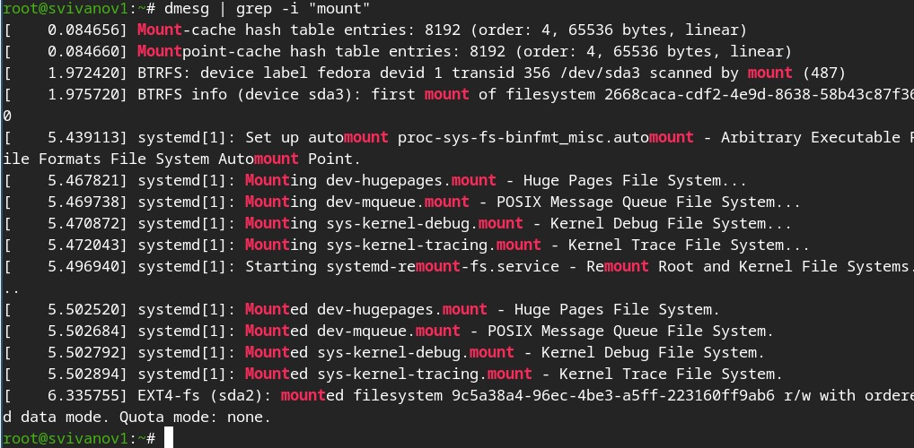{#fig:031 width=70%}

# Контрольные вопросы

1.	**Какую информацию содержит учётная запись пользователя?** 

Учетная запись пользователя содержит системное имя, идентификатор пользователя, идентификатор группы, полное имя, домашний каталог и начальную оболочку.

2. **Укажите команды терминала и приведите примеры:**

- Для получения справки по команде ‘man <команда>’, например, (man ls)
- Для перемещения по файловой системе ‘cd <каталог>’, например, (cd / - перемещение в корневой каталог)
- Для просмотра содержимого каталога ‘ls <каталог>’, пример, (ls / - содержимое корневого каталога)
- Для определения объёма каталога ‘du -s <каталог>’, пример, (du -s /etc)
- Для создания или удаления каталогов и файлов ‘rm <ключ> <название файла/каталога>’
Пустые каталоги можно удалять командой rmdir (если добавить ключ -s, то можно удалять и не только пустые).
- Для задания определённых прав на файл / каталог ‘chmod <xxx> <имя>’, например, (chmod 777 lab8-1.txt)
- Для просмотра истории команд. ‘history’

3. **Что такое файловая система? Приведите примеры с краткой характеристикой.**

Файловая система – это порядок, определяющий способ организации, хранения и именования данных на носителях информации. Например: ext4. Характеристика: ext4 это файловая система для операционных систем Linux, поддерживающая файлы до 16 терабайт и файловые системы до 1 экзабайта. Обладает улучшенной производительностью, надежностью, поддержкой расширенных атрибутов и обратной совместимостью с Ext2 и Ext3. Обеспечивает быстрые операции чтения и записи данных.

4. **Как посмотреть, какие файловые системы подмонтированы в ОС?**

Команда mount.

5. **Как удалить зависший процесс?**

Чтобы удалить зависший процесс, можно использовать команду Kill <PID>. Pid можно получить командой ps axu | grep “то, что мы ищем”. (kill 5099).

# Вывод

В ходе работы были приобретены практические навыки установки виртуальной машины и операционной системы на виртуальную машину, а также настройки минимально необходимых для дальнейшей работы сервисов.

