---
## Front matter
lang: ru-RU
title: Лабораторная работа № 2
subtitle: Операционные системы
author:
  - Иванов Сергей Владимирович, НПИбд-01-23
institute:
  - Российский университет дружбы народов, Москва, Россия
date: 17 февраля 2024

## i18n babel
babel-lang: russian
babel-otherlangs: english

## Formatting pdf
toc: false
slide_level: 2
aspectratio: 169
section-titles: true
theme: metropolis
header-includes:
 - \metroset{progressbar=frametitle,sectionpage=progressbar,numbering=fraction}
 - '\makeatletter'
 - '\beamer@ignorenonframefalse'
 - '\makeatother'

  ## Fonts
mainfont: PT Serif
romanfont: PT Serif
sansfont: PT Sans
monofont: PT Mono
mainfontoptions: Ligatures=TeX
romanfontoptions: Ligatures=TeX
sansfontoptions: Ligatures=TeX,Scale=MatchLowercase
monofontoptions: Scale=MatchLowercase,Scale=0.9
---

## Цель работы

1. Изучить идеологию и применение средств контроля версий.
2. Освоить умения по работе с git.

## Задание

1. Создать базовую конфигурацию для работы с git.
2. Создать ключ SSH.
3. Создать ключ PGP.
4. Настроить подписи git.
5. Зарегистрироваться на Github.
6. Создать локальный каталог для выполнения заданий по предмету.

# Выполнение работы

## Установка git

- dnf install git 

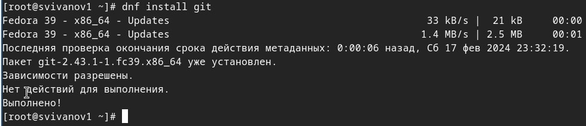{#fig:001 width=70%}

## Установка gh

- dnf install gh

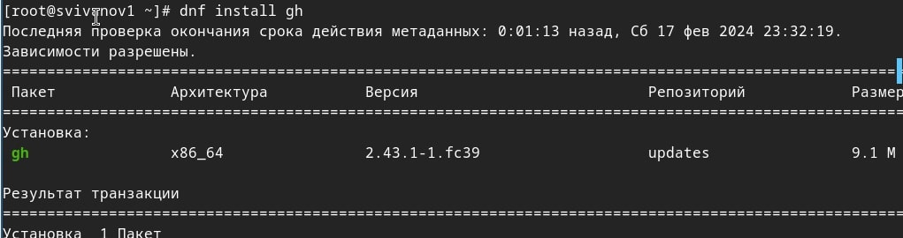{#fig:002 width=70%}

## Базовая настройка git

Зададим имя и email владельца репозитория, настроим utf-8 в выводе сообщений git, зададим имя начальной ветки, укажем параметр autocrlf, параметр safecrlf

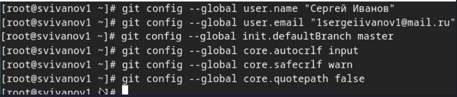{#fig:003 width=70%}

## Ключ ssh

Создадим ключ ssh по алгоритму rsa с ключём размером 4096 бит 'ssh-keygen -t rsa -b 4096'

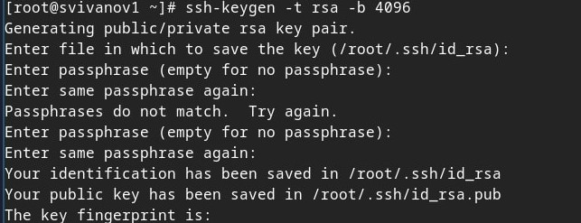{#fig:004 width=70%}

## Ключ ssh

Создадим ключ ssh по алгоритму ed25519 'ssh-keygen -t ed25519'

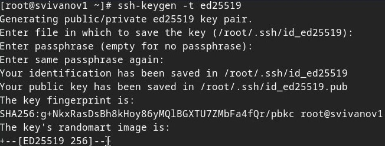{#fig:005 width=70%}

## Создадим ключ pgp

'gpg --full-generate-key', выбираем тип RSA and RSA, размер 4096, срок действия - не истекает никогда.

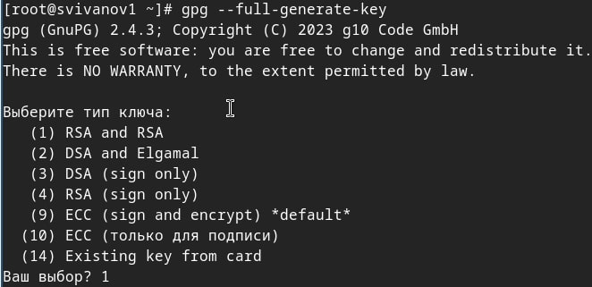{#fig:006 width=70%}

## Копирование ключа

Выводим список ключей и копируем отпечаток приватного ключа 'gpg --list-secret-keys --keyid-format LONG', скопируем наш сгенерированный PGP ключ в буфер обмена

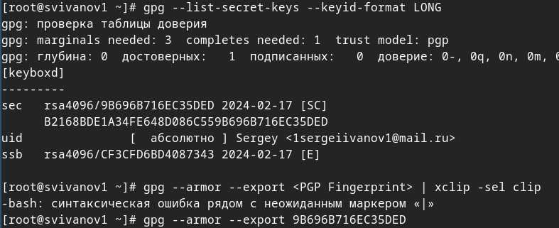{#fig:007 width=70%}

## Добавляем ключ на GitHub

Перейдём в настройки GitHub (https://github.com/settings/keys), нажмем на кнопку New GPG key и вставим полученный ключ в поле ввода

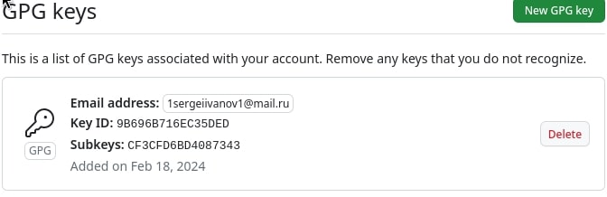{#fig:008 width=70%}

## Настройка автоматической подписи коммитов

Используя введёный email, укажем Git применять его при подписи коммитов:

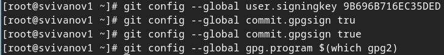{#fig:009 width=70%}

## Авторизация gh

Авторизуемся для настройки gh через браузер

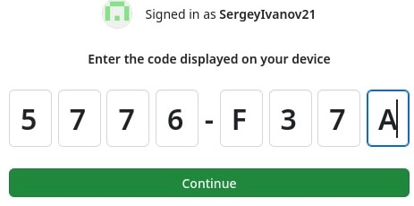{#fig:010 width=70%}

## Создание репозитория курса

Создадим репозиторий курса на основе шаблона и рабочее пространство

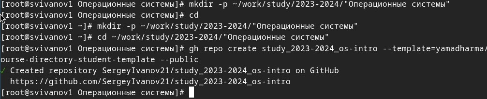{#fig:011 width=70%}

## Клонирование репозитория

Клонируем репозиторий в рабочее пространство

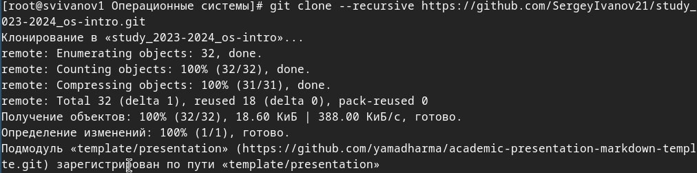{#fig:012 width=70%}

## Удаление лишнего файла

Перейдем в каталог курса и удалим лишние файлы

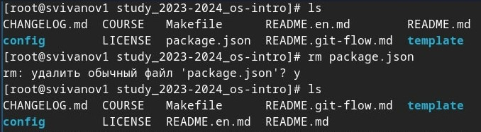{#fig:013 width=70%}

## Создадим необходимые каталоги

- echo os-intro > COURSE

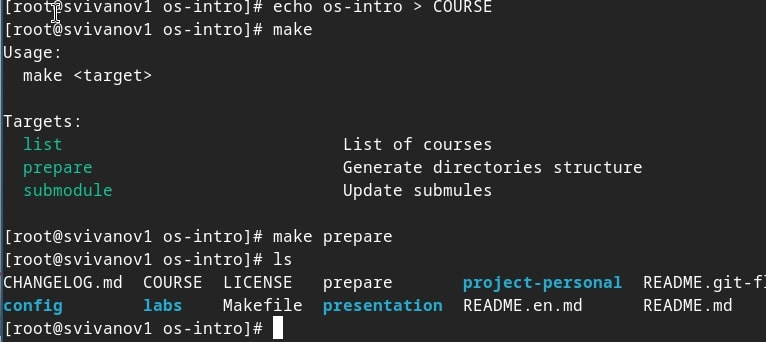{#fig:014 width=70%}

## Отправление файлов на сервер

- git add

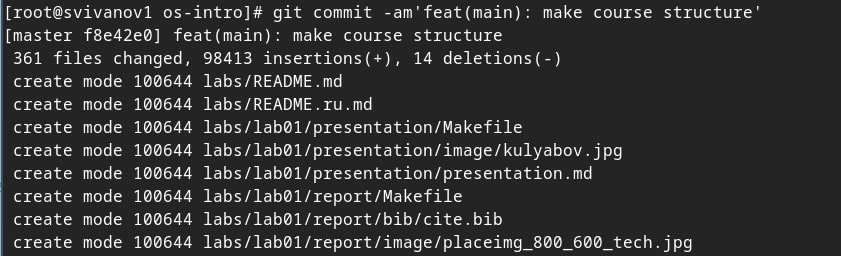{#fig:015 width=70%}

## Отправление файлов на сервер

Добавляем комментарий и отправляем файлы

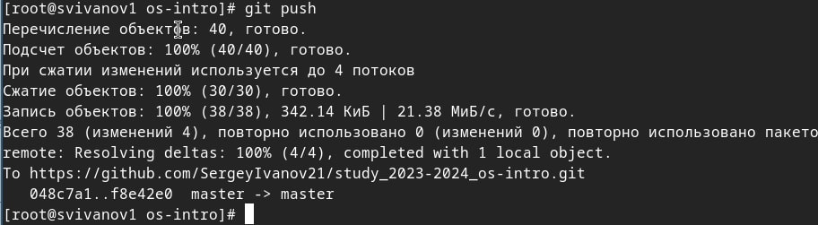{#fig:016 width=70%}

# Вывод

## Вывод 

В результате выполнения лабораторной работы мы изучили идеологию и применение средств контроля версий а также освоили умения по работе с git.

## Список литературы

:::{#refs}

https://esystem.rudn.ru/mod/page/view.php?id=1098933

:::

