---
## Front matter
title: "Отчет по лабораторной работе №2"
subtitle: "Дисциплина: Операционные системы"
author: "Иванов Сергей Владимирович"

## Generic otions
lang: ru-RU
toc-title: "Содержание"

## Bibliography
bibliography: bib/cite.bib
csl: pandoc/csl/gost-r-7-0-5-2008-numeric.csl

## Pdf output format
toc: true # Table of contents
toc-depth: 2
lof: true # List of figures
fontsize: 12pt
linestretch: 1.5
papersize: a4
documentclass: scrreprt
## I18n polyglossia
polyglossia-lang:
  name: russian
  options:
	- spelling=modern
	- babelshorthands=true
polyglossia-otherlangs:
  name: english
## I18n babel
babel-lang: russian
babel-otherlangs: english
## Fonts
mainfont: PT Serif
romanfont: PT Serif
sansfont: PT Sans
monofont: PT Mono
mainfontoptions: Ligatures=TeX
romanfontoptions: Ligatures=TeX
sansfontoptions: Ligatures=TeX,Scale=MatchLowercase
monofontoptions: Scale=MatchLowercase,Scale=0.9
## Biblatex
biblatex: true
biblio-style: "gost-numeric"
biblatexoptions:
  - parentracker=true
  - backend=biber
  - hyperref=auto
  - language=auto
  - autolang=other*
  - citestyle=gost-numeric
## Pandoc-crossref LaTeX customization
figureTitle: "Рис."
listingTitle: "Листинг"
lofTitle: "Список иллюстраций"
lolTitle: "Листинги"
## Misc options
indent: true
header-includes:
  - \usepackage{indentfirst}
  - \usepackage{float} # keep figures where there are in the text
  - \floatplacement{figure}{H} # keep figures where there are in the text
---

# Цель работы

1. Изучить идеологию и применение средств контроля версий.
2. Освоить умения по работе с git.

# Задание

1. Создать базовую конфигурацию для работы с git.
2. Создать ключ SSH.
3. Создать ключ PGP.
4. Настроить подписи git.
5. Зарегистрироваться на Github.
6. Создать локальный каталог для выполнения заданий по предмету.

# Выполнение лабораторной работы

Установим git 'dnf install git'(рис. 1).

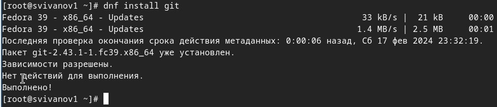{#fig:001 width=70%}

Установим gh 'dnf install gh' (рис. 2).

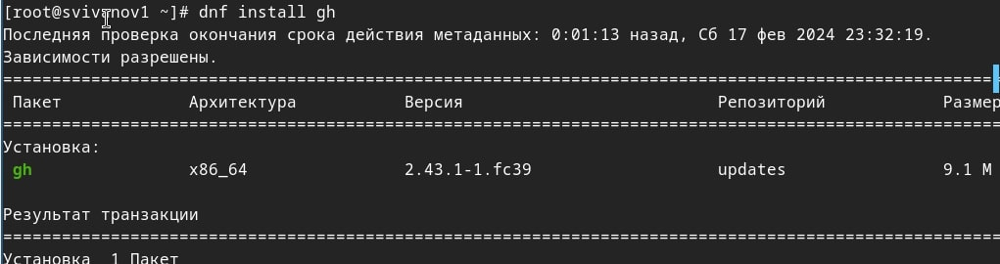{#fig:002 width=70%}

Проведем базовую настройку git. Зададим имя и email владельца репозитория, настроим utf-8 в выводе сообщений git, зададим имя начальной ветки, укажем параметр autocrlf, параметр safecrlf (рис. 3).

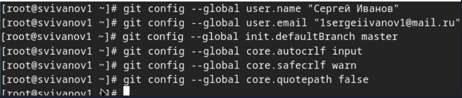{#fig:003 width=70%}

Создадим ключ ssh по алгоритму rsa с ключём размером 4096 бит 'ssh-keygen -t rsa -b 4096' (рис. 4).

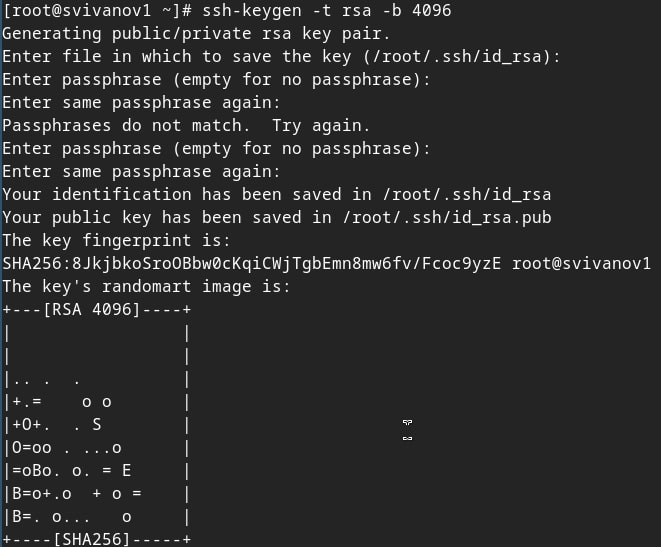{#fig:004 width=70%}

Создадим ключ ssh по алгоритму ed25519 'ssh-keygen -t ed25519' (рис. 5). 

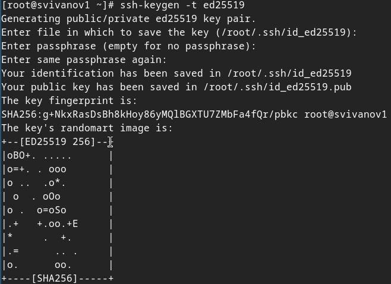{#fig:005 width=70%}

Создадим ключ pgp 'gpg --full-generate-key', выбираем тип RSA and RSA, размер 4096, срок действия - не истекает никогда. (рис. 6). 

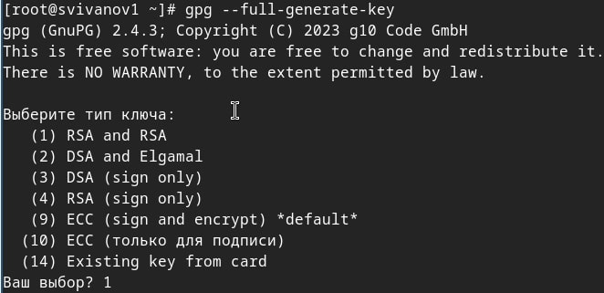{#fig:006 width=70%}

Пропускаем этап создания учетной записи GitHub, так как она уже создана

Выводим список ключей и копируем отпечаток приватного ключа 'gpg --list-secret-keys --keyid-format LONG', скопируем наш сгенерированный PGP ключ в буфер обмена (рис. 7). 

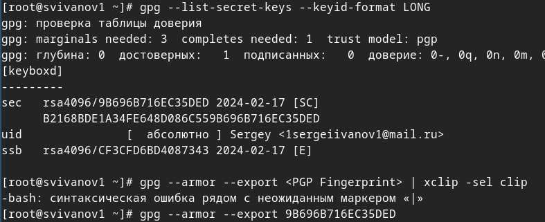{#fig:007 width=70%}

Перейдём в настройки GitHub (https://github.com/settings/keys), нажмем на кнопку New GPG key и вставим полученный ключ в поле ввода. (рис. 8).

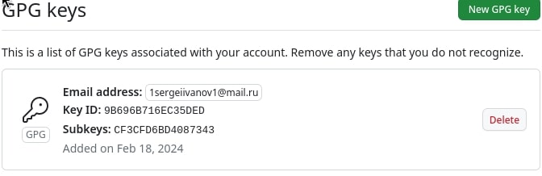{#fig:008 width=70%}

Настроим автоматические подписи коммитов git
Используя введёный email, укажем Git применять его при подписи коммитов: (рис. 9).

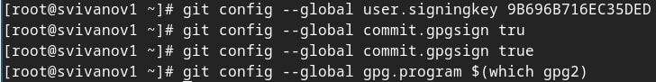{#fig:009 width=70%}

Авторизуемся для настройки gh через браузер (рис. 10).

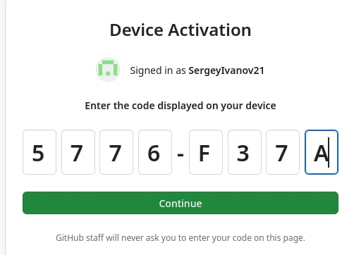{#fig:010 width=70%}

Создадим репозиторий курса на основе шаблона и рабочее пространство (рис. 11). 

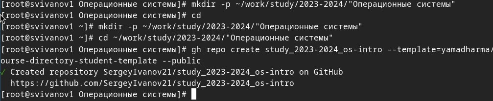{#fig:011 width=70%}

Клонируем репозиторий в рабочее пространство (рис. 12). 

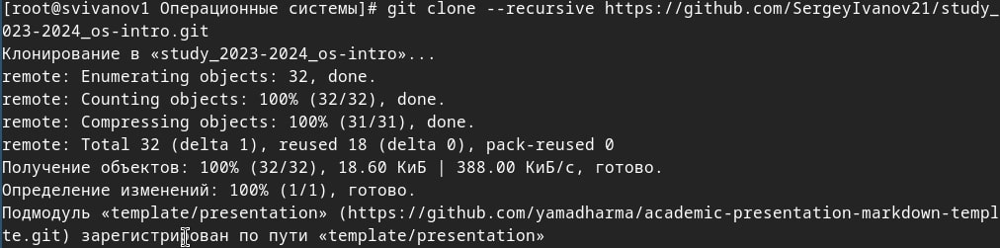{#fig:012 width=70%}

Перейдем в каталог курса и удалим лишние файлы (рис. 13). 

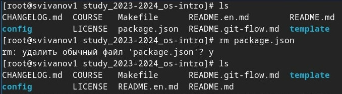{#fig:013 width=70%}

Создадим необходимые каталоги 'echo os-intro > COURSE' (рис. 14). 

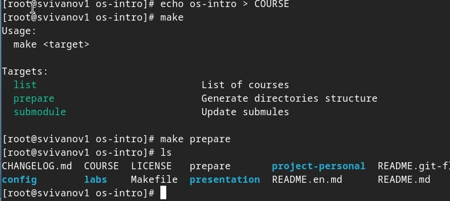{#fig:014 width=70%}

Отправим файлы на сервер 'git add' (рис. 15). 

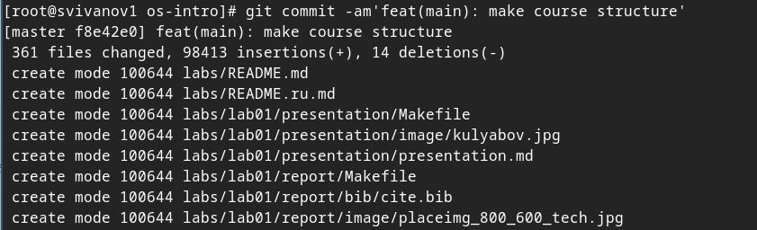{#fig:015 width=70%}

Добавляем комментарий и отправляем файлы (рис. 16).

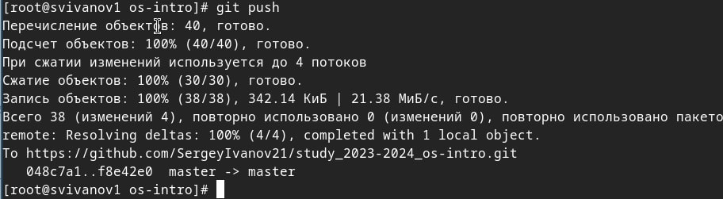{#fig:016 width=70%}

# Контрольные вопросы

**1. Что такое системы контроля версий (VCS) и для решения каких задач они предназначаются?**
Это программное обеспечение для облегчения работы с изменяющейся информацией. VCS позволяет хранить несколько версий одного и того же документа, при необходимости возвращаться к более ранним версиям, определять, кто и когда сделал то или иное изменение, и многое другое.

**2. Объясните следующие понятия VCS и их отношения: хранилище, commit, история, рабочая копия.**
Хранилище (repository), или репозиторий, — место хранения всех версий и служебной информации. 
Commit («[трудовой] вклад») — синоним версии; процесс создания новой версии.
История – место, где сохраняются все коммиты, по которым можно посмотреть данные о коммитах.
Рабочая копия – текущее состояние файлов проекта, основанное на версии, загруженной из хранилища.

**3. Что представляют собой и чем отличаются централизованные и децентрализованные VCS? Приведите примеры VCS каждого вида.**
Централизованные VCS: одно основное хранилище всего проекта и каждый пользователь копирует себе необходимые ему файлы из этого репозитория, изменяет и, затем, добавляет свои изменения обратно. 
Децентрализованные VCS:
у каждого пользователя свой вариант (возможно не один) репозитория.

**4. Опишите действия с VCS при единоличной работе с хранилищем.**
В случае индивидуальной работы с хранилищем VCS пользователь создает, сохраняет и обновляет версии документов непосредственно в своем локальном хранилище.

**5. Опишите порядок работы с общим хранилищем VCS.**
При работе с общим хранилищем VCS пользователи сначала загружают, обновлюи и обмениваются версиями документов с помощью коммитов и пушей.

**6. Каковы основные задачи, решаемые инструментальным средством git?**
У Git две основных задачи: первая — хранить информацию о всех изменениях в вашем коде, начиная с самой первой строчки, а вторая — обеспечение удобства командной работы над кодом.

**7. Назовите и дайте краткую характеристику командам git.**
git –version (Проверка версии Git)
git init (Инициализировать ваш текущий рабочий каталог как Git-репозиторий)
git clone --recursive https://www.github.com/username/repo-name (Скопировать существующий удаленный Git-репозиторий)
git remote (Просмотреть список текущих удалённых репозиториев Git)
git remote -v (Для более подробного вывода)
git add my_script.py (Можете указать в команде конкретный файл).
git add . (Позволяет охватить все файлы в текущем каталоге, включая файлы, чье имя начинается с точки)
git commit -am "Commit message" (Вы можете сжать все индексированные файлы и отправить коммит).
git branch (Просмотреть список текущих веток можно с помощью команды branch)
git –help (Чтобы узнать больше обо всех доступных параметрах и командах)
git push origin master (Передать локальные коммиты в ветку удаленного репозитория).

**8. Приведите примеры использования при работе с локальным и удалённым репозиториями.**
Пример использования локального репозитория: пользователь вносит изменения в код и сохраняет их локально. Пример использования удаленного репозитория: пользователь скачивает код с удаленного сервера, вносит изменения и отправляет их обратно на сервер.

**9. Что такое и зачем могут быть нужны ветви (branches)?**
Ветки нужны, чтобы несколько программистов могли вести работу над одним и тем же проектом или даже файлом одновременно, при этом не мешая друг другу. Кроме того, ветки используются для тестирования экспериментальных функций: чтобы не повредить основному проекту, создается новая ветка специально для экспериментов.

**10. Как и зачем можно игнорировать некоторые файлы при commit?**
Игнорируемые файлы — это, как правило, артефакты сборки и файлы, генерируемые машиной из исходных файлов в вашем репозитории, либо файлы, которые по какой-либо иной причине не должны попадать в коммиты.

# Выводы

В результате выполнения лабораторной работы мы изучили идеологию и применение средств контроля версий а также освоили умения по работе с git.

