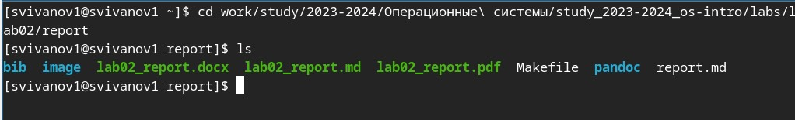
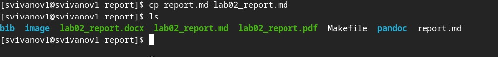
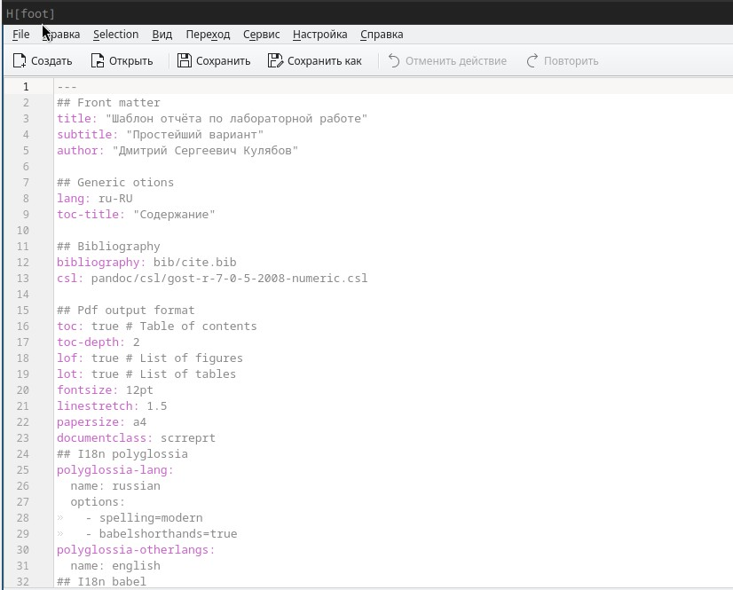
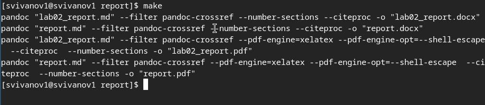
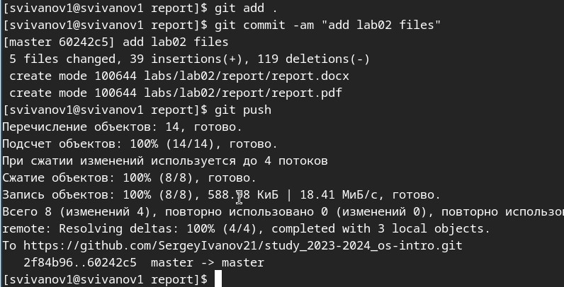

---
## Front matter
lang: ru-RU
title: Лабораторная работа № 3
subtitle: Операционные системы
author:
  - Иванов Сергей Владимирович, НПИбд-01-23
institute:
  - Российский университет дружбы народов, Москва, Россия
date: 23 февраля 2024

## i18n babel
babel-lang: russian
babel-otherlangs: english

## Formatting pdf
toc: false
slide_level: 2
aspectratio: 169
section-titles: true
theme: metropolis
header-includes:
 - \metroset{progressbar=frametitle,sectionpage=progressbar,numbering=fraction}
 - '\makeatletter'
 - '\beamer@ignorenonframefalse'
 - '\makeatother'

  ## Fonts
mainfont: PT Serif
romanfont: PT Serif
sansfont: PT Sans
monofont: PT Mono
mainfontoptions: Ligatures=TeX
romanfontoptions: Ligatures=TeX
sansfontoptions: Ligatures=TeX,Scale=MatchLowercase
monofontoptions: Scale=MatchLowercase,Scale=0.9
---

## Цель работы

- Научиться оформлять отчёты с помощью легковесного языка разметки Markdown.
- Сделать отчёт по предыдущей лабораторной работе в формате Markdown.

## Теоретическое введение

Markdown — облегчённый язык разметки, созданный с целью обозначения форматирования в простом тексте, с максимальным сохранением его читаемости человеком, и пригодный для машинного преобразования в языки для продвинутых публикаций.

# Выполнение работы

## Перейдем в рабочий каталог 

Перейдем в рабочий каталог, в котором находится шаблон для отчета по лабораторной работе.

{#fig:001 width=70%}

## Копируем шаблон

Командой cp копирую шаблон, в котором буду работать

{#fig:002 width=70%}

## Редактируем файл

Открываю файл с помощью редактора kwrite и редактирую шаблон

{#fig:003 width=70%}

## Компиляция шаблона

После редактирования выполняем компиляцию в форматы docx и pdf командой make

{#fig:004 width=70%}

## Отправка файлов

После успешной компиляции отправляем файлы на глобальный репозиторий 

{#fig:005 width=70%}

# Вывод

## Вывод 

При выполнении данной лабораторной работы я научилась оформлять отчеты с помощью легковесного языка разметки Markdown.

# Спасибо за внимание!

