---
## Front matter
lang: ru-RU
title: Лабораторная работа № 4
subtitle: Операционные системы
author:
  - Иванов Сергей Владимирович, НПИбд-01-23
institute:
  - Российский университет дружбы народов, Москва, Россия
date: 4 марта 2024

## i18n babel
babel-lang: russian
babel-otherlangs: english

## Formatting pdf
toc: false
slide_level: 2
aspectratio: 169
section-titles: true
theme: metropolis
header-includes:
 - \metroset{progressbar=frametitle,sectionpage=progressbar,numbering=fraction}
 - '\makeatletter'
 - '\beamer@ignorenonframefalse'
 - '\makeatother'

  ## Fonts
mainfont: PT Serif
romanfont: PT Serif
sansfont: PT Sans
monofont: PT Mono
mainfontoptions: Ligatures=TeX
romanfontoptions: Ligatures=TeX
sansfontoptions: Ligatures=TeX,Scale=MatchLowercase
monofontoptions: Scale=MatchLowercase,Scale=0.9
---

## Цель работы

1. Получение навыков правильной работы с репозиториями git.

## Задание

1. Выполнить работу для тестового репозитория.
2. Преобразовать рабочий репозиторий в репозиторий с git-flow и conventional commits.

# Выполнение работы

## Установка git-flow

Активируем репозиторий Corp

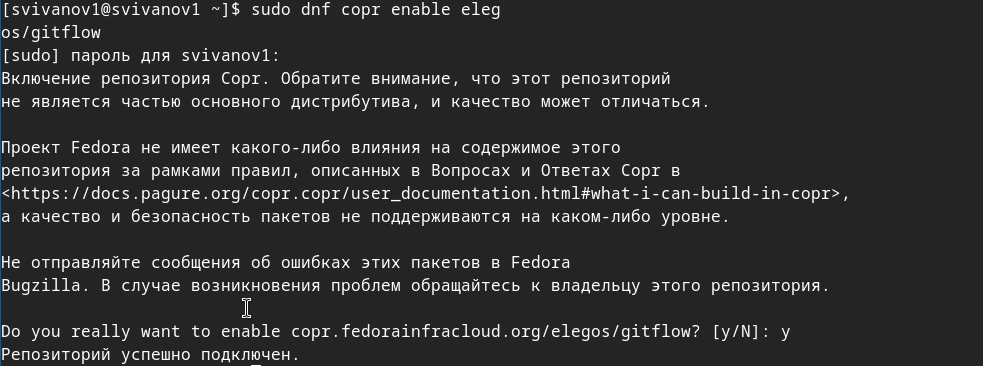{#fig:001 width=70%}

## Установка git-flow

- dnf install gitflow 

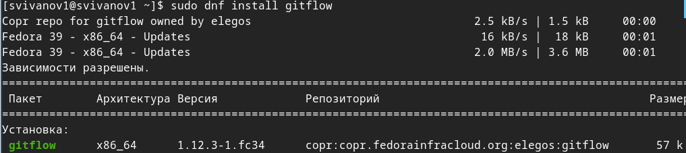{#fig:002 width=70%}

## Установка Node.js

Установим Node.js 

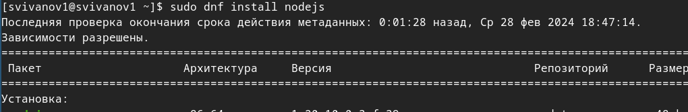{#fig:003 width=70%}

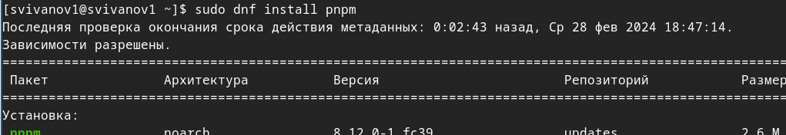{#fig:004 width=70%}

## Настройка Node.js

Запустим 'pnpm setup' и перелогинимся 

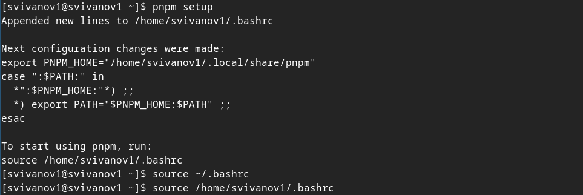{#fig:005 width=70%}

## Установка Commitzen

Установим программу для помощи в форматировании коммитов. 

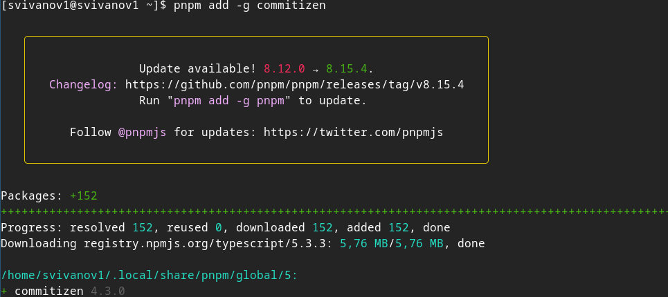{#fig:006 width=70%}

## Установка Standard-changelog

Установим программу для помощи в создании логов.  

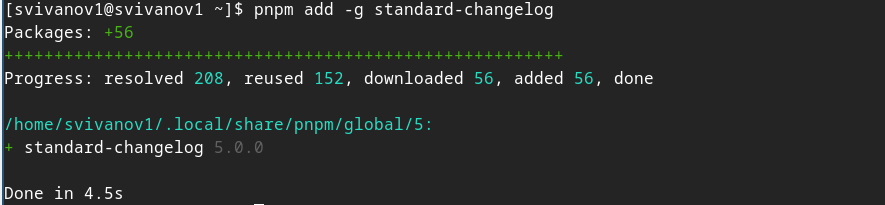{#fig:007 width=70%}

## Создаем репозиторий

Создадим репозиторий 'git-extended' 

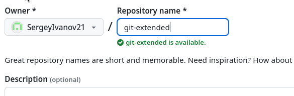{#fig:008 width=70%}

## Клонируем репозиторий

Клонируем репозиторий и создаем файл README.md 

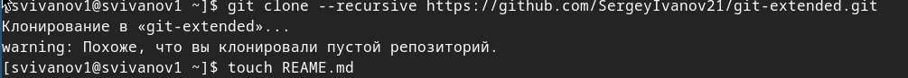{#fig:009 width=70%}

## Коммит

Делаем коммит и выкладываем на github 

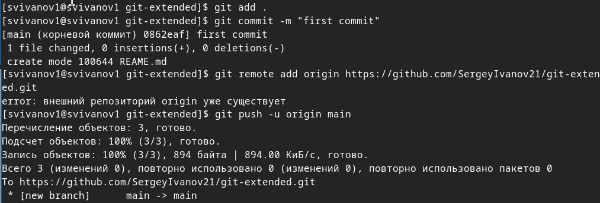{#fig:010 width=70%}

## Сконфигурим формат коммитов

Добавим в файл package.json команду для формирования коммитов  

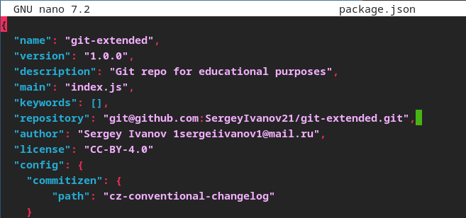{#fig:011 width=70%}

## Отправляем на сервер

Добавим новые файлы, выполним коммит, отправим на github  

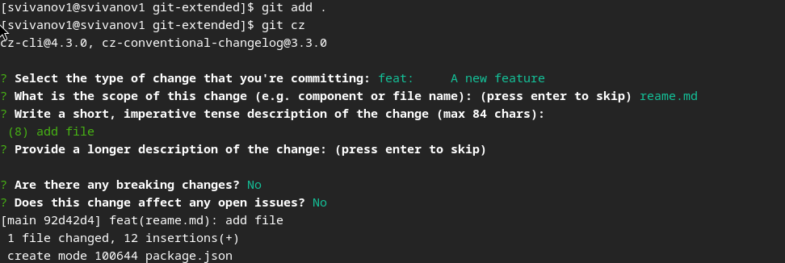{#fig:012 width=70%}

## Конфигурация git-flow

Инициализируем git-flow, префикс для ярлыков установим в v

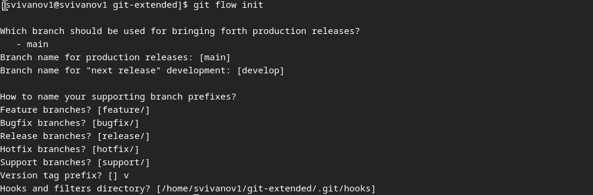{#fig:013 width=70%}

## Проверка ветки

Проверим, что мы на ветке develop 

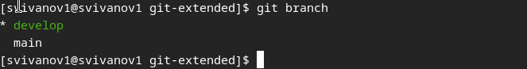{#fig:014 width=70%}

## Загрузим в хранилище

Загрузим весь репозиторий в хранилище 

{#fig:015 width=70%}

## Установим внешнюю ветку

Установим внешнюю ветку как вышестоящую для этой ветки и создадим релиз с версией 1.0.0 

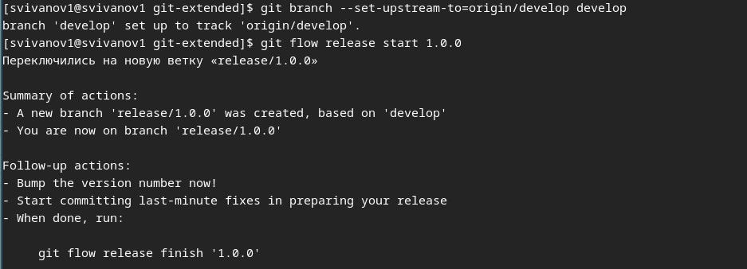{#fig:016 width=70%}

## Журнал изменений

Создадим журнал изменений и добавим журнал изменений в индекс  

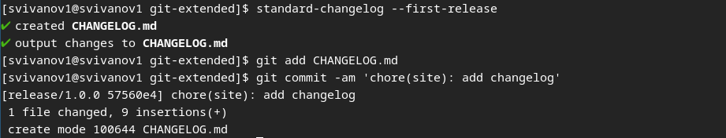{#fig:017 width=70%}

## Релизная ветка

Зальём релизную ветку в основную ветку 

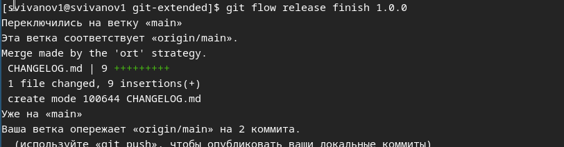{#fig:018 width=70%}

## Отправка

Отправим данные на github  

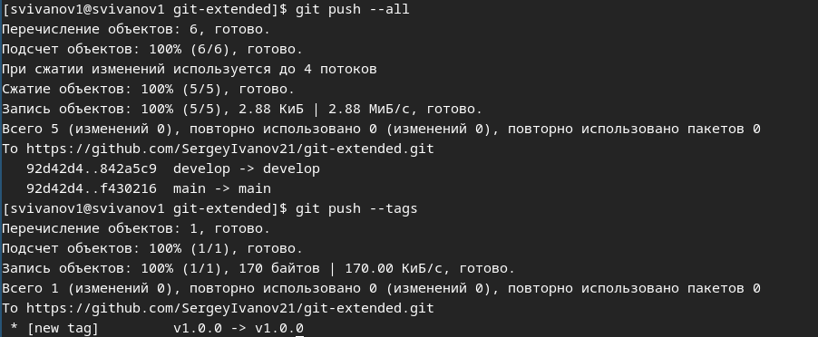{#fig:019 width=70%}

## Создаем релиз

Создадим релиз на github.  

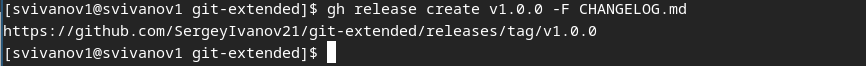{#fig:020 width=70%}

## Новая ветка

Создадим ветку для новой функциональности, объединим ветку feature_branch c develop. 

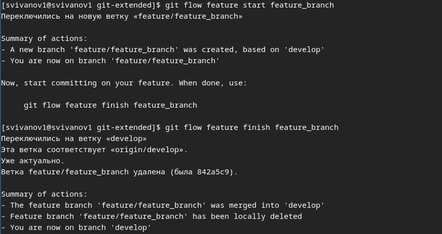{#fig:021 width=70%}

## Новый релиз

Создадим релиз с версией 1.2.3. 

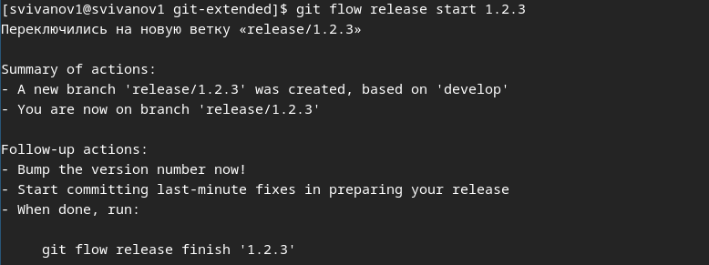{#fig:022 width=70%}

## Номер версии

Обновим номер версии в файле package.json. Установим её в 1.2.3. 

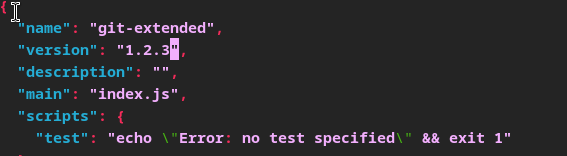{#fig:023 width=70%}

## Журнал изменений

Создадим журнал изменений 

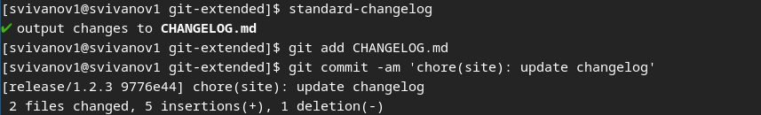{#fig:024 width=70%}

## Журнал изменений

Добавим журнал изменений в индекс и зальём релизную ветку в основную ветку.  

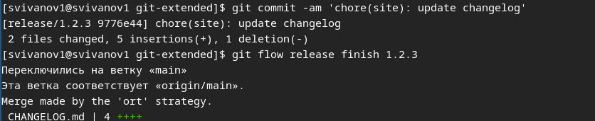{#fig:025 width=70%}

## Отправка данных

Отправим данные на github. 

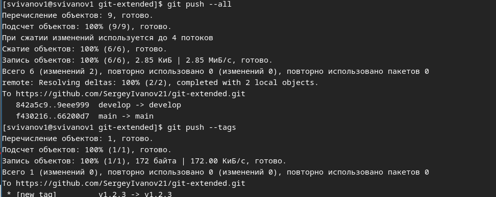{#fig:026 width=70%}

## Создадим релиз

Создадим релиз на github с комментарием из журнала изменений 

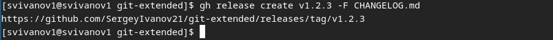{#fig:027 width=70%}

# Вывод

## Вывод 

В результате выполнения лабораторной работы я получил навыки правильной работы с репозиториями git.

