---
## Front matter
title: "Отчет по лабораторной работе №4"
subtitle: "Дисциплина: Операционные системы"
author: "Иванов Сергей Владимирович"

## Generic otions
lang: ru-RU
toc-title: "Содержание"

## Bibliography
bibliography: bib/cite.bib
csl: pandoc/csl/gost-r-7-0-5-2008-numeric.csl

## Pdf output format
toc: true # Table of contents
toc-depth: 2
lof: true # List of figures
fontsize: 12pt
linestretch: 1.5
papersize: a4
documentclass: scrreprt
## I18n polyglossia
polyglossia-lang:
  name: russian
  options:
	- spelling=modern
	- babelshorthands=true
polyglossia-otherlangs:
  name: english
## I18n babel
babel-lang: russian
babel-otherlangs: english
## Fonts
mainfont: PT Serif
romanfont: PT Serif
sansfont: PT Sans
monofont: PT Mono
mainfontoptions: Ligatures=TeX
romanfontoptions: Ligatures=TeX
sansfontoptions: Ligatures=TeX,Scale=MatchLowercase
monofontoptions: Scale=MatchLowercase,Scale=0.9
## Biblatex
biblatex: true
biblio-style: "gost-numeric"
biblatexoptions:
  - parentracker=true
  - backend=biber
  - hyperref=auto
  - language=auto
  - autolang=other*
  - citestyle=gost-numeric
## Pandoc-crossref LaTeX customization
figureTitle: "Рис."
listingTitle: "Листинг"
lofTitle: "Список иллюстраций"
lolTitle: "Листинги"
## Misc options
indent: true
header-includes:
  - \usepackage{indentfirst}
  - \usepackage{float} # keep figures where there are in the text
  - \floatplacement{figure}{H} # keep figures where there are in the text
---

# Цель работы

1. Получение навыков правильной работы с репозиториями git.

# Задание

1. Выполнить работу для тестового репозитория.
2. Преобразовать рабочий репозиторий в репозиторий с git-flow и conventional commits.

# Выполнение лабораторной работы

Установим git-flow из коллекции репозиториев Copr. Активируем репозиторий Corp. (рис. 1).

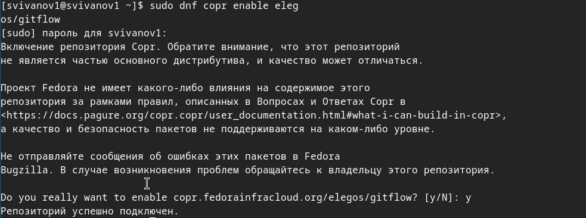{#fig:001 width=70%}

Установим git-flow
- dnf install gitflow (рис. 2).

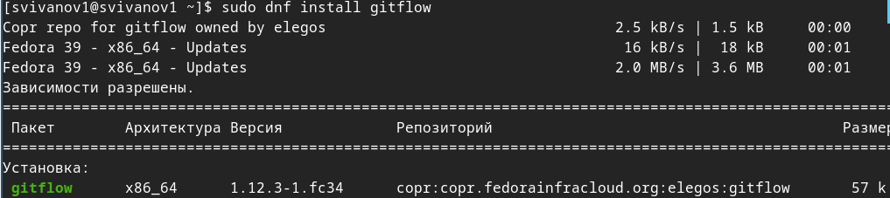{#fig:002 width=70%}

Установим Node.js (рис. 3, 4).

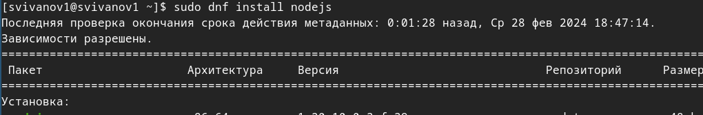{#fig:003 width=70%}

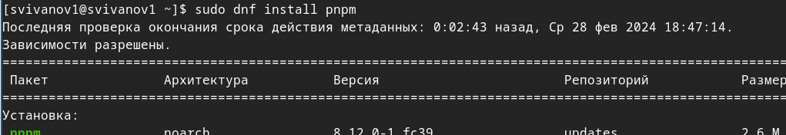{#fig:004 width=70%}

Настроим Node.js. Запустим 'pnpm setup' и перелогинимся (рис. 5). 

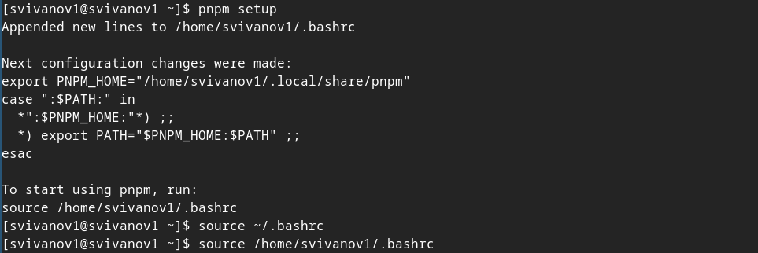{#fig:005 width=70%}

Установим программу для помощи в форматировании коммитов. (рис. 6). 

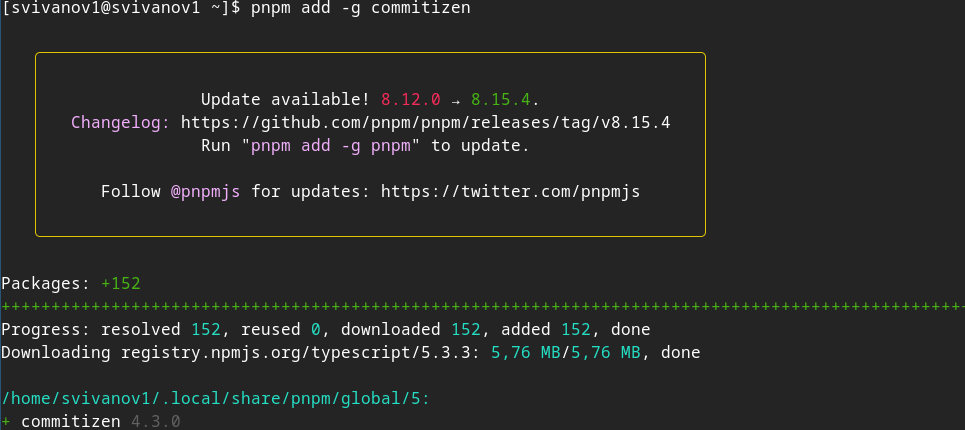{#fig:006 width=70%}

Установим программу для помощи в создании логов. (рис. 7). 

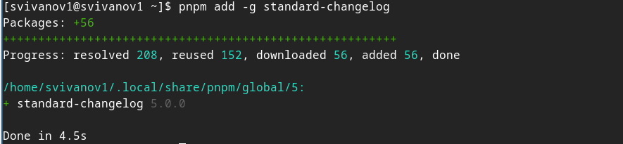{#fig:007 width=70%}

Создадим репозиторий 'git-extended' (рис. 8).

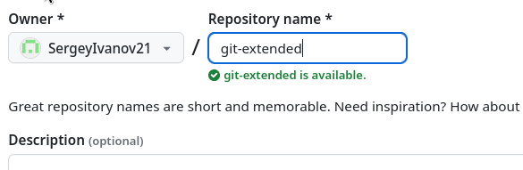{#fig:008 width=70%}

Клонируем репозиторий и создаем файл README.md (рис. 9).

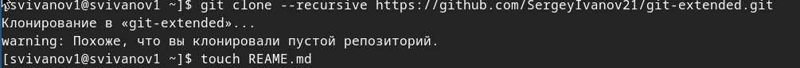{#fig:009 width=70%}

Делаем коммит и выкладываем на github (рис. 10).

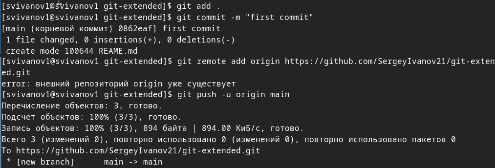{#fig:010 width=70%}

Сконфигурим формат коммитов. Для этого добавим в файл package.json команду для формирования коммитов (рис. 11). 

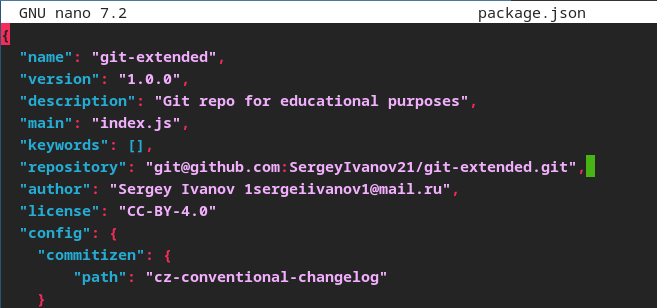{#fig:011 width=70%}

Добавим новые файлы, выполним коммит, отправим на github (рис. 12). 

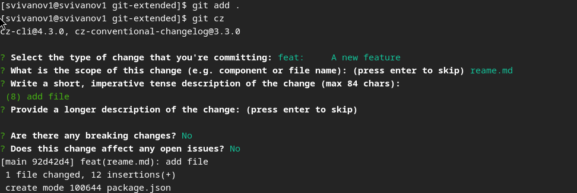{#fig:012 width=70%}

Инициализируем git-flow, префикс для ярлыков установим в v (рис. 13). 

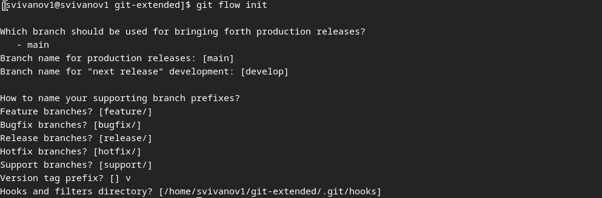{#fig:013 width=70%}

Проверим, что мы на ветке develop (рис. 14). 

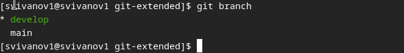{#fig:014 width=70%}

Загрузим весь репозиторий в хранилище (рис. 15). 

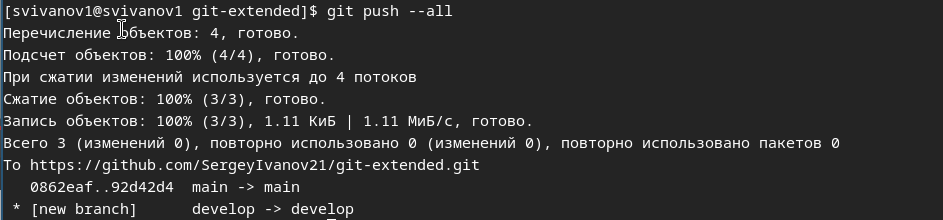{#fig:015 width=70%}

Установим внешнюю ветку как вышестоящую для этой ветки и создадим релиз с версией 1.0.0 (рис. 16).

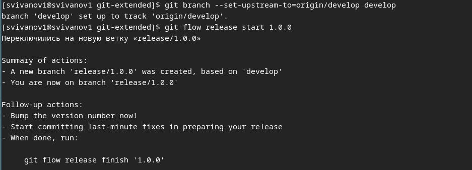{#fig:016 width=70%}

Создадим журнал изменений и добавим журнал изменений в индекс (рис. 17). 

{#fig:017 width=70%}

Зальём релизную ветку в основную ветку (рис. 18). 

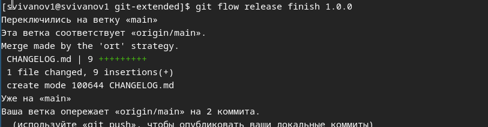{#fig:018 width=70%}

Отправим данные на github (рис. 19). 

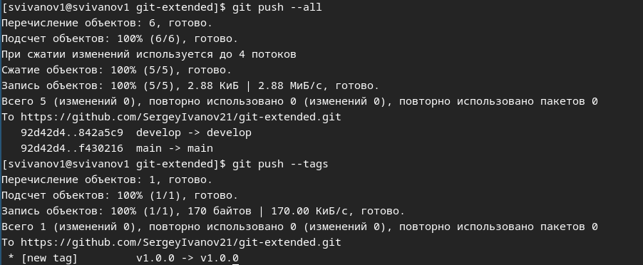{#fig:019 width=70%}

Создадим релиз на github. (рис. 20). 

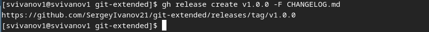{#fig:020 width=70%}

Создадим ветку для новой функциональности, объединим ветку feature_branch c develop. (рис. 21). 

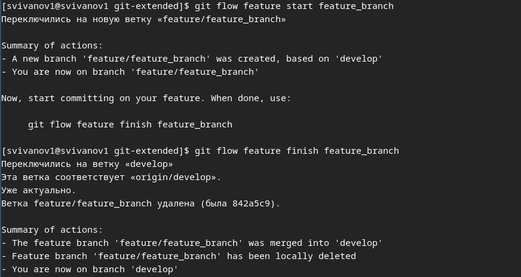{#fig:021 width=70%}

Создадим релиз с версией 1.2.3. (рис. 22). 

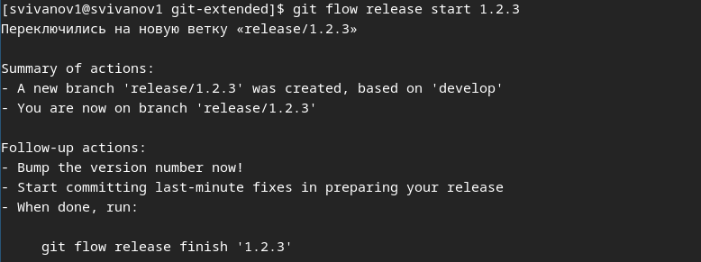{#fig:022 width=70%}

Обновим номер версии в файле package.json. Установим её в 1.2.3. (рис. 23). 

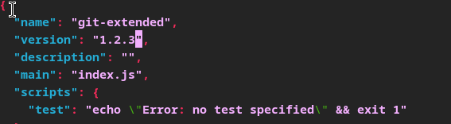{#fig:023 width=70%}

Создадим журнал изменений (рис. 24). 

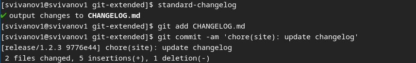{#fig:024 width=70%}

Добавим журнал изменений в индекс и зальём релизную ветку в основную ветку. (рис. 25). 

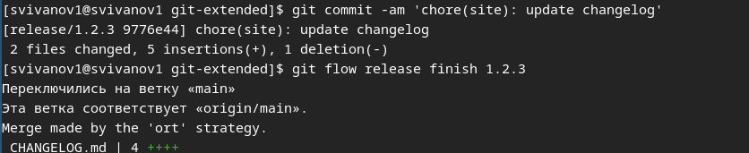{#fig:025 width=70%}

Отправим данные на github. (рис. 26). 

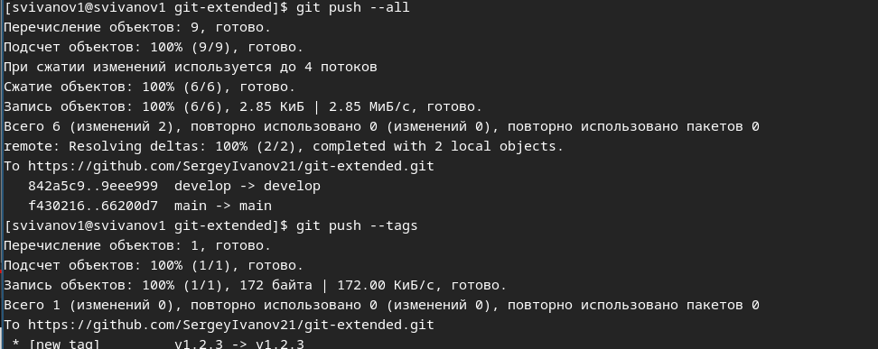{#fig:026 width=70%}

Создадим релиз на github с комментарием из журнала изменений (рис. 27)

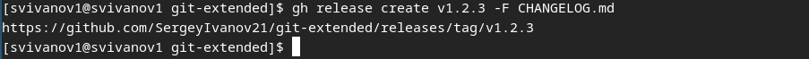{#fig:027 width=70%}

# Выводы

В результате выполнения лабораторной работы я получил навыки правильной работы с репозиториями git.

