---
## Front matter
lang: ru-RU
title: Лабораторная работа № 5
subtitle: Операционные системы
author:
  - Иванов Сергей Владимирович, НПИбд-01-23
institute:
  - Российский университет дружбы народов, Москва, Россия
date: 10 марта 2024

## i18n babel
babel-lang: russian
babel-otherlangs: english

## Formatting pdf
toc: false
slide_level: 2
aspectratio: 169
section-titles: true
theme: metropolis
header-includes:
 - \metroset{progressbar=frametitle,sectionpage=progressbar,numbering=fraction}
 - '\makeatletter'
 - '\beamer@ignorenonframefalse'
 - '\makeatother'

  ## Fonts
mainfont: PT Serif
romanfont: PT Serif
sansfont: PT Sans
monofont: PT Mono
mainfontoptions: Ligatures=TeX
romanfontoptions: Ligatures=TeX
sansfontoptions: Ligatures=TeX,Scale=MatchLowercase
monofontoptions: Scale=MatchLowercase,Scale=0.9
---

## Цель работы

Целью лабораторной работы является настроить рабочую среду и научиться пользоваться менеджером паролей.

# Выполнение работы

## Установка менеджера паролей

Установим менеджер паролей pass. 

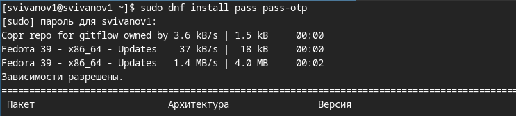{#fig:001 width=70%}

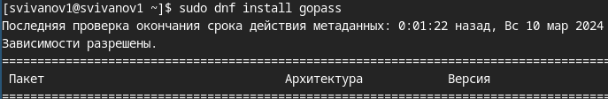{#fig:002 width=70%}

## Список ключей

Просмотрим список ключей GPG, видим что он есть 

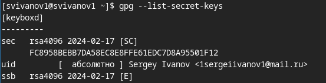{#fig:003 width=70%}

## Инициализация хранилища

Инициализируем хранилище 

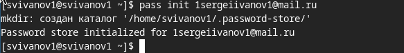{#fig:004 width=70%}

## Структура git

Создадим структуру git

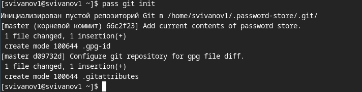{#fig:005 width=70%}

## Создание репозитория

Так же создадим репозиторий

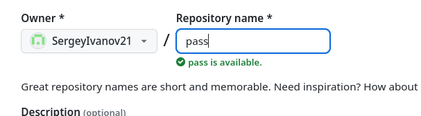{#fig:006 width=70%}

## Задаем адрес

Зададим адрес репозитория на хостинге  

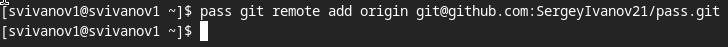{#fig:007 width=70%}

## Синхронизация репозитория

Синхронизируем репозиторий. 

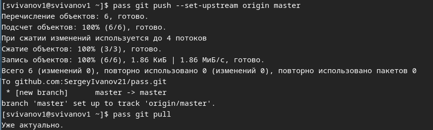{#fig:008 width=70%}

## Синхронизация вручную

Так же можем вручную закоммитить и выложить изменения 

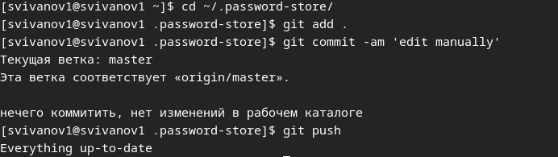{#fig:009 width=70%}

## Проверка статуса

Проверить статус синхронизации можно командой 
- pass git status

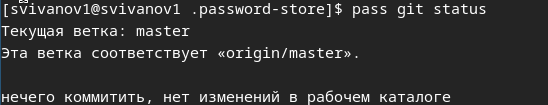{#fig:010 width=70%}

## Настройка интерфейса с браузером

Включим репозиторий Corp. 

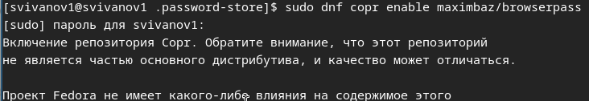{#fig:011 width=70%}

## Настройка интерфейса с браузером

Устанавливаем программу, обеспечивающую интерфейс native messaging. 

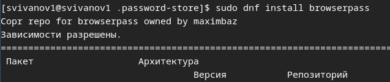{#fig:012 width=70%}

## Настройка интерфейса с браузером

Подключим плагин для Firefox 

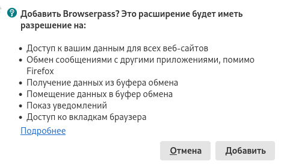{#fig:013 width=70%}

## Добавление пароля

Добавим новый пароль, отобразим пароль для указанного имени файла, заменим существующий пароль 

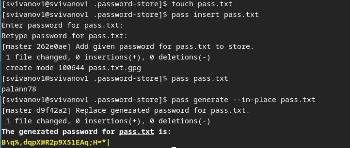{#fig:014 width=70%}

## Установка дополнительного програмного обеспечения

Установим дополнительное программное обеспечение 

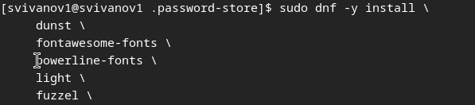{#fig:015 width=70%}

## Установка шрифтов

Установим шрифты 

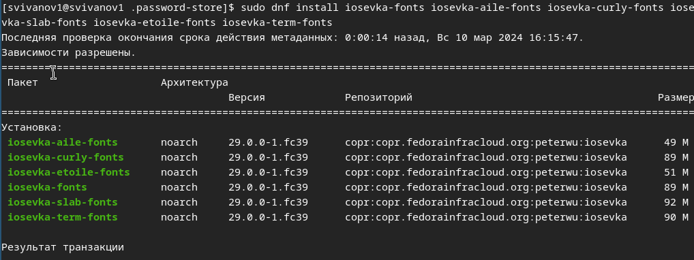{#fig:016 width=70%}

## Установка бинарного файла

Установим бинарный файл. Скрипт определяет архитектуру процессора и операционную систему и скачивает необходимый файл.

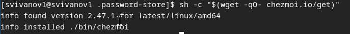{#fig:017 width=70%}

## Создание репозитория

Создадим свой репозиторий для конфигурационных файлов на основе шаблона 

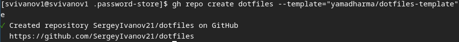{#fig:018 width=70%}

## Инициализация chezmoi

Инициализируем chezmoi с репозиторием dotfiles

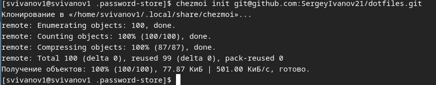{#fig:019 width=70%}

## Проверка изменений

Проверим какие изменения внесёт chezmoi в домашний каталог 

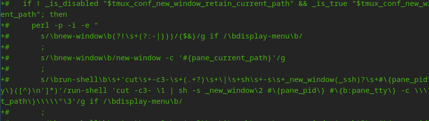{#fig:020 width=70%}

## Применение изменений

Соглашаемся с изменениями 

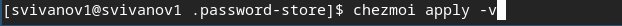{#fig:021 width=70%}

## Вторая машина

Проделываем тоже самое на второй машине. Установим свои dotfiles на новую машину с помощью одной команды 

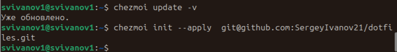{#fig:022 width=70%}

## Извлекаем изменения

Извлечем последние изменения из своего репозитория и посмотрим, что изменится, фактически не применяя изменения 

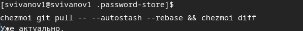{#fig:023 width=70%}

## Автоматическое отправление

Включаем автоматическое фиксирование и отправление изменений в репозиторий

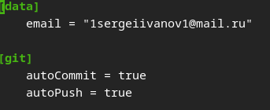{#fig:024 width=70%}

# Вывод

## Вывод 

В результате выполнения лабораторной работы мы настроили рабочую среду и научились пользоваться менеджером паролей.

## Список литературы

:::{#refs}

https://esystem.rudn.ru/mod/page/view.php?id=1098939#org2695679

:::

