---
## Front matter
title: "Отчет по лабораторной работе №5"
subtitle: "Дисциплина: Операционные системы"
author: "Иванов Сергей Владимирович"

## Generic otions
lang: ru-RU
toc-title: "Содержание"

## Bibliography
bibliography: bib/cite.bib
csl: pandoc/csl/gost-r-7-0-5-2008-numeric.csl

## Pdf output format
toc: true # Table of contents
toc-depth: 2
lof: true # List of figures
fontsize: 12pt
linestretch: 1.5
papersize: a4
documentclass: scrreprt
## I18n polyglossia
polyglossia-lang:
  name: russian
  options:
	- spelling=modern
	- babelshorthands=true
polyglossia-otherlangs:
  name: english
## I18n babel
babel-lang: russian
babel-otherlangs: english
## Fonts
mainfont: PT Serif
romanfont: PT Serif
sansfont: PT Sans
monofont: PT Mono
mainfontoptions: Ligatures=TeX
romanfontoptions: Ligatures=TeX
sansfontoptions: Ligatures=TeX,Scale=MatchLowercase
monofontoptions: Scale=MatchLowercase,Scale=0.9
## Biblatex
biblatex: true
biblio-style: "gost-numeric"
biblatexoptions:
  - parentracker=true
  - backend=biber
  - hyperref=auto
  - language=auto
  - autolang=other*
  - citestyle=gost-numeric
## Pandoc-crossref LaTeX customization
figureTitle: "Рис."
listingTitle: "Листинг"
lofTitle: "Список иллюстраций"
lolTitle: "Листинги"
## Misc options
indent: true
header-includes:
  - \usepackage{indentfirst}
  - \usepackage{float} # keep figures where there are in the text
  - \floatplacement{figure}{H} # keep figures where there are in the text
---

# Цель работы

Целью лабораторной работы является настроить рабочую среду и научиться пользоваться менеджером паролей.

# Выполнение лабораторной работы

Установим менеджер паролей pass. (рис. 1, 2).

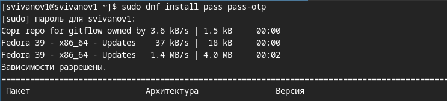{#fig:001 width=70%}

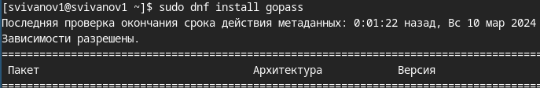{#fig:002 width=70%}

Просмотрим список ключей GPG, видим что он есть (рис. 3).

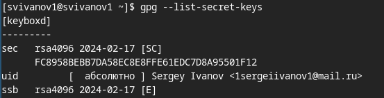{#fig:003 width=70%}

Инициализируем хранилище (рис. 4).

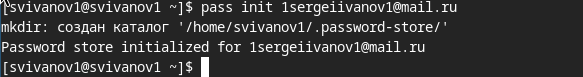{#fig:004 width=70%}

Создадим структуру git (рис. 5). 

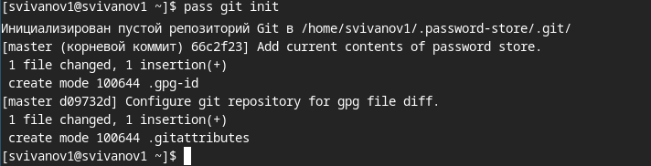{#fig:005 width=70%}

Так же создадим репозиторий (рис. 6). 

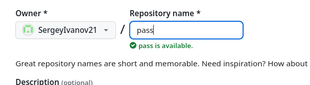{#fig:006 width=70%}

Зададим адрес репозитория на хостинге (рис. 7). 

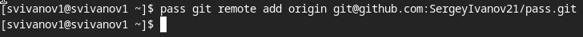{#fig:007 width=70%}

Синхронизируем репозиторий. (рис. 8).

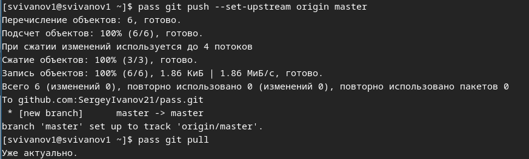{#fig:008 width=70%}

Так же можем вручную закоммитить и выложить изменения (рис. 9).

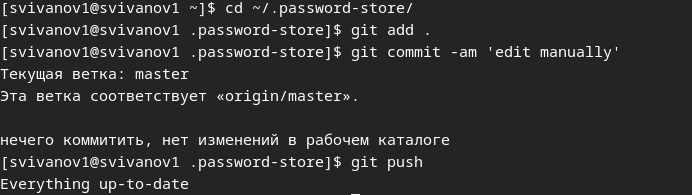{#fig:009 width=70%}

Проверить статус синхронизации можно командой (рис. 10).

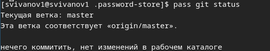{#fig:010 width=70%}

Включим репозиторий Corp. (рис. 11). 

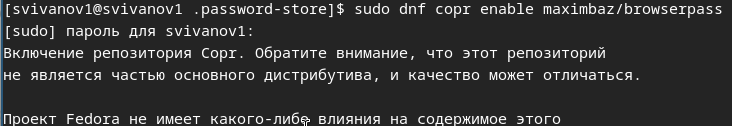{#fig:011 width=70%}

Устанавливаем программу, обеспечивающую интерфейс native messaging. (рис. 12). 

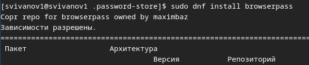{#fig:012 width=70%}

Подключим плагин для Firefox (рис. 13). 

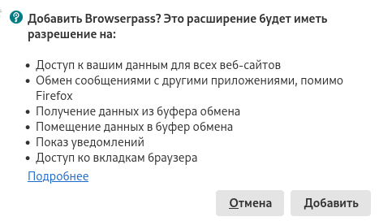{#fig:013 width=70%}

Добавим новый пароль, отобразим пароль для указанного имени файла, заменим существующий пароль (рис. 14). 

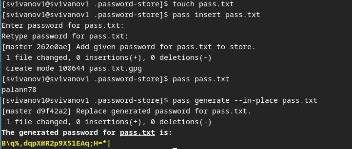{#fig:014 width=70%}

Установим дополнительное программное обеспечение (рис. 15). 

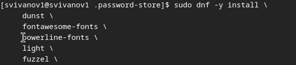{#fig:015 width=70%}

Установим шрифты (рис. 16).

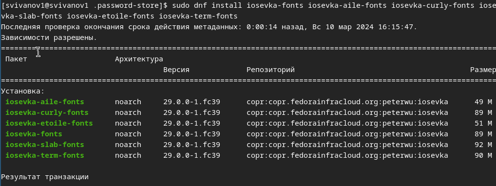{#fig:016 width=70%}

Установим бинарный файл. Скрипт определяет архитектуру процессора и операционную систему и скачивает необходимый файл (рис. 17).

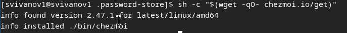{#fig:017 width=70%}

Создадим свой репозиторий для конфигурационных файлов на основе шаблона (рис. 18).

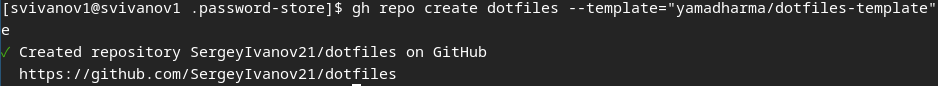{#fig:018 width=70%}

Инициализируем chezmoi с репозиторием dotfiles (рис. 19).

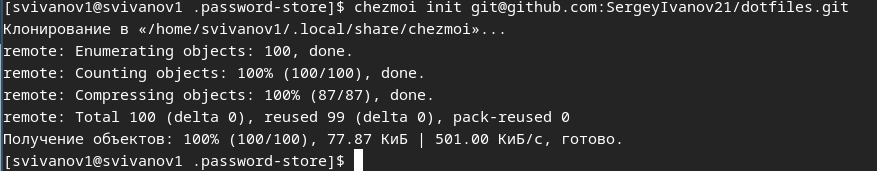{#fig:019 width=70%}

Проверим какие изменения внесёт chezmoi в домашний каталог (рис. 20).

{#fig:020 width=70%}

Соглашаемся с изменениями (рис. 21).

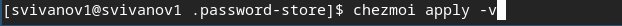{#fig:021 width=70%}

Проделываем тоже самое на второй машине. Установим свои dotfiles на новую машину с помощью одной команды (рис. 22).

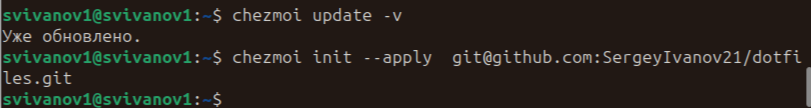{#fig:022 width=70%}

Извлечем последние изменения из своего репозитория и посмотрим, что изменится, фактически не применяя изменения (рис. 23).

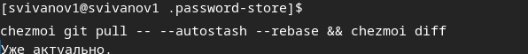{#fig:023 width=70%}

Включаем автоматическое фиксирование и отправление изменений в репозиторий (рис. 24).

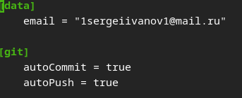{#fig:024 width=70%}

# Выводы

В результате выполнения лабораторной работы мы настроили рабочую среду и научились пользоваться менеджером паролей.

