---
## Front matter
lang: ru-RU
title: Лабораторная работа № 6
subtitle: Операционные системы
author:
  - Иванов Сергей Владимирович, НПИбд-01-23
institute:
  - Российский университет дружбы народов, Москва, Россия
date: 11 марта 2024

## i18n babel
babel-lang: russian
babel-otherlangs: english

## Formatting pdf
toc: false
slide_level: 2
aspectratio: 169
section-titles: true
theme: metropolis
header-includes:
 - \metroset{progressbar=frametitle,sectionpage=progressbar,numbering=fraction}
 - '\makeatletter'
 - '\beamer@ignorenonframefalse'
 - '\makeatother'

  ## Fonts
mainfont: PT Serif
romanfont: PT Serif
sansfont: PT Sans
monofont: PT Mono
mainfontoptions: Ligatures=TeX
romanfontoptions: Ligatures=TeX
sansfontoptions: Ligatures=TeX,Scale=MatchLowercase
monofontoptions: Scale=MatchLowercase,Scale=0.9
---

## Цель работы

Целью данной лабораторной работы является приобретение практических навыков взаимодействия пользователя с системой посредством командной строки.

# Выполнение работы

## Команда pwd

Полное имя домашнего каталога можно узнать с помощью команды pwd. 

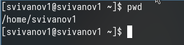{#fig:001 width=70%}

## Перемещение между директориями

С помощью утилиты cd переходим в подкаталог tmp корневого каталога.

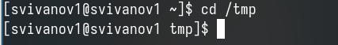{#fig:002 width=70%}

## Просмотр содержимого каталога

С помощью команды ls, просмотрим содержимое каталога tmp.

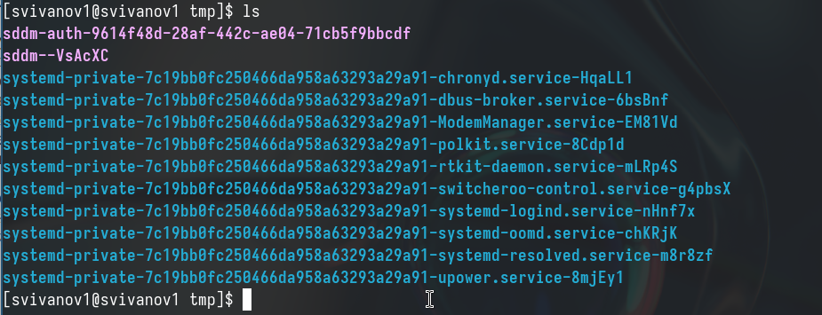{#fig:003 width=70%}

## Просмотр содержимого каталога

Использую команду ls с разными опциями. Опция -l позволит увидеть дополнительную информацию о файлах в каталоге

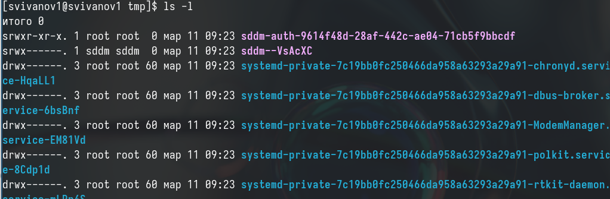{#fig:004 width=70%}

## Просмотр содержимого каталога

Опция -a покажет скрытые файлы в каталоге. 

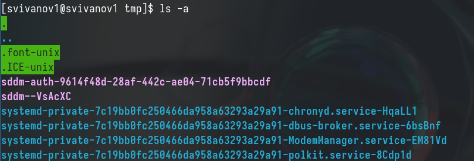{#fig:005 width=70%}

## Просмотр содержимого каталога

Перехожу в каталог /var/spool/ с помощью cd.
Чтобы определить, есть ли в каталоге подкатлог с соответствющим именем, воспользуемся утилитой ls с флагом -F, чтобы проверить, что мы найдем именно каталог. В директории действительно есть такой каталог

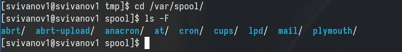{#fig:006 width=70%}

## Перемещение между директориями

Затем проверяю содержимое каталога с помощью утилиты ls, опция -l позволяет определить владельцев файлов, опция -a показывает все содержимое каталога, -F поможет определить что из содержимого каталога файл, а что каталог

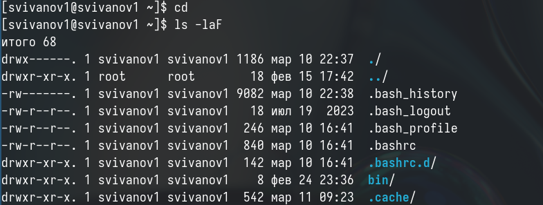{#fig:007 width=70%}

## Создание директории

Создаю директорию newdir с помощью утилиты mkdir, затем проверяю, с помощью ls

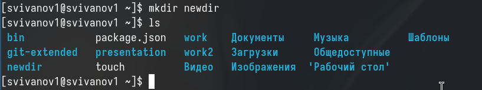{#fig:008 width=70%}

## Создание директории

Создаю для каталога newdir подкаталог morefun, проверяю, что каталог создан.

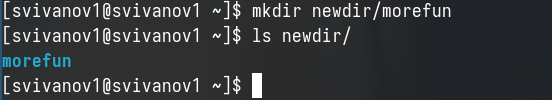{#fig:009 width=70%}

## Создание директорий

Чтобы создать несколько директорий одной строчкой нужно перечислить названия директорий через пробел после утилиты mkdir. Проверяю, что все файлы созданы.

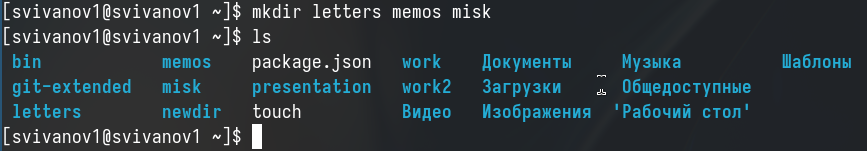{#fig:010 width=70%}

## Удаление директорий

Чтобы удалить несколько пустых директорий одной строчкой нужно перечислить назваания директорий через пробел после утилиты rmdir. Проверяю, что все файлы удалены. 

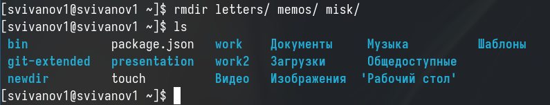{#fig:011 width=70%}

## Попытка удаления директории

Пытаюсь удалить newdir с помощью rm. Утилита rm по умолчанию удаляет файлы, но newdir не пустая дериктория, поэтому нужно добавить опцию для рекурсивного удаления -r. Использовалась утилиты без опций, поэтому каталог не был удален. 

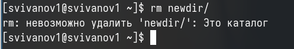{#fig:012 width=70%}

## Удаление директорий

Удаляю директорию newdir с помощью утилиты rmdir, т.к директория не пустая, я добавляю флаг удалить рекурсивно -p, чтобы удалилсь и все подкаталоги. 

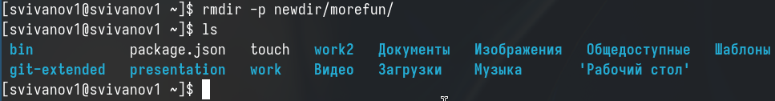{#fig:013 width=70%}

## Опция для утилиты

С помощью команды man ls я могу прочесть документацию к команде ls, опция, которая позолит выводить все подкаталоги каталогов, это -R. 

{#fig:014 width=70%}

## Опция утилиты

Так как мне нужно найти опцию утилиты ls для сортировки, то сузим поиск до результатов с таким же вопросом. Выясняем, что нам нужна комбинация опций -lt.

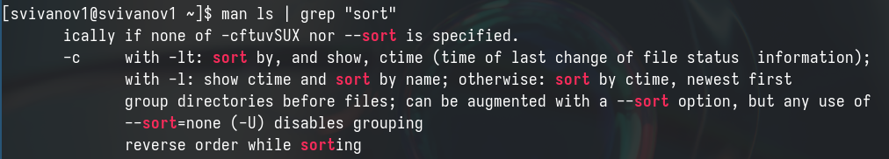{#fig:015 width=70%}

## Опции команды

С помощью man cd узнаю описание команды cd и ее опции. Основных опций немного.

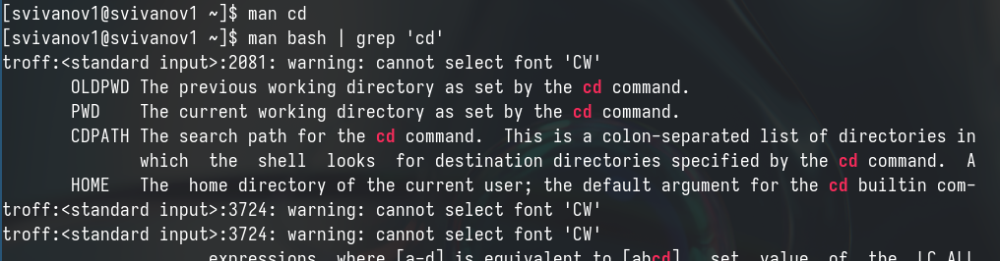{#fig:016 width=70%}

## Информация о pwd

С помощью man pwd узнаю описание команды pwd и ее опции. (рис. 17).

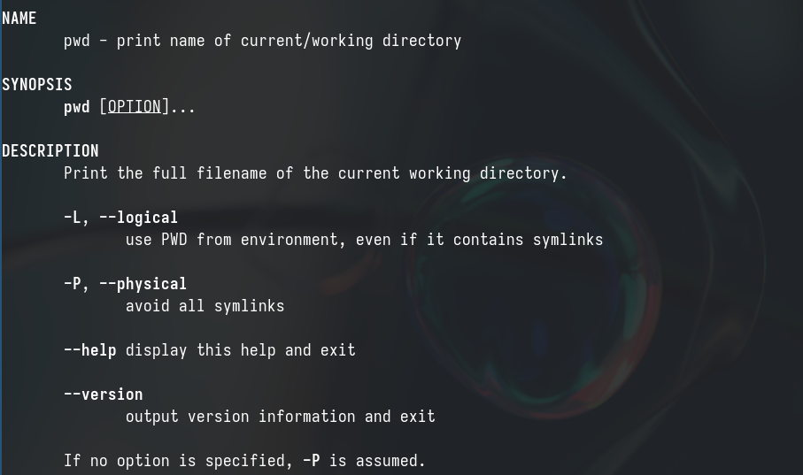{#fig:017 width=70%}

## Информация о mkdir

С помощью man mkdir узнаю описание команды mkdir и ее опции 

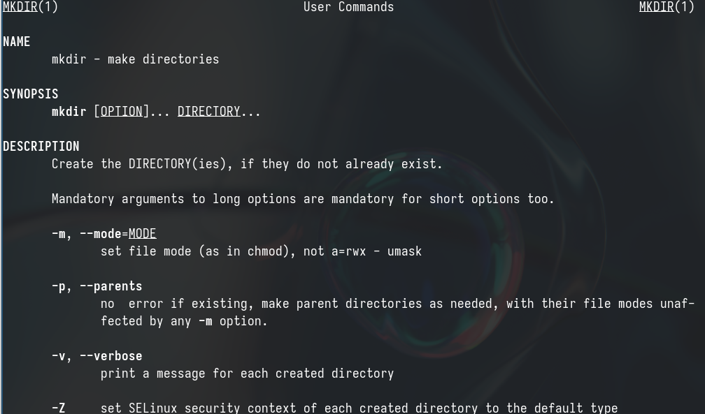{#fig:018 width=70%}

## Информация о rmdir

С помощью man rmdir узнаю описание команды rmdir и ее опции 

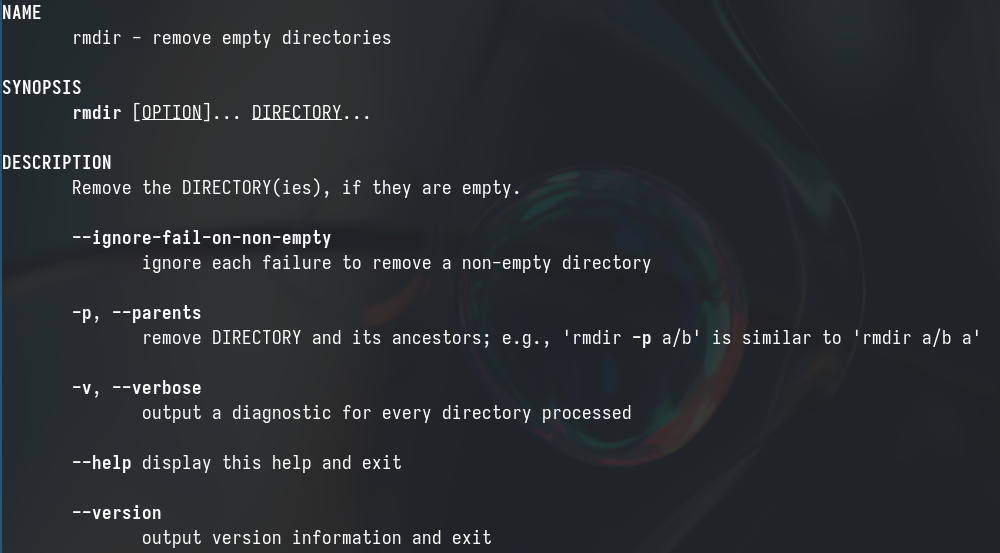{#fig:019 width=70%}

## Информация о rm

С помощью man rm узнаю описание команды rm и ее опции.

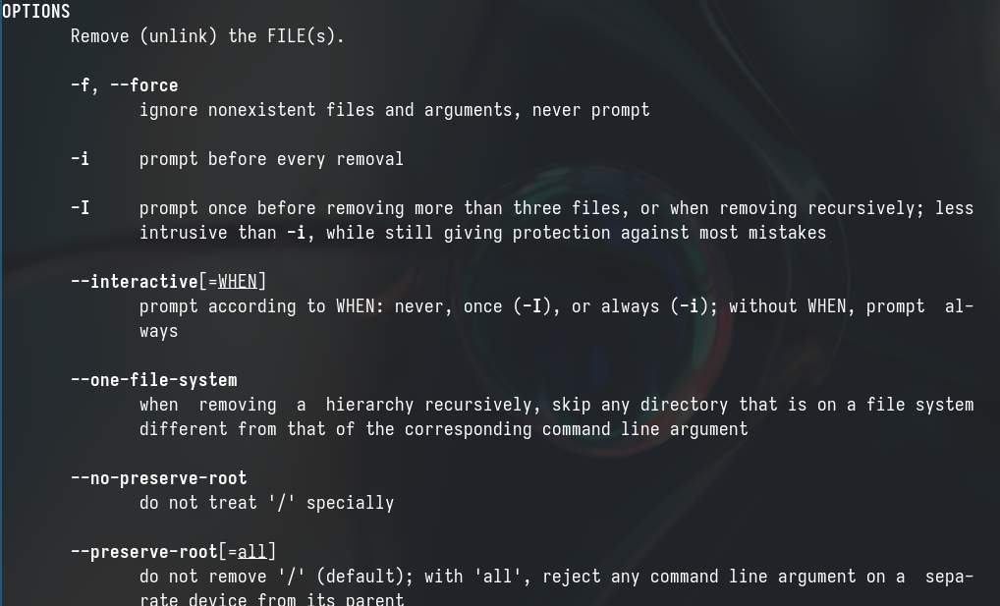{#fig:020 width=70%}

## Команда history

Опции --help --version показывают справку по команде и ее версию. Выводим историю команд с помощью утилиты history 

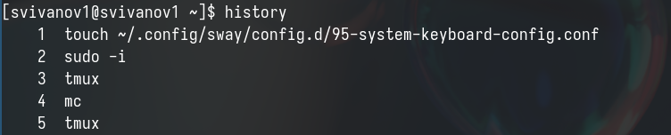{#fig:021 width=70%}

## Модификация команды

Модифицирую команду 

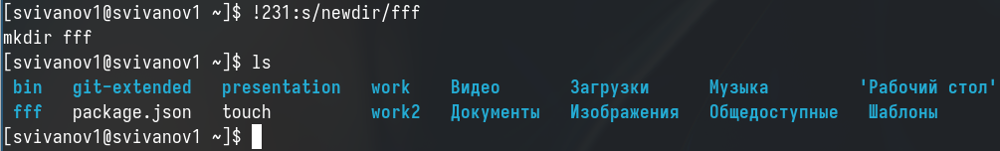{#fig:022 width=70%}

## Модификация команды

Модифицирую команду

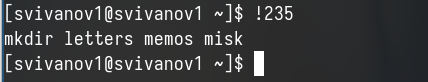{#fig:023 width=70%}

# Вывод

## Вывод 

Я приобрел практические навыки взаимодействия пользователя с системой посредством командной строки.

## Список литературы

:::{#refs}

https://esystem.rudn.ru/mod/page/view.php?id=1098933

:::

