---
## Front matter
title: "Отчет по лабораторной работе №6"
subtitle: "Дисциплина: Операционные системы"
author: "Иванов Сергей Владимирович"

## Generic otions
lang: ru-RU
toc-title: "Содержание"

## Bibliography
bibliography: bib/cite.bib
csl: pandoc/csl/gost-r-7-0-5-2008-numeric.csl

## Pdf output format
toc: true # Table of contents
toc-depth: 2
lof: true # List of figures
fontsize: 12pt
linestretch: 1.5
papersize: a4
documentclass: scrreprt
## I18n polyglossia
polyglossia-lang:
  name: russian
  options:
	- spelling=modern
	- babelshorthands=true
polyglossia-otherlangs:
  name: english
## I18n babel
babel-lang: russian
babel-otherlangs: english
## Fonts
mainfont: PT Serif
romanfont: PT Serif
sansfont: PT Sans
monofont: PT Mono
mainfontoptions: Ligatures=TeX
romanfontoptions: Ligatures=TeX
sansfontoptions: Ligatures=TeX,Scale=MatchLowercase
monofontoptions: Scale=MatchLowercase,Scale=0.9
## Biblatex
biblatex: true
biblio-style: "gost-numeric"
biblatexoptions:
  - parentracker=true
  - backend=biber
  - hyperref=auto
  - language=auto
  - autolang=other*
  - citestyle=gost-numeric
## Pandoc-crossref LaTeX customization
figureTitle: "Рис."
listingTitle: "Листинг"
lofTitle: "Список иллюстраций"
lolTitle: "Листинги"
## Misc options
indent: true
header-includes:
  - \usepackage{indentfirst}
  - \usepackage{float} # keep figures where there are in the text
  - \floatplacement{figure}{H} # keep figures where there are in the text
---

# Цель работы

Целью данной лабораторной работы является приобретение практических навыков взаимодействия пользователя с системой посредством командной строки.

# Задание

1. Определить полное имя домашнего каталога.
2. Выполнить следующие действия:
- Перейти в каталог /tmp.
- Вывести на экран содержимое каталога /tmp.
- Определить, есть ли в каталоге /var/spool подкаталог с именем cron.
- Перейти в домашний каталог и вывести на экран его содержимое. Определить, кто является владельцем файлов и подкаталогов.
3. Выполнить следующие действия:
- В домашнем каталоге создать новый каталог с именем newdir.
- В каталоге ~/newdir создать новый каталог с именем morefun.
- В домашнем каталоге создать одной командой три новых каталога с именами
letters, memos, misk. Затем удалить эти каталоги одной командой.
- Попробовать удалить ранее созданный каталог ~/newdir командой rm. Проверть,
был ли каталог удалён.
- Удалить каталог ~/newdir/morefun из домашнего каталога. Проверить, был ли
каталог удалён.
4. С помощью команды man определить, какую опцию команды ls нужно использовать для просмотра содержимого не только указанного каталога, но и подкаталогов,
входящих в него.
5. С помощью команды man определить набор опций команды ls, позволяющий отсортировать по времени последнего изменения выводимый список содержимого каталога
с развёрнутым описанием файлов.
6. Использовать команду man для просмотра описания следующих команд: cd, pwd, mkdir,
rmdir, rm. Поясните основные опции этих команд.
7. Используя информацию, полученную при помощи команды history, выполнить модификацию и исполнение нескольких команд из буфера команд.

# Выполнение лабораторной работы

Полное имя домашнего каталога можно узнать с помощью команды pwd. (рис. 1)

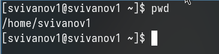{#fig:001 width=70%}

С помощью утилиты cd переходим в подкаталог tmp корневого каталога (рис. 2).

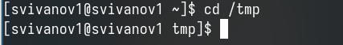{#fig:002 width=70%}

С помощью команды ls, просмотрим содержимое каталога tmp (рис. 3).

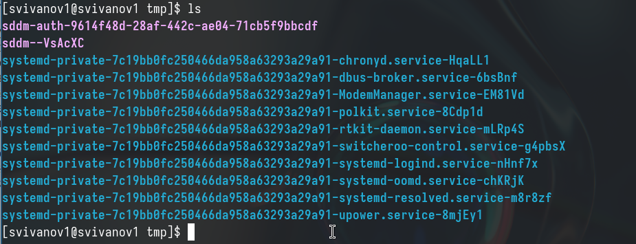{#fig:003 width=70%}

Пробую использовать команду ls с разными опциями. Опция -l позволит увидеть дополнительную информацию о файлах в каталоге: время создания, владельца, права (рис. 4).

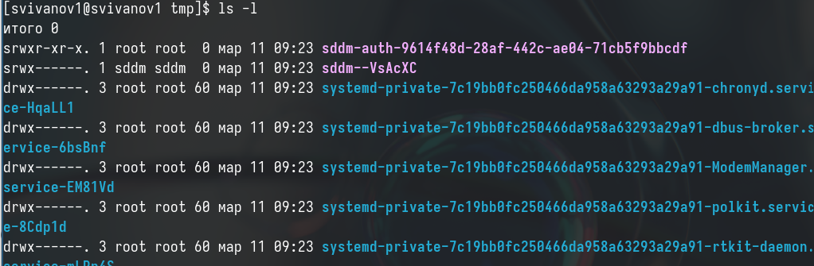{#fig:004 width=70%}

Опция -a покажет скрытые файлы в каталоге (рис. 5). 

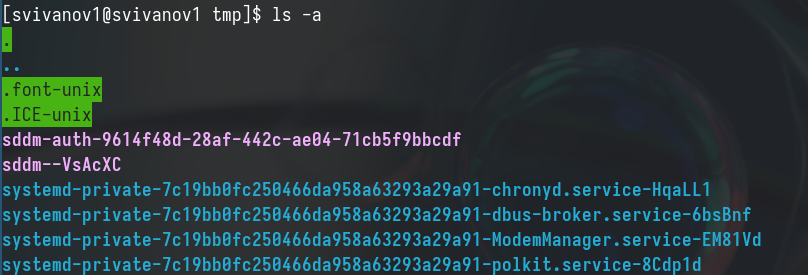{#fig:005 width=70%}

Перехожу в каталог /var/spool/ с помощью cd.
Чтобы определить, есть ли в каталоге подкатлог с соответствющим именем, Воспользуемся утилитой ls с флагом -F, чтобы проверить, что мы найдем именно каталог. И да, в директории действительно есть такой каталог (рис. 6). 

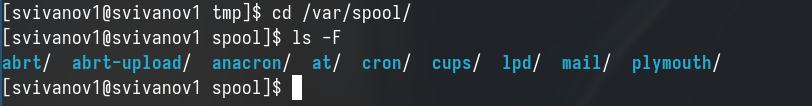{#fig:006 width=70%}

Возвращаюсь в домашний каталог, для этого достаточно ввести команду cd. Затем проверяю содержимое каталога с помощью утилиты ls, опция -l позволяет определить владельцев файлов, опция -a показывает все содержимое каталога, -F поможет определить что из содержимого каталога файл, а что каталог (рис. 7). 

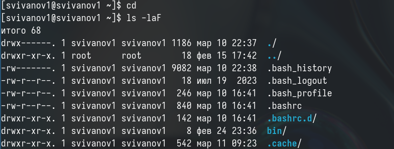{#fig:007 width=70%}

Создаю директорию newdir с помощью утилиты mkdir, затем проверяю, что директория создалась с помощью ls (рис. 8).

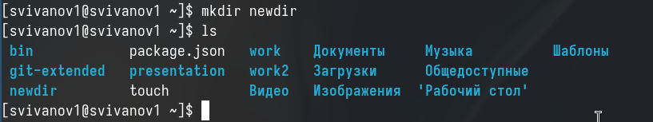{#fig:008 width=70%}

Создаю для каталога newdir подкаталог morefun, проверяю, что каталог создан (рис. 9).

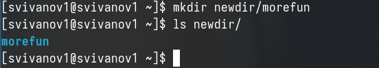{#fig:009 width=70%}

Чтобы создать несколько директорий одной строчкой нужно перечислить назваания директорий через пробел после утилиты mkdir. Проверяю, что все файлы созданы. (рис. 10).

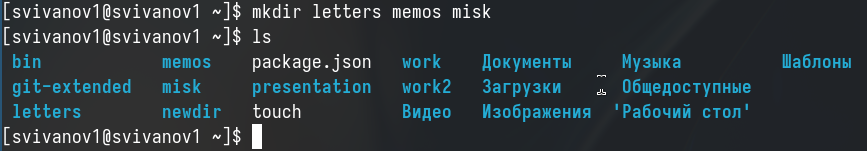{#fig:010 width=70%}

Чтобы удалить несколько пустых директорий одной строчкой нужно перечислить назваания директорий через пробел после утилиты rmdir. Проверяю, что все файлы удалены. (рис. 11). 

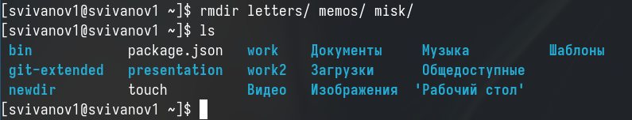{#fig:011 width=70%}

Пытаюсь удалить newdir с помощью rm. Утилита rm по умолчанию удаляет файлы, но newdir не пустая дериктория, поэтому нужно добавить опцию для рекурсивного удаления -r. Использовалась утилиты без опций, поэтому каталог не был удален (рис. 12). 

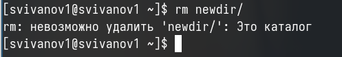{#fig:012 width=70%}

Удаляю директорию newdir с помощью утилиты rmdir, т.к директория не пустая, я добавляю флаг удалить рекурсивно -p, чтобы удалилсь и все подкаталоги (рис. 13). 

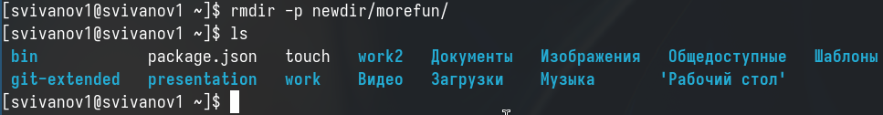{#fig:013 width=70%}

С помощью команды man ls я могу прочесть документацию к команде ls, опция, которая позолить выводить все подкаталоги каталогов предоставлена на скриншоте, это -R  (рис. 14). 

{#fig:014 width=70%}

Так как мне нужно найти опцию утилиты ls для сортировки, то логично сузить поиск до результатов с таким же вопросом. Выясняем, что для сортировки и вывода информации нужна комбинация опций -lt. (рис. 15). 

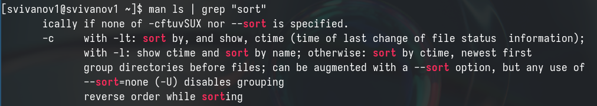{#fig:015 width=70%}

С помощью man cd узнаю описание команды cd и ее опции. Основных опций немного.
1. -P - позволяет следовать по символическим ссылкам перед тем, как обработаны все переходы '..'
3. -L - переходит по символическим ссылкам только после того, как обработаны все переходы ".."
4. -e - позволяет выйти с ошибкой, если диреткория, в которую нужно перейти, не найдена. (рис. 16).

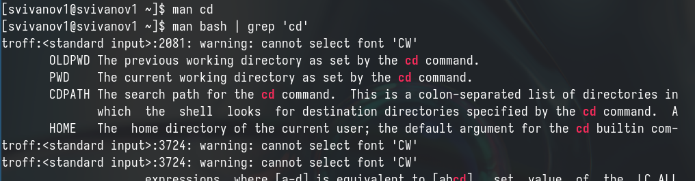{#fig:016 width=70%}

С помощью man pwd узнаю описание команды pwd и ее опции.
1. -L - брать директорию из переменной окружения, даже если она содержит символические ссылки.
2. -P - отбрасывать все символические ссылки. (рис. 17).

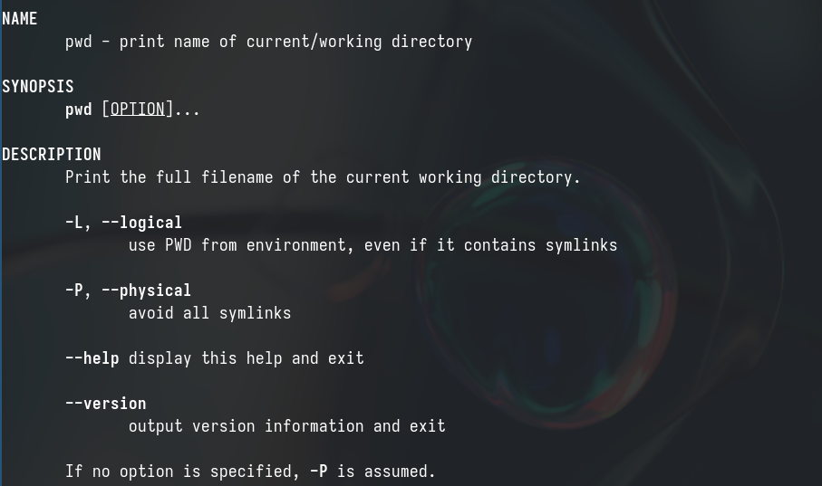{#fig:017 width=70%}

С помощью man mkdir узнаю описание команды mkdir и ее опции 
1. -m - устанавливает права доступа создаваемой директории как chmod, синтаксис тоже как у chmod.
2. -p - позволяет рекурсивно создавать директории и их подкаталоги
3. -v - выводи сообщение о созданных директориях
4. -z - установить контекст SELinux для создаваемой директории по умолчанию
5. -context - установить контекст SELinux для создаваемой директории в значении CTX (рис. 18).

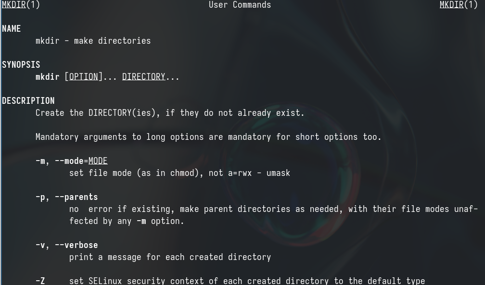{#fig:018 width=70%}

С помощью man rmdir узнаю описание команды rmdir и ее опции 
1. --ignore-fail-on-non-empty - отменяет вывод ошибки, если каталог не пустой, просто его игнорирует
2. -p - удаляет рекурсивно каталоги, если они все содержат в себе только удаляемый каталог
3. -v - выводит сообщение о каждом удалении  директории. (рис. 19).

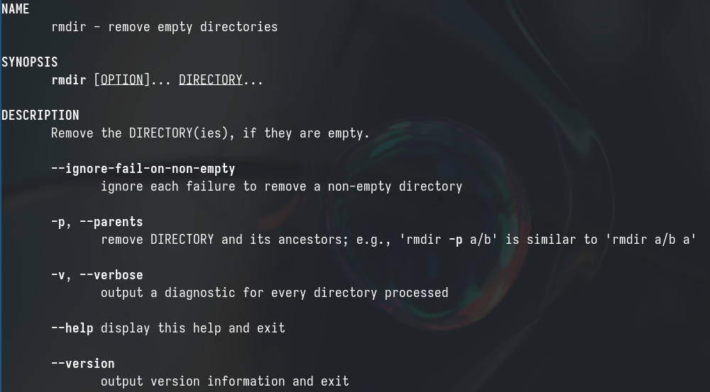{#fig:019 width=70%}

С помощью man rm узнаю описание команды rm и ее опции.
1. -f - игнорировать несуществующие файлы или аргументы, никогда не выводить запрос на подтверждение удаления
2. -i - выводить запрос на подтверждение удаления каждого файла
3. -I - вывести запрос на подтверждение удаления один раз, для всех файлов, если удаляется больше 3-х файлов или идет рекурсивное удаление
4. --interactive - заменяет предыдущие три опции, можно выбрать одну из них.
5. --one-file-system - во время рекурсивного удаления пропускать директории из других файловых систем
6. --no-preserve-root если в качестве директории задана корневая, то считать что это обычная директория и начать удаление.
7. -r, -R - удаляет директории их содержимое рекурсивно
8. -d, --dir - удаляет пустые директории
9. -v - прописывает все действия команды (рис. 20).

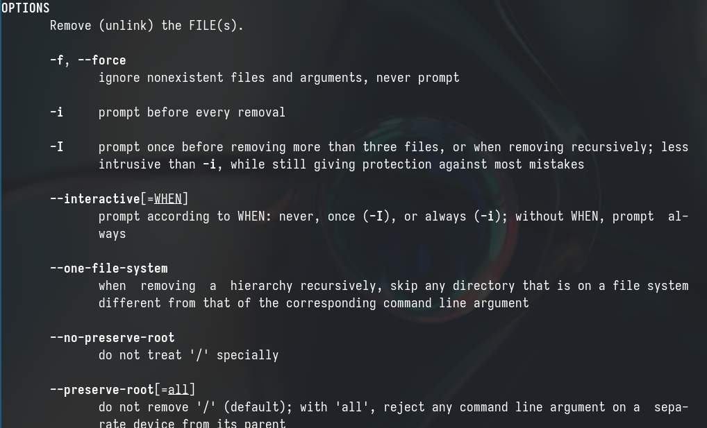{#fig:020 width=70%}

Опции --help --version применимы почти ко всем утилитам, они показывают справку по команде и ее версию соответственно. Выводим историю команд с помощью утилиты history (рис. 21).

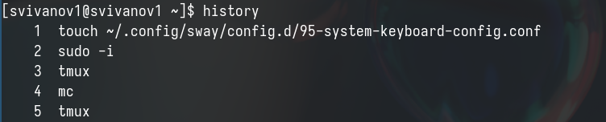{#fig:021 width=70%}

Модифицирую команду (рис. 22).

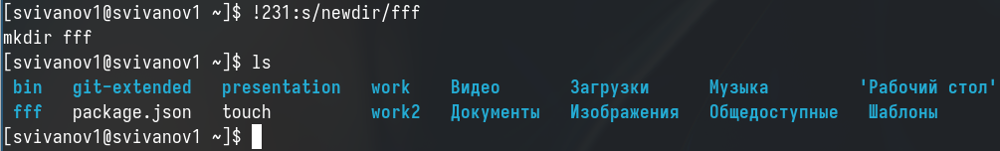{#fig:022 width=70%}

Модифицирую команду (рис. 23).

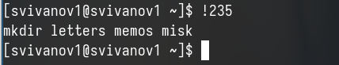{#fig:023 width=70%}

# Выводы

Я приобрел практические навыки взаимодействия пользователя с системой посредством командной строки.

# Ответы на контрольные вопросы

1. Командная строка - это текстовая система, которая передает команды компьютеру и возвращает результаты пользователю, обычно в операционной системе типа Linux взаимодействие пользователя с системой осуществляется с помощью построчного ввода команд.
2. Для определения абсолютного пути к текущему каталогу используется команда pwd. Например: если я введу pwd в своем домашнем каталоге, то получу /home/svivanov1.
3. С помощью команды ls можно определить имена файлов, используя опцию -F для определения типов файлов, а если необходимы скрытые файлы, то добавим опцию -a. Пример можно найти в лабораторной работе.
4. С помощью команды ls можно определить имена файлов, а если требуются скрытые файлы, добавляем опцию -a. Пример можно найти в лабораторной работе.
5. rmdir по умолчанию удаляет пустые каталоги, не удаляя файлы, в то время как rm удаляет файлы, но не каталоги без опций (-d, -r). Можно удалить файл и каталог одной командой в одной строке. Если файл находится в каталоге, воспользуемся рекурсивным удалением; если файл и каталог не связаны, добавим опцию -d и введем имена через пробел после утилиты.
6. Информацию о последних выполненных командах пользователем можно увидеть с помощью history. Примеры приведены в лабораторной работе.
7. Для замены частей выполненной команды можно использовать синтаксис !номеркоманды в выводе history:s/что заменяем/на что заменяем. Примеры приведены в лабораторной работе.
8. Предположим, я не в домашнем каталоге. Если я введу "cd ; ls", то окажусь в домашнем каталоге и увижу список файлов в нем.
9. Символ экранирования (обратный слеш) добавляется перед спецсимволом, чтобы использовать его как обычный символ, а также позволяет системе читать названия директорий с пробелом. Пример: cd work/Операционные\ системы/
10. Опция -l в ls позволяет увидеть дополнительную информацию о файлах в каталоге, такую как время создания, владельца, права доступа.
11. Относительный путь к файлу начинается из текущей директории (она сама не включается в путь) и прописывается относительно данной директории, в то время как абсолютный путь начинается с корневого каталога.
12. Для получения справки по команде можно использовать man <имя команды> или <имя команды> --help.
13. Клавиша Tab.

