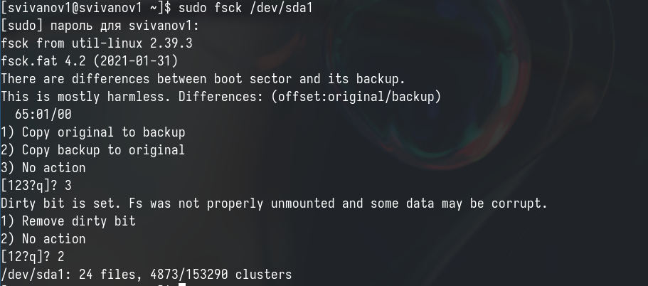
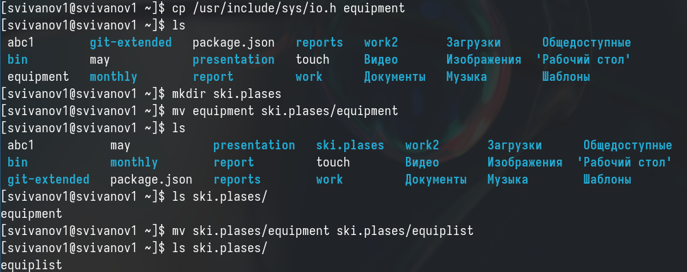

---
## Front matter
lang: ru-RU
title: Лабораторная работа № 7
subtitle: Операционные системы
author:
  - Иванов Сергей Владимирович, НПИбд-01-23
institute:
  - Российский университет дружбы народов, Москва, Россия
date: 15 марта 2024

## i18n babel
babel-lang: russian
babel-otherlangs: english

## Formatting pdf
toc: false
slide_level: 2
aspectratio: 169
section-titles: true
theme: metropolis
header-includes:
 - \metroset{progressbar=frametitle,sectionpage=progressbar,numbering=fraction}
 - '\makeatletter'
 - '\beamer@ignorenonframefalse'
 - '\makeatother'

  ## Fonts
mainfont: PT Serif
romanfont: PT Serif
sansfont: PT Sans
monofont: PT Mono
mainfontoptions: Ligatures=TeX
romanfontoptions: Ligatures=TeX
sansfontoptions: Ligatures=TeX,Scale=MatchLowercase
monofontoptions: Scale=MatchLowercase,Scale=0.9
---

## Цель работы

Целью данной лабораторной работы является ознакомление с файловой системой Linux, её структурой, именами и содержанием каталогов. Приобретение практических навыков по применению команд для работы
с файлами и каталогами, по управлению процессами, по проверке использования диска и обслуживанию файловой системы

## Задание

1. Выполнить все примеры из лабораторной работы
2. Выполнить команды по копированию, созданию и перемещению файлов и каталогов
3. Определить опции команды chmod
4. Изменить права доступа к файлам
5. Прочитать документацию о командах mount, fsck, mkfs, kill

# Выполнение работы

## Создание файла

Создаем файл, дважды копируем его и проверяем, что все команды были выполнены корректно.

{#fig:001 width=70%}

## Создание директории

Создаю директорию, копирую в нее два созданных файла, проверяю, что все скопировалось

{#fig:002 width=70%}

## Копирование файла

Копирую файл, находящийся не в текущей диреткории в файл с новым именем тоже не текущей директории

{#fig:003 width=70%}

## Создание директории

Создаю новую директорию. Копирую предыдущую созданную директорию со всем содержимым в каталог /tmp. Затем копирую предыдущую созданную директорию в новую созданную

{#fig:004 width=70%}

## Переименовывание файла

Переименовываю файл, затем перемещаю его в каталог

{#fig:005 width=70%}

## Создание директории

Создаю новую директорию, переименовываю файлы, перемещаю директорию в директорию reports, переименовываю эту директорию, убираю из названия 01

{#fig:006 width=70%}

## Изменение прав доступа

Создаю пустой файл, проверяю права доступа у него, изменяю права доступа, добавляя пользователю возможность выполнять файл

{#fig:007 width=70%}

## Изменение прав доступа

Меняю права доступа у директории: группы и остальные пользователи не смогут ее прочетсь

{#fig:008 width=70%}

## Изменение прав доступа

Изменяю права доступа у директории, запрещаю группам и остальным пользователям читать. Создаю новый пустой файл, даю ему права доступа: группы могут читать и писать содержимое

{#fig:009 width=70%}

## Проверка файловой системы

Проверяю файловую систему

{#fig:010 width=70%}

## Копирование файла

Копирую файл в домашний каталог с новым именем, создаю новую пустую директорию, перемещаю файл в нее, переименовываю файл

{#fig:011 width=70%}

## Создание файла

Создаю новый файл, копирую его в новую директорию, но сразу с новым именем. Создаю внутри этого каталога подкаталог, перемещаю файлы в подкаталог

{#fig:012 width=70%}

## Создание директории

Создаю новую директорию, перемещаю ее с новым именем в директорию, созданную в прошлый раз

{#fig:013 width=70%}

## Изменение прав доступа

Проверяю, какие права нужно поменять и как, чтобы у новой директории были нужные по заданию права

{#fig:014 width=70%}

## Изменение прав доступа

Проверяю, какие права нужно поменять и как, чтобы у новых файлов были нужные по заданию права

{#fig:015 width=70%}

## Изменение прав доступа

Создаю файл, добавляю право на исполнение и убираю право на запись для владельца, затем создаю следующий файл, ему в правах доступа добавляю право на запись для группы

{#fig:016 width=70%}

## Чтение файла

Читаю содержимое файла

{#fig:017 width=70%}

## Копирование файла

Копирую файл с новым именем, перемещаю его в ранее созданную директорию, копирую ее с новым именем, копирую в нее скопированную до этого папку

{#fig:018 width=70%}

## Изменение прав доступа

Убираю право на чтение у файла для создателя, поэтому не могу его прочесть, также не могу его скопировать, потому что отказано в доступе на чтение, возвращаю все права 

{#fig:019 width=70%}

## Работа с правами доступа

Убираю у директории право на исполнение для пользователя, пытаюсь в нее войти - отказано в доступе, возвращаю все права

{#fig:020 width=70%}

## Чтение документации

Я прочитал описание каждой из четырех команд с помощью man: - mount, - fsck, - mkfs, - Kill

{#fig:021 width=70%}

# Вывод

## Вывод 

При выполнении данной лабораторной работы я ознакомился с файловой системой Linux, её структурой, именами и содержанием каталогов. Приобрел практические навыки по применению команд для работы
с файлами и каталогами, по управлению процессами, по проверке использования диска и обслуживанию файловой системы.

## Список литературы

:::{#refs}

https://esystem.rudn.ru/mod/page/view.php?id=1098933

:::

