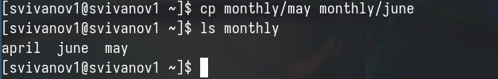
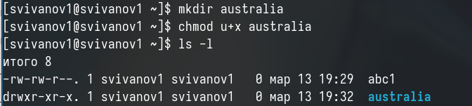

---
## Front matter
title: "Отчет по лабораторной работе №7"
subtitle: "Дисциплина: Операционные системы"
author: "Иванов Сергей Владимирович"

## Generic otions
lang: ru-RU
toc-title: "Содержание"

## Bibliography
bibliography: bib/cite.bib
csl: pandoc/csl/gost-r-7-0-5-2008-numeric.csl

## Pdf output format
toc: true # Table of contents
toc-depth: 2
lof: true # List of figures
fontsize: 12pt
linestretch: 1.5
papersize: a4
documentclass: scrreprt
## I18n polyglossia
polyglossia-lang:
  name: russian
  options:
	- spelling=modern
	- babelshorthands=true
polyglossia-otherlangs:
  name: english
## I18n babel
babel-lang: russian
babel-otherlangs: english
## Fonts
mainfont: PT Serif
romanfont: PT Serif
sansfont: PT Sans
monofont: PT Mono
mainfontoptions: Ligatures=TeX
romanfontoptions: Ligatures=TeX
sansfontoptions: Ligatures=TeX,Scale=MatchLowercase
monofontoptions: Scale=MatchLowercase,Scale=0.9
## Biblatex
biblatex: true
biblio-style: "gost-numeric"
biblatexoptions:
  - parentracker=true
  - backend=biber
  - hyperref=auto
  - language=auto
  - autolang=other*
  - citestyle=gost-numeric
## Pandoc-crossref LaTeX customization
figureTitle: "Рис."
listingTitle: "Листинг"
lofTitle: "Список иллюстраций"
lolTitle: "Листинги"
## Misc options
indent: true
header-includes:
  - \usepackage{indentfirst}
  - \usepackage{float} # keep figures where there are in the text
  - \floatplacement{figure}{H} # keep figures where there are in the text
---

# Цель работы

Целью данной лабораторной работы является ознакомление с файловой системой Linux, её структурой, именами и содержанием каталогов. Приобретение практических навыков по применению команд для работы
с файлами и каталогами, по управлению процессами, по проверке использования диска и обслуживанию файловой системы

# Задание

1. Выполнить все примеры из лабораторной работы
2. Выполнить команды по копированию, созданию и перемещению файлов и каталогов
3. Определить опции команды chmod
4. Изменить права доступа к файлам
5. Прочитать документацию о командах mount, fsck, mkfs, kill

# Выполнение лабораторной работы

Создаем файл, дважды копируем его с новыми имнами и проверяем, что все команды были выполнены корректно. (рис. 1).

{#fig:001 width=70%}

Создаю директорию, копирую в нее два файла, созданных на прошлом этапе, проверяю, что все скопировалось (рис. 2).

{#fig:002 width=70%}

Копирую файл, находящийся не в текущей диреткории в файл с новым именем тоже не текущей директории (рис. 3).

{#fig:003 width=70%}

Создаю новую директорию. Копирую предыдущую созданную директорию вместе со всем содержимым в каталог /tmp. Затем копирую предыдущую созданную директорию в новую созданную (рис. 4).

{#fig:004 width=70%}

Переименовываю файл, затем перемещаю его в каталог (рис. 5). 

{#fig:005 width=70%}

Создаю новую директорию, переименовываю monthly.00 в monthly.01, перемещаю директорию в директорию reports, переименовываю эту директорию, убираю из названия 01 (рис. 6). 

{#fig:006 width=70%}

Создаю пустой файл, проверяю права доступа у него, изменяю права доступа, добавляя пользователю (создателю) возможность выполнять файл (рис. 7). 

{#fig:007 width=70%}

Меняю права доступа у директории: группы и остальные пользователи не смогут ее прочетсь (рис. 8).

{#fig:008 width=70%}

Изменяю права доступа у директории, запрещаю группам и остальным пользователям читать. Создаю новый пустой файл, даю ему права доступа: группы могут читать и писать содержимое (рис. 9).

{#fig:009 width=70%}

Проверяю файловую систему (рис. 10).

{#fig:010 width=70%}

Копирую файл в домашний каталог с новым именем, создаю новую пустую директорию, перемещаю файл в эту директорию, переименовываю файл (рис. 11). 

{#fig:011 width=70%}

Создаю новый файл, копирую его в новую директорию, но уже сразу с новым именем. Создаю внутри этого каталога подкаталог, перемещаю файлы в подкаталог (рис. 12). 

{#fig:012 width=70%}

Создаю новую директорию, в этой же строчке перемещаю ее с новым именем в директорию, созданную в прошлый раз (рис. 13). 

{#fig:013 width=70%}

Проверяю, какие права нужно поменять и как, чтобы у новой директории были нужные по заданию права (рис. 14). 

{#fig:014 width=70%}

Проверяю, какие права нужно поменять и как, чтобы у новых файлов были нужные по заданию права (рис. 15). 

{#fig:015 width=70%}

Создаю файл, добавляю в правах доступа право на исполнение и убираю право на запись для владельца, затем создаю следующий файл, ему в правах доступа добавляю право на запись для группы (рис. 16).

{#fig:016 width=70%}

Читаю содержимое файла (рис. 17).

{#fig:017 width=70%}

Копирую файл с новым именем, перемещаю его в ранее созданную директорию, рекурсивно ее копирую с новым именем, рекурсивно копирую в нее скопированную до этого папку (рис. 18).

{#fig:018 width=70%}

Убираю право на чтение у файла для создателя, поэтому не могу его прочесть, также не могу его скопировать, потому что отказано в доступе на чтение, возвращаю все права (рис. 19).

{#fig:019 width=70%}

Убираю у директории право на исполнение для пользователя, пытаюсь в нее войти - отказано в доступе, возвращаю все права (рис. 20).

{#fig:020 width=70%}

Я прочитал описание каждой из четырех команд с помощью man
- mount — утилита командной строки в UNIX-подобных операционных системах. Применяется для монтирования файловых систем.
- fsck (проверка файловой системы) - это утилита командной строки, которая позволяет выполнять проверки согласованности и интерактивное исправление в одной или нескольких файловых системах Linux. Он использует программы, специфичные для типа файловой системы, которую он проверяет.
- mkfs используется для создания файловой системы Linux на некотором устройстве, обычно в разделе жёсткого диска. В качестве аргумента filesys для файловой системы может выступать или название устройства
- Команда Kill посылает указанный сигнал указанному процессу. Если не указано ни одного сигнала, посылается сигнал SIGTERM. Сигнал SIGTERM завершает лишь те процессы, которые не обрабатывают его приход. Для других процессов может быть необходимым послать сигнал SIGKILL, поскольку этот сигнал перехватить невозможно. (рис. 21)

{#fig:021 width=70%}

# Контрольные вопросы

1. На жестком диске компьютера, на котором проводилась лабораторная работа, были установлены различные файловые системы, такие как Ext2, Ext3, Ext4, Btrfs и Extended Filesystem. Файловая система Extended Filesystem является стандартной для Linux и отличается высокой стабильностью и большим количеством функций. Ext2, Ext3 и Ext4 представляют собой последовательные версии файловой системы Ext, с каждой последующей версией вносятся улучшения, включая стабильность и увеличение максимального размера раздела. Btrfs - новая файловая система, ориентированная на отказоустойчивость, легкость администрирования и восстановления данных, хотя некоторые пользователи считают её нестабильной.

2. Общая структура файловой системы включает корневой каталог "/", который содержит всю иерархию системы, и другие директории первого уровня, такие как: /bin — здесь находятся двоичные исполняемые файлы. Основные общие команды, хранящиеся отдельно от других программ в системе (прим.: pwd, ls, cat, ps);

/boot — тут расположены файлы, используемые для загрузки системы (образ initrd, ядро vmlinuz);

/dev — в данной директории располагаются файлы устройств (драйверов). С помощью этих файлов можно взаимодействовать с устройствами. К примеру, если это жесткий диск, можно подключить его к файловой системе. В файл принтера же можно написать напрямую и отправить задание на печать;

/etc — в этой директории находятся файлы конфигураций программ. Эти файлы позволяют настраивать системы, сервисы, скрипты системных демонов;

/home — каталог, аналогичный каталогу Users в Windows. Содержит домашние каталоги учетных записей пользователей (кроме root). При создании нового пользователя здесь создается одноименный каталог с аналогичным именем и хранит личные файлы этого пользователя;

/lib — содержит системные библиотеки, с которыми работают программы и модули ядра;

/lost+found — содержит файлы, восстановленные после сбоя работы системы. Система проведет проверку после сбоя и найденные файлы можно будет посмотреть в данном каталоге;

/media — точка монтирования внешних носителей. Например, когда вы вставляете диск в дисковод, он будет автоматически смонтирован в директорию /media/cdrom;

/mnt — точка временного монтирования. Файловые системы подключаемых устройств обычно монтируются в этот каталог для временного использования;

/opt — тут расположены дополнительные (необязательные) приложения. Такие программы обычно не подчиняются принятой иерархии и хранят свои файлы в одном подкаталоге (бинарные, библиотеки, конфигурации);

/proc — содержит файлы, хранящие информацию о запущенных процессах и о состоянии ядра ОС;

/root — директория, которая содержит файлы и личные настройки суперпользователя;

/run — содержит файлы состояния приложений. Например, PID-файлы или UNIX-сокеты;

/sbin — аналогично /bin содержит бинарные файлы. Утилиты нужны для настройки и администрирования системы суперпользователем;

/srv — содержит файлы сервисов, предоставляемых сервером (прим. FTP или Apache HTTP);

/sys — содержит данные непосредственно о системе. Тут можно узнать информацию о ядре, драйверах и устройствах;

/tmp — содержит временные файлы. Данные файлы доступны всем пользователям на чтение и запись. Стоит отметить, что данный каталог очищается при перезагрузке;

/usr — содержит пользовательские приложения и утилиты второго уровня, используемые пользователями, а

не системой. Содержимое доступно только для чтения (кроме root). Каталог имеет вторичную иерархию и похож на корневой;

/var — содержит переменные файлы. Имеет подкаталоги, отвечающие за отдельные переменные. Например, логи будут храниться в /var/log, кэш в /var/cache, очереди заданий в /var/spool/ и так далее.

3. Для доступа к содержимому файловой системы операционная система должна выполнить операцию монтирования тома.

4. Основные причины нарушения целостности файловой системы могут включать отсутствие синхронизации между образом файловой системы в памяти и данными на диске при аварийном выключении, что может привести к различным ошибкам. Для исправления повреждений файловой системы можно использовать инструменты для восстановления данных или провести проверку и восстановление с помощью соответствующих командных инструментов.

5. Файловая система создается с помощью команды mkfs, которая позволяет создать файловую систему Linux.

6. Команда cat используется для вывода содержимого файла на стандартное устройство вывода. Команды head и tail позволяют просматривать первые и последние строки файла соответственно. Команда tac аналогична cat, но выводит строки в обратном порядке. Для просмотра больших текстовых файлов часто используются команды more и less для постраничного просмотра.

7. Команда cp в Linux используется для копирования или перемещения файлов и директорий.

8. Команда mv в Linux используется для переименования или перемещения файлов и директорий.

9. Права доступа определяют, кто и как может обращаться к файлам или каталогам. Они могут быть изменены с помощью команды chmod, доступной владельцу файла или директории или пользователю с правами администратора.

# Выводы

При выполнении данной лабораторной работы я ознакомился с файловой системой Linux, её структурой, именами и содержанием каталогов. Приобрел практические навыки по применению команд для работы
с файлами и каталогами, по управлению процессами, по проверке использования диска и обслуживанию файловой системы.

