---
## Front matter
lang: ru-RU
title: Лабораторная работа № 8
subtitle: Операционные системы
author:
  - Иванов Сергей Владимирович, НПИбд-01-23
institute:
  - Российский университет дружбы народов, Москва, Россия
date: 17 марта 2024

## i18n babel
babel-lang: russian
babel-otherlangs: english

## Formatting pdf
toc: false
slide_level: 2
aspectratio: 169
section-titles: true
theme: metropolis
header-includes:
 - \metroset{progressbar=frametitle,sectionpage=progressbar,numbering=fraction}
 - '\makeatletter'
 - '\beamer@ignorenonframefalse'
 - '\makeatother'

  ## Fonts
mainfont: PT Serif
romanfont: PT Serif
sansfont: PT Sans
monofont: PT Mono
mainfontoptions: Ligatures=TeX
romanfontoptions: Ligatures=TeX
sansfontoptions: Ligatures=TeX,Scale=MatchLowercase
monofontoptions: Scale=MatchLowercase,Scale=0.9
---

## Цель работы

Цель данной лабораторной работы - ознакомление с инструментами поиска файлов и фильтрации текстовых данных, а также приобретение практических навыков по управлению процессами (и заданиями), по проверке использования диска и по обслуживанию файловых систем.

# Выполнение работы

## Запись в файл

Вхожу в систему под соотвествующим именем пользователя, открываю терминал, записываю в файл file.txt названия файлов из каталога /etc с помощью перенаправления ">" 

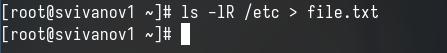{#fig:001 width=70%}

## Вывод содержимого файла

Проверяю, что в файл записались нужные значения с помощью утилиты head 

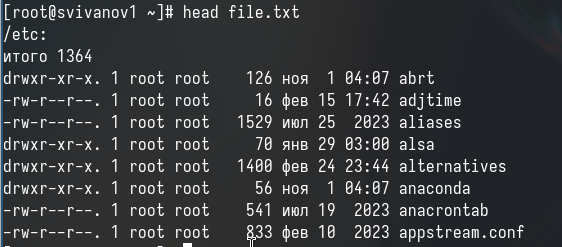{#fig:002 width=70%}

## Добавление данных в файл

Добавил в созданный файл имена файлов из домашнего каталога, используя перенаправление ">>" в режиме добавления

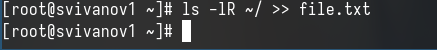{#fig:003 width=70%}

## Поиск файлов определенного расширения

Вывожу на экран имена всех файлов, имеющих расширение ".conf" с помощью утилиты grep

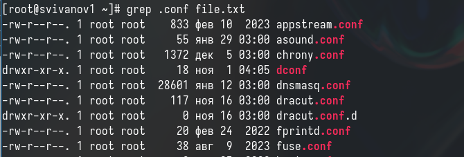{#fig:004 width=70%}

## Запись в файл

Добавляю вывод прошлой команды в новый файл conf.txt с помощью перенаправления ">" 

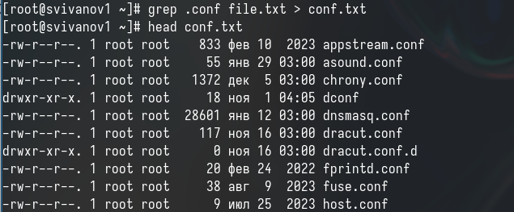{#fig:005 width=70%}

## Поиск файлов, начинающихся с определенного элемента

Определяю, какие файлы в домашнем каталоге начинаются с символа "c" с помощью утилиты find, прописываю ей в аргументах домашнюю директорию, выбираю опцию -name

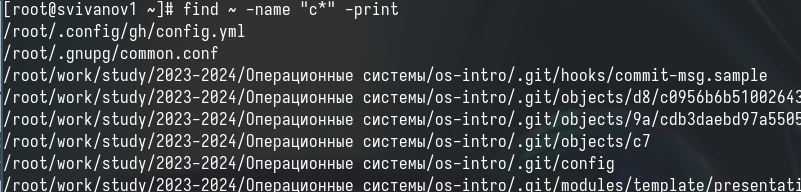{#fig:006 width=70%}

## Поиск файлов, начинающихся с определенного элемента

Второй способ использовать утилиту ls -lR и использовать grep. Но этот способ не работает для поиска файлов из подкаталогов

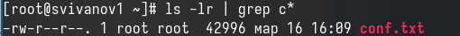{#fig:007 width=70%}

## Поиск файлов, начинающихся с определенного элемента

С помощью метода find ищу все файлы, начинающиеся с буквы "h" 

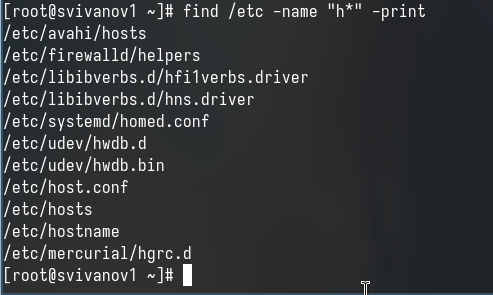{#fig:008 width=70%}

## Создание фонового процесса

Запускаю в фоновом режиме процесс, который будет записывать в файл logfile файлы, имена которых начинаются с log

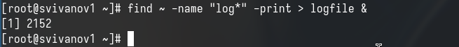{#fig:009 width=70%}

## Удаление файла

Проверяю, что файл создан, удаляю его, проверяю, что файл удален

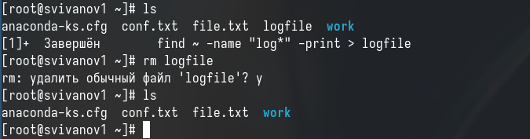{#fig:010 width=70%}

## Создание фонового процесса

Запускаю в консоли в фоновом режиме редактор gedit

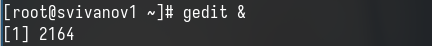{#fig:011 width=70%}

## Поиск идентификатора процесса

С помощью утилиты ps определяю идентификатор процесса gedit. Также мы можем сделать это с помощью pgrep. 

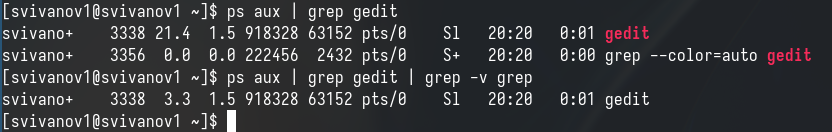{#fig:012 width=70%}

## Чтение документации

Прочитал справку команды kill 

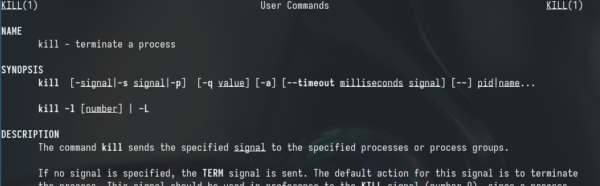{#fig:013 width=70%}

## Удаление процесса

Использую команду kill и идентификатор процесса, чтобы его удалить. Замечаем, что закрылась программа gedit.

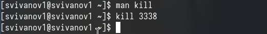{#fig:014 width=70%}

## Чтение документации

Прочитал документацию про функции df и du

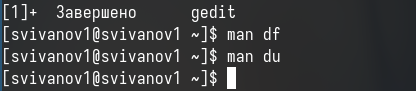{#fig:015 width=70%}

## Утилита df

Использую утилиту df, чтобы выяснить, сколько свободного места есть у нашей системы.

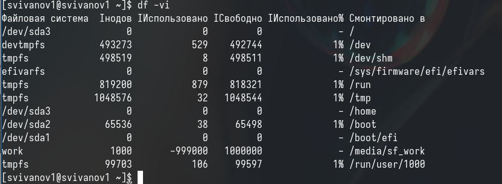{#fig:016 width=70%}

## Утилита du

Использую утилиту du. Она нужна чтобы просмотреть, сколько места занимают файлы в определенной директории.

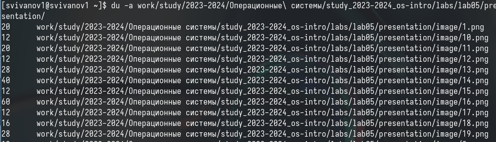{#fig:017 width=70%}

## Чтение документации

Прочитал документацию о команде find 

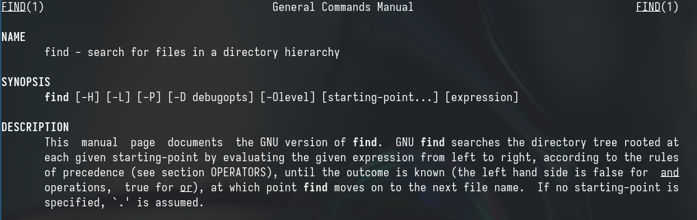{#fig:018 width=70%}

## Вывод директорий

Вывожу имена всех директорий, имеющихся в моем домашнем каталоге.

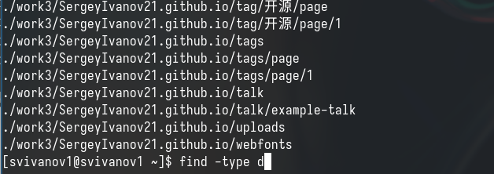{#fig:019 width=70%}

# Вывод

## Вывод 

В результате выполнения лабораторной работы я ознакомился с инструментами поиска файлов и фильтрации текстовых данных, а также приобрел практические навыки по управлению процессами (и заданиями), по проверке использования диска и по обслуживанию файловых систем.

## Список литературы

:::{#refs}

https://esystem.rudn.ru/mod/page/view.php?id=1098933

:::

