---
## Front matter
lang: ru-RU
title: Лабораторная работа № 9
subtitle: Операционные системы
author:
  - Иванов Сергей Владимирович, НПИбд-01-23
institute:
  - Российский университет дружбы народов, Москва, Россия
date: 20 марта 2024

## i18n babel
babel-lang: russian
babel-otherlangs: english

## Formatting pdf
toc: false
slide_level: 2
aspectratio: 169
section-titles: true
theme: metropolis
header-includes:
 - \metroset{progressbar=frametitle,sectionpage=progressbar,numbering=fraction}
 - '\makeatletter'
 - '\beamer@ignorenonframefalse'
 - '\makeatother'

  ## Fonts
mainfont: PT Serif
romanfont: PT Serif
sansfont: PT Sans
monofont: PT Mono
mainfontoptions: Ligatures=TeX
romanfontoptions: Ligatures=TeX
sansfontoptions: Ligatures=TeX,Scale=MatchLowercase
monofontoptions: Scale=MatchLowercase,Scale=0.9
---

## Цель работы

Цель данной лабораторной работы - освоение основных возможностей командной оболочки Midnight Commander, приобретение навыков практической работы по просмотру каталогов и файлов; манипуляций с ними

# Выполнение работы

## Чтение документации

С помощью команды man mc читаю документацию про командную оболочку 

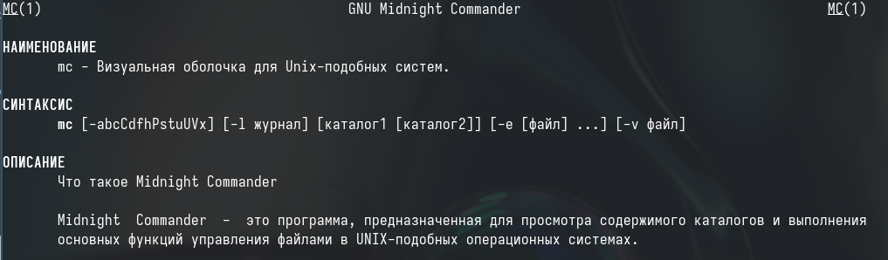{#fig:001 width=70%}

## Окно mc

Ввожу в терминале mc и получаю окно, в котором далее могу работать 

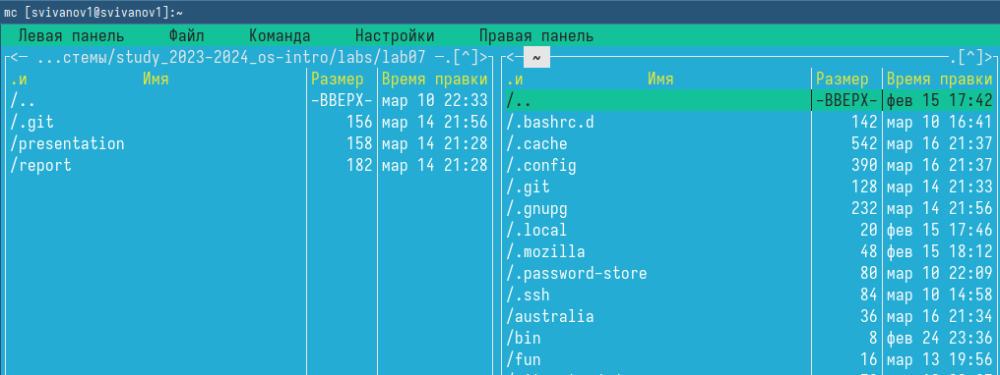{#fig:002 width=70%}

## Перемещение между директориями

С помощью стрелочек влево вправо я могу перемещаться по директориям, а с помощью клавиш вверх вниз перебирать файлы

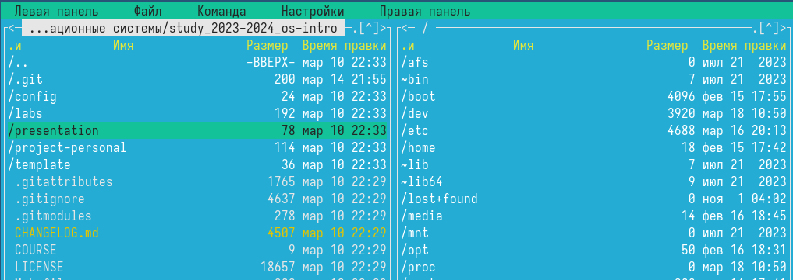{#fig:003 width=70%}

## Копирование файла

С помощью F5 могу создать копию файла в выбранном каталоге 

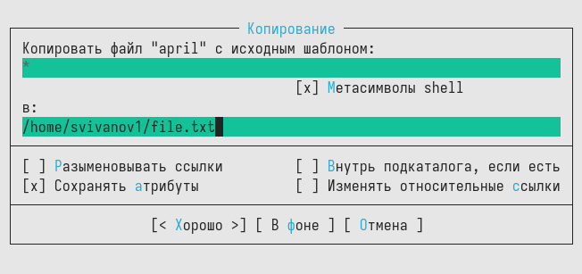{#fig:004 width=70%}

## Просмотр и изменение прав доступа

С помощью управляющих клавиш можно получить информацию о правах доступа на файл и информацию о нем

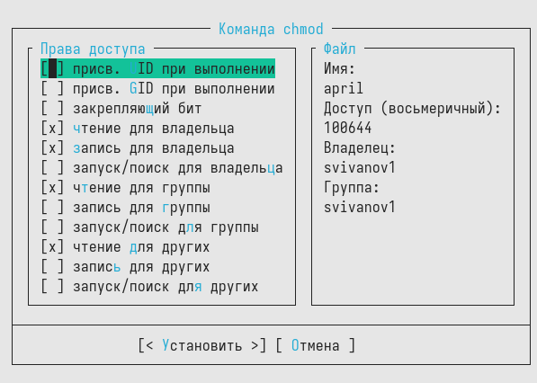{#fig:005 width=70%}

## Вывод информации о файле

В меню правой панели вывел информацию о файле, получая больше информации чем в выводе ls -l

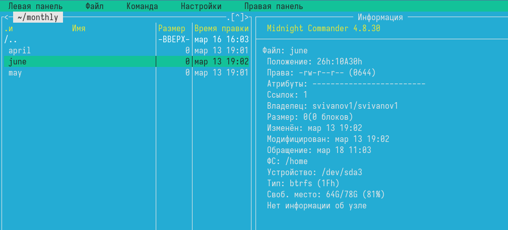{#fig:006 width=70%}

## Открытие файла на изменение

Используя возможности подменю "Файл" просматриваю содержимое текстового файла  

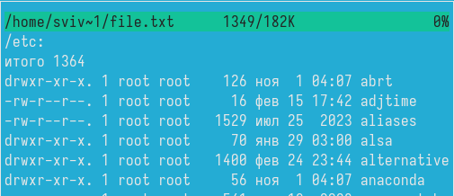{#fig:007 width=70%}

## Сохранение изменений

Открываю файл на изменение, меняю пару строк и закрываю файл без сохранения 

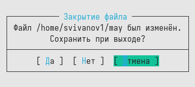{#fig:008 width=70%}

## Создание нового каталога

Создаю новый каталог

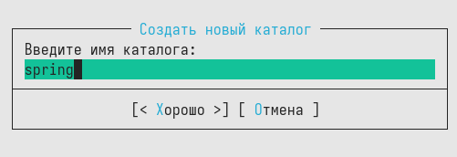{#fig:009 width=70%}

## Копирование файла

Копирую файл в созданный каталог. Действия выше можно было сделать с помощью горячих клавиш. 

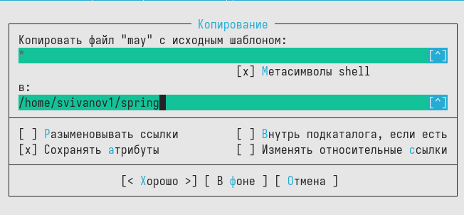{#fig:010 width=70%}

## Поиск файла с фильтром

С помощью средств подменю Команда можно найти файл с заданным условием, я искал файлы формата .txt

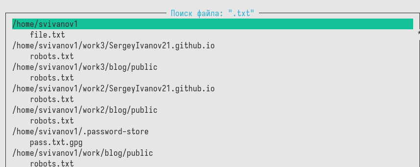{#fig:011 width=70%}

## Перемещение в директорию

Можно перемещаться между директориями, я перемещусь в домашнюю 

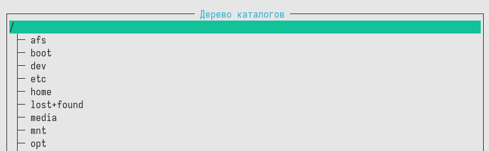{#fig:012 width=70%}

## Использование истории команд

Можно использовать историю команд и применить команду из истории, я применил копирование файла 

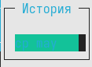{#fig:013 width=70%}

## Открытие файла расширения

Анализирую файл расширения. 

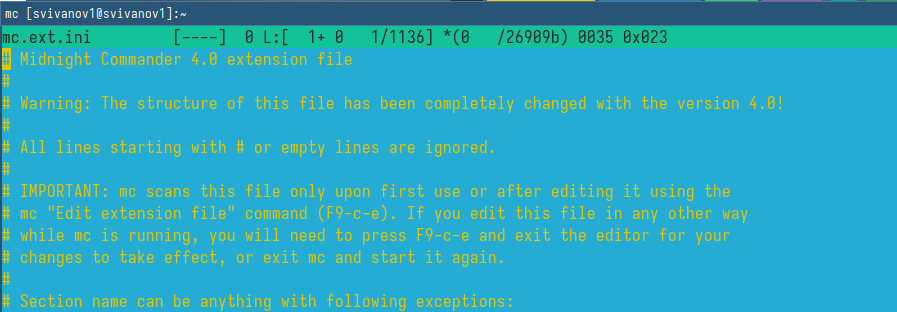{#fig:014 width=70%}

## Открытие файла меню

Анализирую файл меню 

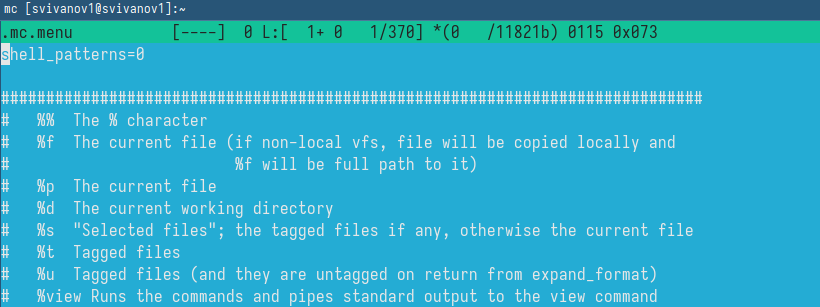{#fig:015 width=70%}

## Настройки панели

Из подменю настройки вызваю окна настройки панели.

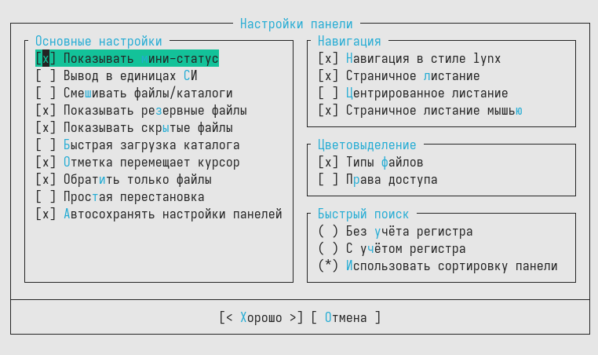{#fig:016 width=70%}

## Настройки внешнего вида

Настройки внешнего вида.

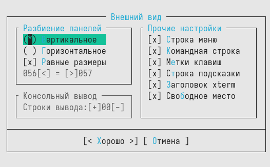{#fig:017 width=70%}

## Настройки распознавания клавиш

Настройки распознавания клавиш. 

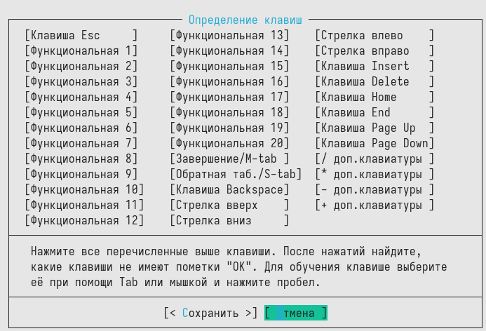{#fig:018 width=70%}

## Параметры конфигурации

Параметры конфигурации. 

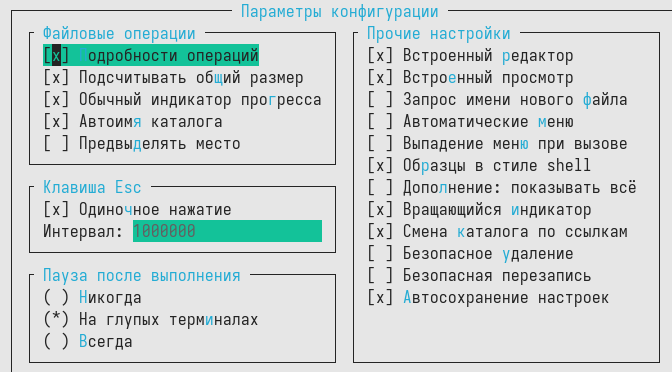{#fig:019 width=70%}

## Создание файла

Командой touch text.txt создаю файл 

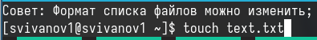{#fig:020 width=70%}

## Открытие файла и запись в него

Клавишей F4 открыл файл для записи, добавил в него текст 

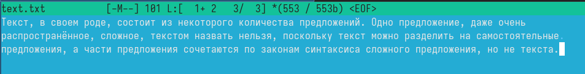{#fig:021 width=70%}

## Выделение текста

Выделяю текст с помощью клавиши F3 и кликов мышью  

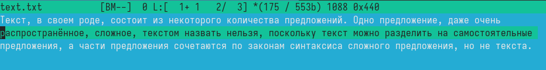{#fig:022 width=70%}

## Перемещение выделенного текста

Перемещаю выделенный текст с помощью клавиши F6 

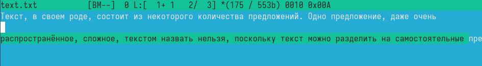{#fig:023 width=70%}

## Удаление строки

Удалил строку текста с помощью ctrl+y. 

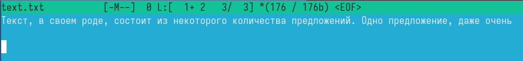{#fig:024 width=70%}

## Сохранение изменений в файле

Сохраняю изменения в файле с помощью горячей клавиши F2. 

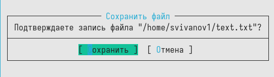{#fig:025 width=70%}

## Отмена последнего действия

С помощью ctrl+u отменяю поседнее действие и возвращаю удаленную строку  

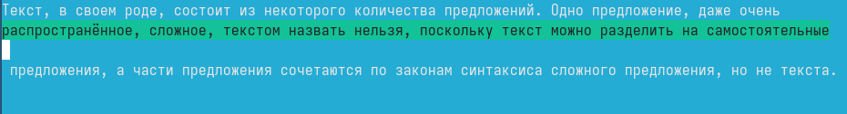{#fig:026 width=70%}

## Добавление текста в начало и в конец файла

С помощью клавиш pgup pgdn попадаю в начало и в конец файла и добавляю текст 

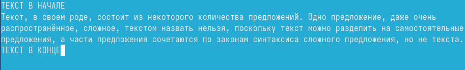{#fig:027 width=70%}

## Закрытие файла с сохранением изменений

Горячая клавиша F10 закрывает файл, дополнительно спрашивая сохранить ли в нем несохраненные изменения, сохраняю и закрываю. 

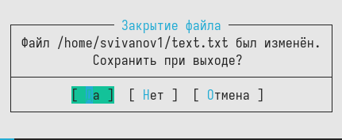{#fig:028 width=70%}

## Текст файла с кодом с подсветкой

Открываю файл формата .cpp, с кодом на С++, встроенный редактор mc вывел его содержимое с подсветкой 

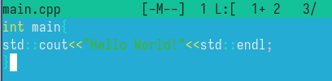{#fig:029 width=70%}

## Текст файла с кодом без подсветки

Отключаю подсветку и вывожу снова тот же самый файл, но уже без подсветки 

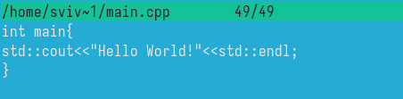{#fig:030 width=70%}

# Вывод

## Вывод 

В результате выполнения лабораторной работы мы изучили идеологию и применение средств контроля версий а также освоили умения по работе с git.

## Список литературы

:::{#refs}

https://esystem.rudn.ru/mod/page/view.php?id=1098933

:::

