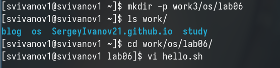
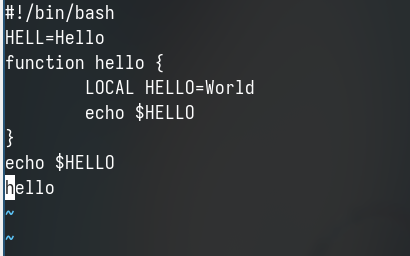
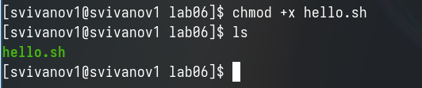
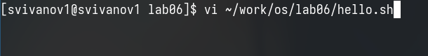
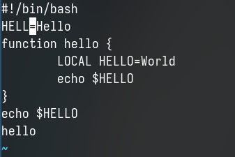
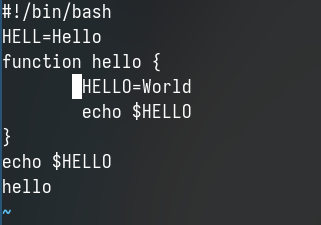
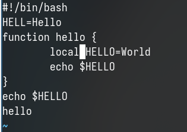
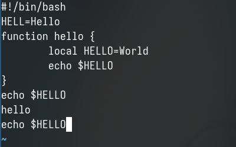
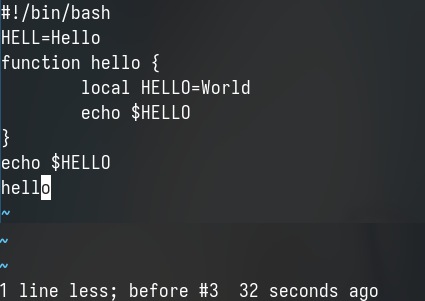
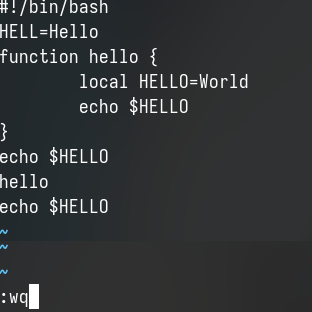

---
## Front matter
lang: ru-RU
title: Лабораторная работа № 10
subtitle: Операционные системы
author:
  - Иванов Сергей Владимирович, НПИбд-01-23
institute:
  - Российский университет дружбы народов, Москва, Россия
date: 6 апреля 2024

## i18n babel
babel-lang: russian
babel-otherlangs: english

## Formatting pdf
toc: false
slide_level: 2
aspectratio: 169
section-titles: true
theme: metropolis
header-includes:
 - \metroset{progressbar=frametitle,sectionpage=progressbar,numbering=fraction}
 - '\makeatletter'
 - '\beamer@ignorenonframefalse'
 - '\makeatother'

  ## Fonts
mainfont: PT Serif
romanfont: PT Serif
sansfont: PT Sans
monofont: PT Mono
mainfontoptions: Ligatures=TeX
romanfontoptions: Ligatures=TeX
sansfontoptions: Ligatures=TeX,Scale=MatchLowercase
monofontoptions: Scale=MatchLowercase,Scale=0.9
---

## Цель работы

Цель данной лабораторной работы - познакомиться с операционной системой Linux, получить практические навыки работы с редактором vi, установленным по умолчанию практически во всех дистрибутивах.

## Задание

1. Ознакомиться с теоретическим материалом.
2. Ознакомиться с редактором vi.
3. Выполнить упражнения, используя команды vi.

# Выполнение работы

## Создание файла через vi

Создаю директорию, перехожу в нее, создаю и открываю файл с помощью редактора vi

{#fig:001 width=70%}

## Запись в файл

Нажимаю i, чтобы начать редактирование и добавлять текст, добавляю текст

{#fig:002 width=70%}

## Режим последней строки

Нажимаю esc, чтобы выйти из режима добавления и перейти в командный режим. Перехожу в режим последней строки 

{#fig:003 width=70%}

## Сохранение и выход

Ввожу w для сохранения и q для выхода и нажимаю enter, после чего файл сохраняется

{#fig:004 width=70%}

## Обновление прав

С помощью chmod добавляю права на исполнение файла

{#fig:005 width=70%}

## Открытие с помощью текстового редактора

Снова открываю этот файл с помощью текстового редактора vi

{#fig:006 width=70%}

## Редактирование файла

Изменяю местоположение курсора 

{#fig:007 width=70%}

## Редактирование файла

В режиме добавления удаляю слово LOCAL, перехожу в командный режим с помощью esc 

{#fig:008 width=70%}

## Редактирование файла

В режиме добавления добавляю слово local, снова перехожу в командный режим с помощью esc 

{#fig:009 width=70%}

## Редактирование файла

В режиме добавления перехожу в конец последней строки и добавляю новую строку. Далее возвращаюсь в режим добавления, удаляю строку и возвращаюсь в командный режим.

{#fig:010 width=70%}

## Отмена последнего действия

В командном режиме нажимаю "u" и отменяю последнее действие

{#fig:011 width=70%}

## Сохранение и выход

Перехожу в режим последней строки и ввожу w для сохранения файла и q для выхода, нажимаю enter и файл закрылся 

{#fig:012 width=70%}

# Вывод

## Вывод 

При выполнении данной лабораторной работы я познакомился с операционной системой Linux, получил практические навыки работы с редактором vi, установленным по умолчанию практически во всех дистрибутивах.

## Список литературы

:::{#refs}

https://esystem.rudn.ru/mod/page/view.php?id=1098933

:::

