---
## Front matter
lang: ru-RU
title: Лабораторная работа № 11
subtitle: Операционные системы
author:
  - Иванов Сергей Владимирович, НПИбд-01-23
institute:
  - Российский университет дружбы народов, Москва, Россия
date: 15 апреля 2024

## i18n babel
babel-lang: russian
babel-otherlangs: english

## Formatting pdf
toc: false
slide_level: 2
aspectratio: 169
section-titles: true
theme: metropolis
header-includes:
 - \metroset{progressbar=frametitle,sectionpage=progressbar,numbering=fraction}
 - '\makeatletter'
 - '\beamer@ignorenonframefalse'
 - '\makeatother'

  ## Fonts
mainfont: PT Serif
romanfont: PT Serif
sansfont: PT Sans
monofont: PT Mono
mainfontoptions: Ligatures=TeX
romanfontoptions: Ligatures=TeX
sansfontoptions: Ligatures=TeX,Scale=MatchLowercase
monofontoptions: Scale=MatchLowercase,Scale=0.9
---

## Цель работы

Цель данной лабораторной работы - познакомиться с операционной системой Linux. Получить практические навыки работы с редактором Emacs.

## Задание

1. Ознакомиться с теоретическим материалом.
2. Ознакомиться с редактором emacs.
3. Выполнить упражнения.
4. Ответить на контрольные вопросы

# Выполнение работы

## Открытие программы

Открываю Emacs через терминал 

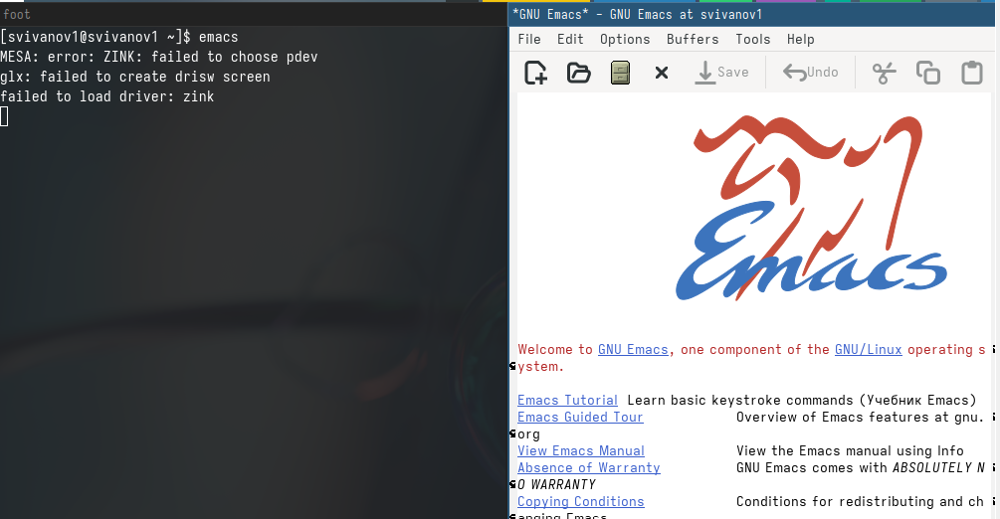{#fig:001 width=70%}

## Создание файла

Создаю файл lab07.sh с помощью комбинации Ctrl-x Ctrl-f 

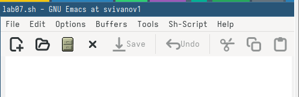{#fig:002 width=70%}

## Редактирование файла

Прописываю в файле текст программы 

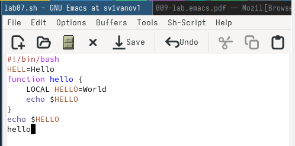{#fig:003 width=70%}

## Сохранение изменений в файле

Сохраняю файл с помощью комбинации C-x C-s 

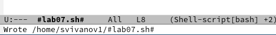{#fig:004 width=70%}

## Вырезание строки

Вырезаю одной командой целую строку (С-k) 

{#fig:005 width=70%}

## Вставка строки в конце файла

Вставляю эту строку в конец файла (C-y) 

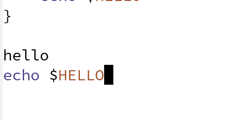{#fig:006 width=70%}

## Вырезанная область

Выделяю область текста (C-space), копирую область в буфер обмена (M-w), вырезаю эту область с помощью C-w 

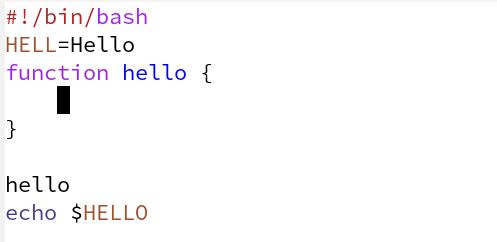{#fig:007 width=70%}

## Вставка в конец файла

Вставляю область в конец файла (С-у) 

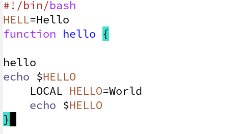{#fig:008 width=70%}

## Отмена последнего действия

Отменяю последнее действие С-/ 

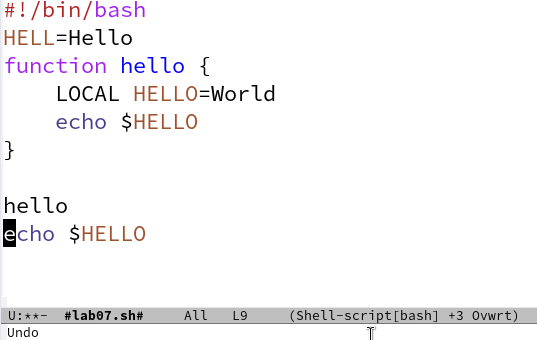{#fig:009 width=70%}

## Курсор в начале строки

Перевожу курсор в начало строки С-а 

{#fig:010 width=70%}

## Курсор в конце строки

Перемещаю курсор в конец строки С-е 

{#fig:011 width=70%}

## Начало буфер

Перемещаю курсор в начало файла М-<  

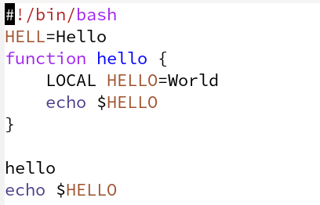{#fig:012 width=70%}

## Конец буфера

Перемещаю курсор в конец файла M->

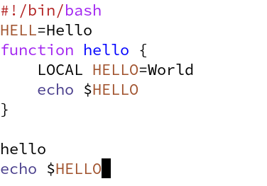{#fig:013 width=70%}

## Список активных буферов

Открываю список активных буферов в другом окне C-x C-b 

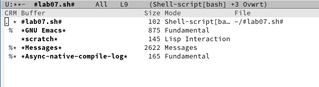{#fig:014 width=70%}

## Другое окно буфера

Переключаюсь на другой буфер C-x o 

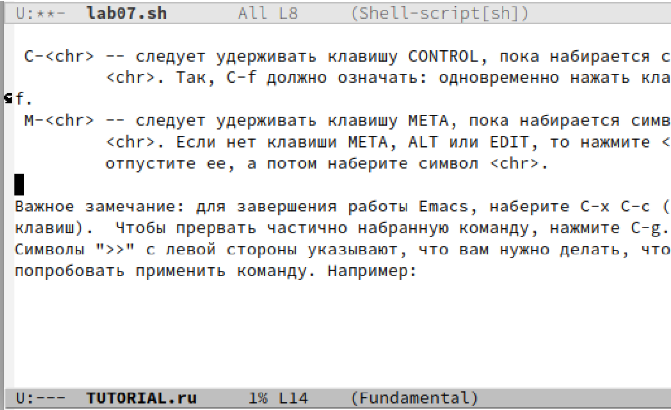{#fig:015 width=70%}

## Закрытие буфера

Закрываю окно другого буфера C-x 0 

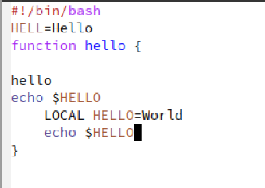{#fig:016 width=70%}

## Открытие другого буфера

Открываю другой буфер без вывода их списка на экран с помощью C-x b 

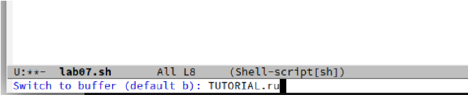{#fig:017 width=70%}

## Четыре окна

Делю фрейм на 4 части: сначала на два окна по вертикали (C-x 3),
а затем каждое из этих окон на две части по горизонтали (C-x 2) 

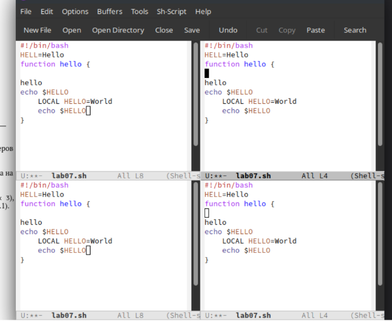{#fig:018 width=70%}

## Открытие буферов в четырех окнах

В каждом из четырех созданных окон с помощью C-x b открыл разные буферы 

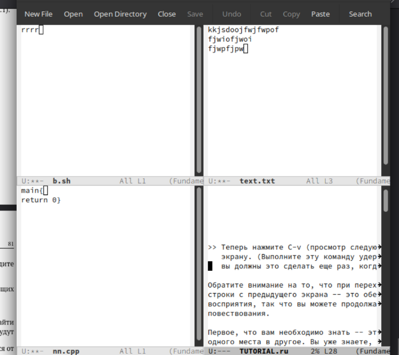{#fig:019 width=70%}

## Режим поиска

Перехожу в режим поиска с помощью C-s, ищу слова в тексте, они подсвечиваются 

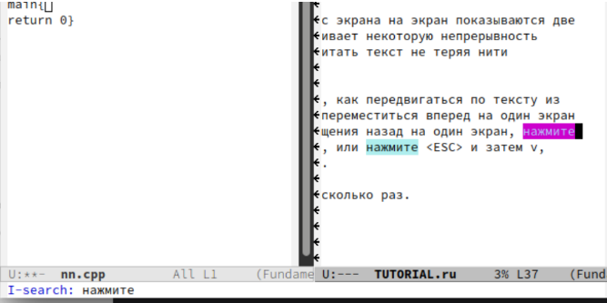{#fig:020 width=70%}

## Перемещение по найденным выражениям

С помощью той же комбинации C-s я могу перемещаться по результатам поиска 

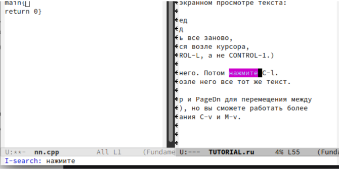{#fig:021 width=70%}

## Выход из режима поиска

С помощью C-g выхожу из режима поиска, снимается выделение

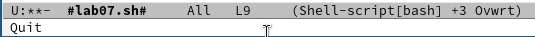{#fig:022 width=70%}

## Замена слова

Перехожу в режим поиска и замены с помощью M-%, ввожу какое слово хочу заменить, затем ввожу на какое хочу заменить 

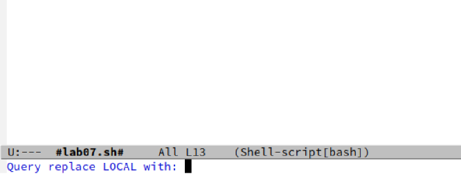{#fig:023 width=70%}

## Слово заменено

Видим, что слова были заменены успешно

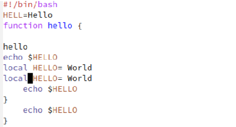{#fig:024 width=70%}

## Режим поиска

С помощью M+s перехожу в другой режим поиска. Он отличается от предыдущего тем, что выводит результат в отдельном окне от окна буфера 

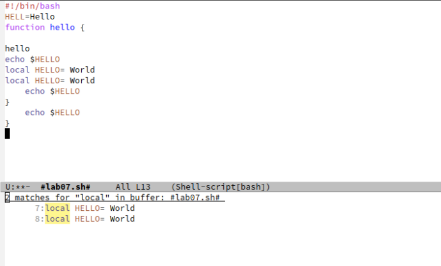{#fig:025 width=70%}

# Вывод

## Вывод 

В ходе данной лабораторной работы я познакомился с операционной системой Linuх, получил практические навыки работы с редактором Emacs.

## Список литературы

:::{#refs}

https://esystem.rudn.ru/mod/page/view.php?id=1098933

:::

