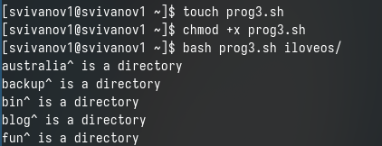

---
## Front matter
lang: ru-RU
title: Лабораторная работа № 12
subtitle: Операционные системы
author:
  - Иванов Сергей Владимирович, НПИбд-01-23
institute:
  - Российский университет дружбы народов, Москва, Россия
date: 23 апреля 2024

## i18n babel
babel-lang: russian
babel-otherlangs: english

## Formatting pdf
toc: false
slide_level: 2
aspectratio: 169
section-titles: true
theme: metropolis
header-includes:
 - \metroset{progressbar=frametitle,sectionpage=progressbar,numbering=fraction}
 - '\makeatletter'
 - '\beamer@ignorenonframefalse'
 - '\makeatother'

  ## Fonts
mainfont: PT Serif
romanfont: PT Serif
sansfont: PT Sans
monofont: PT Mono
mainfontoptions: Ligatures=TeX
romanfontoptions: Ligatures=TeX
sansfontoptions: Ligatures=TeX,Scale=MatchLowercase
monofontoptions: Scale=MatchLowercase,Scale=0.9
---

## Цель работы

Цель данной лабораторной работы - изучить основы программирования в оболочке ОС UNIX/Linux, научиться писать небольшие командные файлы.

# Выполнение работы

## Выполнение программы 1

Создаю файл prog1.sh, делаю его исполняемым, пишу в нем код, и запускаю его 

{#fig:001 width=70%}

## Написанная программа 1

Скрипт, который при запуске будет делать резервную копию самого себя 

{#fig:002 width=70%}

## Выполнение программы 2

Создаю файл prog2.sh, делаю его исполняемым, пишу в нем код, и запускаю его 

{#fig:003 width=70%}

## Написання программа 2

Пример командного файла, обрабатывающего произвольное число
аргументов, в том числе превышающее десять.

{#fig:004 width=70%}

## Выполнение программы 3

Создаю файл prog3.sh, делаю его исполняемым, пишу в нем код, и запускаю его 

{#fig:005 width=70%}

## Написанная программа программа 3

Командный файл — аналог команды ls. Нужно, чтобы он выдавал информацию о нужном каталоге и выводил информацию о правах доступа к файлам этого каталога. 

{#fig:006 width=70%}

## Создание файла с программой 4

Создаю файл prog4.sh, делаю его исполняемым, пишу в нем код 

{#fig:007 width=70%}

## Написанная программа 4

Командный файл, который получает в качестве аргумента командной строки
формат файла и вычисляет количество таких файлов в указанной директории.

{#fig:008 width=70%}

## Выполнение программы 4

И далее, я могу его запустить bash

{#fig:009 width=70%}

# Вывод

## Вывод 

При выполнении данной лабораторной работы я изучил основы программирования в оболочке ОС UNIX/Linux, научился писать небольшие командные файлы.

## Список литературы

:::{#refs}

https://esystem.rudn.ru/mod/page/view.php?id=1098933

:::

