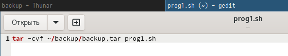
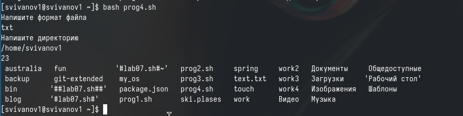

---
## Front matter
title: "Отчет по лабораторной работе №12"
subtitle: "Дисциплина: Операционные системы"
author: "Иванов Сергей Владимирович"

## Generic otions
lang: ru-RU
toc-title: "Содержание"

## Bibliography
bibliography: bib/cite.bib
csl: pandoc/csl/gost-r-7-0-5-2008-numeric.csl

## Pdf output format
toc: true # Table of contents
toc-depth: 2
lof: true # List of figures
fontsize: 12pt
linestretch: 1.5
papersize: a4
documentclass: scrreprt
## I18n polyglossia
polyglossia-lang:
  name: russian
  options:
	- spelling=modern
	- babelshorthands=true
polyglossia-otherlangs:
  name: english
## I18n babel
babel-lang: russian
babel-otherlangs: english
## Fonts
mainfont: PT Serif
romanfont: PT Serif
sansfont: PT Sans
monofont: PT Mono
mainfontoptions: Ligatures=TeX
romanfontoptions: Ligatures=TeX
sansfontoptions: Ligatures=TeX,Scale=MatchLowercase
monofontoptions: Scale=MatchLowercase,Scale=0.9
## Biblatex
biblatex: true
biblio-style: "gost-numeric"
biblatexoptions:
  - parentracker=true
  - backend=biber
  - hyperref=auto
  - language=auto
  - autolang=other*
  - citestyle=gost-numeric
## Pandoc-crossref LaTeX customization
figureTitle: "Рис."
listingTitle: "Листинг"
lofTitle: "Список иллюстраций"
lolTitle: "Листинги"
## Misc options
indent: true
header-includes:
  - \usepackage{indentfirst}
  - \usepackage{float} # keep figures where there are in the text
  - \floatplacement{figure}{H} # keep figures where there are in the text
---

# Цель работы

Цель данной лабораторной работы - изучить основы программирования в оболочке ОС UNIX/Linux, научиться писать небольшие командные файлы.

# Задание

1. Написать скрипт, который при запуске будет делать резервную копию самого себя (то есть файла, в котором содержится его исходный код) в другую директорию backup в вашем домашнем каталоге. При этом файл должен архивироваться одним из архиваторов на выбор zip, bzip2 или tar. Способ использования команд архивации необходимо узнать, изучив справку.
2. Написать пример командного файла, обрабатывающего любое произвольное число аргументов командной строки, в том числе превышающее десять. Например, скрипт может последовательно распечатывать значения всех переданных аргументов.
3. Написать командный файл — аналог команды ls (без использования самой этой команды и команды dir). Требуется, чтобы он выдавал информацию о нужном каталоге и выводил информацию о возможностях доступа к файлам этого каталога.
4. Написать командный файл, который получает в качестве аргумента командной строки формат файла (.txt, .doc, .jpg, .pdf и т.д.) и вычисляет количество таких файлов в указанной директории. Путь к директории также передаётся в виде аргумента командной строки

# Выполнение лабораторной работы

Создаю файл prog1.sh в котором буду писать программу с расширением sh (shell) с помощью утилиты touch, далее делаю его исполняемым с помощью chmod +x, открываю файл в текстовом редакторе, пишу в нем код, и после этого, я могу его запустить bash (рис. 1).

{#fig:001 width=70%}

Скрипт, который при запуске будет делать резервную копию самого себя в другую директорию backup в домашнем каталоге. При этом файл должен архивироваться одним из архиваторов на выбор zip, bzip2 или tar (рис. 2).

{#fig:002 width=70%}

```shell
#!/bin/bash
tar -cvf ~/backup/backup.tar prog1.sh
```
Создаю файл prog2.sh в котором буду писать программу с расширением sh с помощью утилиты touch, далее делаю его исполняемым с помощью chmod +x, открываю файл в текстовом редакторе, пишу в нем код, и после этого, я могу его запустить bash (рис. 3).

{#fig:003 width=70%}

Пример командного файла, обрабатывающего любое произвольное число
аргументов командной строки, в том числе превышающее десять. Например, скрипт может последовательно распечатывать значения всех переданных аргументов (рис. 4).

{#fig:004 width=70%}

```shell
#!/bin/bash
for A in $*
    do echo $A
done
```

Создаю файл prog3.sh в котором буду писать программу с расширением sh с помощью утилиты touch, далее делаю его исполняемым с помощью chmod +x, открываю файл в текстовом редакторе, пишу в нем код, и после этого, я могу его запустить bash (рис. 5).

{#fig:005 width=70%}

Командный файл — аналог команды ls (без использования самой этой команды и команды dir). Требуется, чтобы он выдавал информацию о нужном каталоге
и выводил информацию о возможностях доступа к файлам этого каталога. (рис. 6).

{#fig:006 width=70%}

```shell
#!/bin/bash
for A in *
do
    if test -d "$A"
    then
        echo "$A^ is a directory"
    else
        echo -n "$A: is a file and "
        if test -w $A
        then
            echo writeable
                if test -r $A
                then
                    echo "readable"
            else
                echo "neither readable or writeable"
                fi
            fi
        fi
    done
```
Создаю файл prog4.sh в котором буду писать программу с расширением sh с помощью утилиты touch, далее делаю его исполняемым с помощью chmod +x, открываю файл в текстовом редакторе, пишу в нем код (рис. 7).

{#fig:007 width=70%}

Командный файл, который получает в качестве аргумента командной строки
формат файла (.txt, .doc, .jpg, .pdf и т.д.) и вычисляет количество таких файлов в указанной директории. Путь к директории также передаётся в виде аргумента командной строки (рис. 8).

{#fig:008 width=70%}

И далее, я могу его запустить bash (рис. 9).

{#fig:009 width=70%}

```shell
#!bin/bash
format=""
directory=""
echo "Напишите формат файла"
read format
echo "Напишите директорию"
read directory
find "${directory}" -name "*.${format}" -type f | wc -l
ls
```

# Вывод

При выполнении данной лабораторной работы я изучил основы программирования в оболочке ОС UNIX/Linux, научился писать небольшие командные файлы.


