---
## Front matter
lang: ru-RU
title: Лабораторная работа № 13
subtitle: Операционные системы
author:
  - Иванов Сергей Владимирович, НПИбд-01-23
institute:
  - Российский университет дружбы народов, Москва, Россия
date: 29 апреля 2024

## i18n babel
babel-lang: russian
babel-otherlangs: english

## Formatting pdf
toc: false
slide_level: 2
aspectratio: 169
section-titles: true
theme: metropolis
header-includes:
 - \metroset{progressbar=frametitle,sectionpage=progressbar,numbering=fraction}
 - '\makeatletter'
 - '\beamer@ignorenonframefalse'
 - '\makeatother'

  ## Fonts
mainfont: PT Serif
romanfont: PT Serif
sansfont: PT Sans
monofont: PT Mono
mainfontoptions: Ligatures=TeX
romanfontoptions: Ligatures=TeX
sansfontoptions: Ligatures=TeX,Scale=MatchLowercase
monofontoptions: Scale=MatchLowercase,Scale=0.9
---

## Цель работы

Цель данной лабораторной работы - изучить основы программирования в оболочке ОС UNIX, научится писать более сложные командные файлы с использованием логических управляющих конструкций и циклов.

# Выполнение работы

## Создание файла

Создаю файл с разрешением на исполнение 

{#fig:001 width=70%}

## Код программы

Командный файл, который анализирует командную строку с ключами а затем ищет в указанном файле нужные строки 

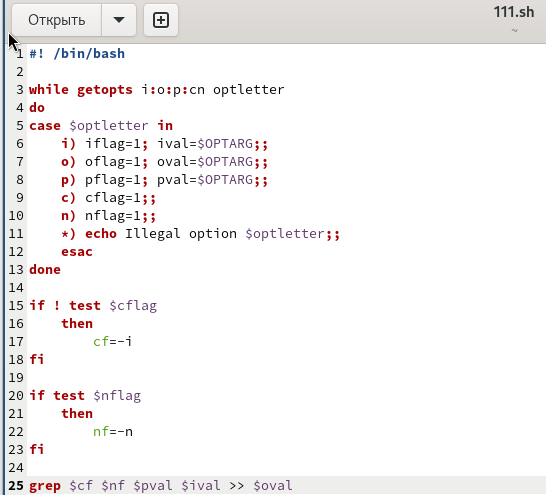{#fig:002 width=70%}

## Результат работы программы

Результат работы программы в файле output.txt 

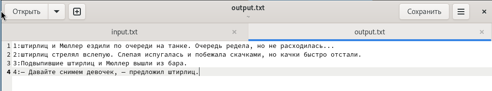{#fig:003 width=70%}

## Создание файла

Создаю исполняемый файл для второй программы, также создаю файл 12.сpp для программы на С 

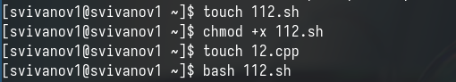{#fig:004 width=70%}

## Код программы на Си

Пишу программу на Си, которая вводит число и определяет, является ли оно больше нуля

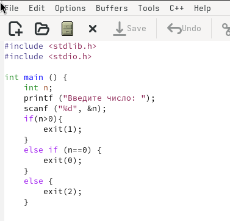{#fig:005 width=70%}

## Код программы

Командный файл должен вызывать программу и, проанализировав, выдать сообщение о том, какое число было введено 

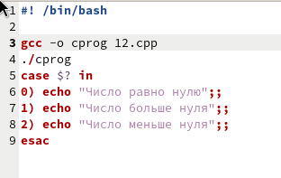{#fig:006 width=70%}

## Результат работы программы

Программа работает корректно 

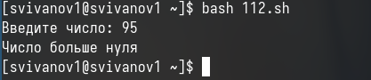{#fig:007 width=70%}

## Создание файла

Создаю исполняемый файл для третьей программы 

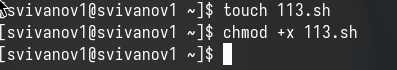{#fig:008 width=70%}

## Код программы

Командный файл, создающий указанное число файлов, пронумерованных
последовательно. Этот файл должен уметь удалять все созданные им файлы 

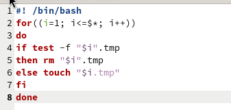{#fig:009 width=70%}

## Результат работы программы

Проверяю, что программа создала файлы и удалила их при соответствующих запросах

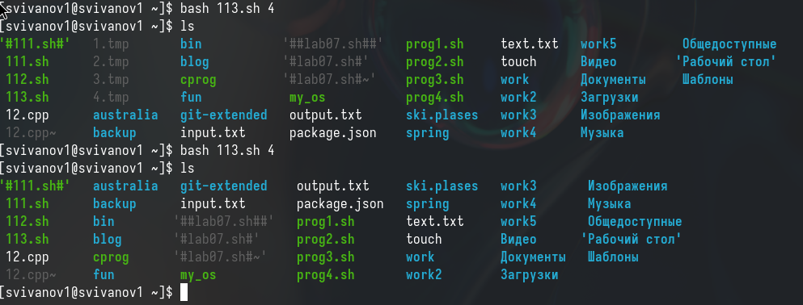{#fig:010 width=70%}

## Код программы

Создаю исполняемый файл для четвертой программы. Это командный файл, который с помощью команды tar запаковывает в архив все файлы в указанной директории.

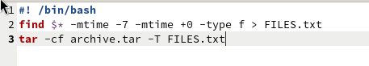{#fig:011 width=70%}

## Результат работы программы

Проверяю работу программы 

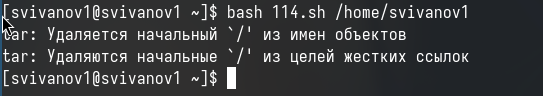{#fig:012 width=70%}

# Вывод

## Вывод 

При выполнении данной лабораторной работы я изучил основы программирования в оболочке ОС UNIX, научился писать более сложные командные файлы с использованием логических управляющих конструкций и циклов.

## Список литературы

:::{#refs}

https://esystem.rudn.ru/mod/page/view.php?id=1098933

:::

