---
## Front matter
title: "Отчет по лабораторной работе №13"
subtitle: "Дисциплина: Операционные системы"
author: "Иванов Сергей Владимирович"

## Generic otions
lang: ru-RU
toc-title: "Содержание"

## Bibliography
bibliography: bib/cite.bib
csl: pandoc/csl/gost-r-7-0-5-2008-numeric.csl

## Pdf output format
toc: true # Table of contents
toc-depth: 2
lof: true # List of figures
fontsize: 12pt
linestretch: 1.5
papersize: a4
documentclass: scrreprt
## I18n polyglossia
polyglossia-lang:
  name: russian
  options:
	- spelling=modern
	- babelshorthands=true
polyglossia-otherlangs:
  name: english
## I18n babel
babel-lag: russia
babel-otherlangs: english
## Fonts
mainfont: PT Serif
romanfont: PT Serif
sansfont: PT Sans
monofont: PT Mono
mainfontoptions: Ligatures=TeX
romanfontoptions: Ligatures=TeX
sansfontoptions: Ligatures=TeX,Scale=MatchLowercase
monofontoptions: Scale=MatchLowercase,Scale=0.9
## Biblatex
biblatex: true
biblio-style: "gost-numeric"
biblatexoptions:
  - parentracker=true
  - backend=biber
  - hyperref=auto
  - language=auto
  - autolang=other*
  - citestyle=gost-numeric
## Pandoc-crossref LaTeX customization
figureTitle: "Рис."
listingTitle: "Листинг"
lofTitle: "Список иллюстраций"
lolTitle: "Листинги"
## Misc options
indent: true
header-includes:
  - \usepackage{indentfirst}
  - \usepackage{float} # keep figures where there are in the text
  - \floatplacement{figure}{H} # keep figures where there are in the text
---

# Цель работы

Цель данной лабораторной работы - изучить основы программирования в оболочке ОС UNIX, научится писать более сложные командные файлы с использованием логических управляющих конструкций и циклов.

# Задание

1. Используя команды getopts grep, написать командный файл, который анализирует командную строку с ключами:
- -iinputfile — прочитать данные из указанного файла;
- -ooutputfile — вывести данные в указанный файл;
- -pшаблон — указать шаблон для поиска;
- -C — различать большие и малые буквы;
- -n — выдавать номера строк.
а затем ищет в указанном файле нужные строки, определяемые ключом -p.
2. Написать на языке Си программу, которая вводит число и определяет, является ли оно больше нуля, меньше нуля или равно нулю. Затем программа завершается с помощью функции exit(n), передавая информацию в о коде завершения в оболочку. Командный файл должен вызывать эту программу и, проанализировав с помощью команды $?, выдать сообщение о том, какое число было введено.
3. Написать командный файл, создающий указанное число файлов, пронумерованных последовательно от 1 до N (например 1.tmp, 2.tmp, 3.tmp,4.tmp и т.д.). Число файлов, которые необходимо создать, передаётся в аргументы командной строки. Этот же командный файл должен уметь удалять все созданные им файлы (если они существуют).
4. Написать командный файл, который с помощью команды tar запаковывает в архив все файлы в указанной директории. Модифицировать его так, чтобы запаковывались только те файлы, которые были изменены менее недели тому назад (использовать команду find).

# Выполнение лабораторной работы

Создаю файл с разрешением на исполнение (рис. 1).

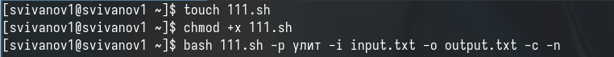{#fig:001 width=70%}

Командный файл, c командами getopts и grep, который анализирует
командную строку с ключами:
- -iinputfile — прочитать данные из указанного файла;
- -ooutputfile — вывести данные в указанный файл;
- -pшаблон — указать шаблон для поиска;
- -C — различать большие и малые буквы;
- -n — выдавать номера строк.
а затем ищет в указанном файле нужные строки, определяемые ключом -p (рис. 2).

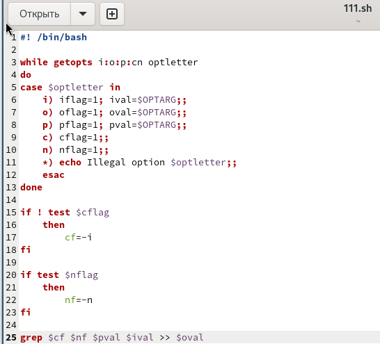{#fig:002 width=70%}

```sh
#! /bin/bash

while getopts i:o:p:cn optletter
do
case $optletter in
    i) iflag=1; ival=$OPTARG;;
    o) oflag=1; oval=$OPTARG;;
    p) pflag=1; pval=$OPTARG;;
    c) cflag=1;;
    n) nflag=1;;
    *) echo Illegal option $optletter;;
    esac
done

if ! test $cflag
    then
        cf=-i
fi

if test $nflag
    then
        nf=-n
fi

grep $cf $nf $pval $ival >> $oval
```
Результат работы программы в файле output.txt (рис. 3).

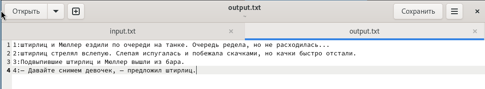{#fig:003 width=70%}

Создаю исполняемый файл для второй программы, также создаю файл 12.сpp для программы на С (рис. 4).

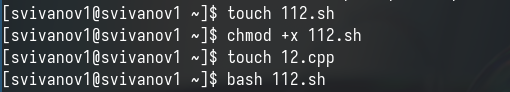{#fig:004 width=70%}

Пишу программу на языке Си, которая вводит число и определяет, является ли оно больше нуля, меньше нуля или равно нулю. Затем программа завершается с помощью функции exit(n), передавая информацию в о коде завершения в оболочку (рис. 5).

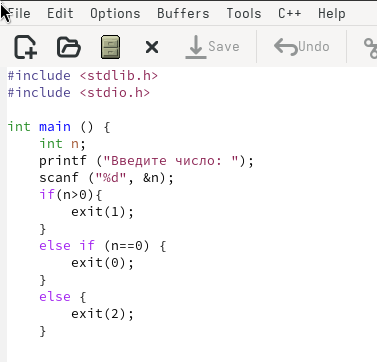{#fig:005 width=70%}

```c
#include <stdlib.h>
#include <stdio.h>

int main () {
    int n;
    printf ("Введите число: ");
    scanf ("%d", &n);
    if(n>0){
        exit(1);
    }
    else if (n==0) {
        exit(0);
    }
    else {
        exit(2);
    }
```
Командный файл должен вызывать эту программу и, проанализировав с помощью команды $?, выдать сообщение о том, какое число было введено (рис. 6).

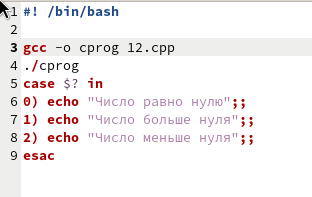{#fig:006 width=70%}

```sh
#! /bin/bash

gcc -o cprog 12.c
./cprog
case $? in
0) echo "Число равно нулю";;
1) echo "Число больше нуля";;
2) echo "Число меньше нуля";;
esac
```
Программа работает корректно (рис. 7).

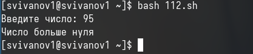{#fig:007 width=70%}

Создаю исполняемый файл для третьей программы (рис. 8).

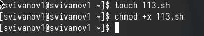{#fig:008 width=70%}

Командный файл, создающий указанное число файлов, пронумерованных
последовательно от 1 до N (например 1.tmp, 2.tmp, 3.tmp,4.tmp и т.д.). Число файлов, которые необходимо создать, передаётся в аргументы командной строки. Этот же командный файл должен уметь удалять все созданные им файлы (если они существуют) (рис. 9).

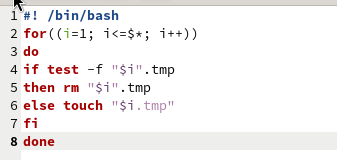{#fig:009 width=70%}

```sh
#! /bin/bash
for((i=1; i<=$*; i++))
do
if test -f "$i".tmp
then rm "$i".tmp
else touch "$i.tmp"
fi
done
```

Проверяю, что программа создала файлы и удалила их при соответствующих запросах (рис. 10).

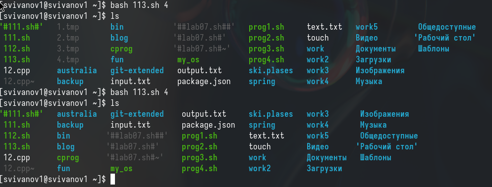{#fig:010 width=70%}

Создаю исполняемый файл для четвертой программы. Это командный файл, который с помощью команды tar запаковывает в архив все файлы в указанной директории. Модифицировать его так, чтобы запаковывались только те файлы, которые были изменены менее недели тому назад (использовать
команду find) (рис. 11).

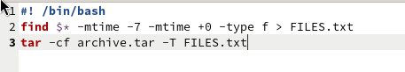{#fig:011 width=70%}

```sh
#! /bin/bash
find $* -mtime -7 -mtime +0 -type f > FILES.txt
tar -cf archive.tar -T FILES.txt
```

Проверяю работу программы (рис. 12).

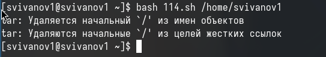{#fig:012 width=70%}

# Вывод

При выполнении данной лабораторной работы я изучил основы программирования в оболочке ОС UNIX, научился писать более сложные командные файлы с использованием логических управляющих конструкций и циклов.


