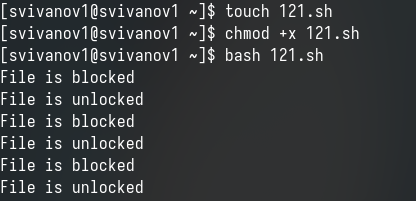
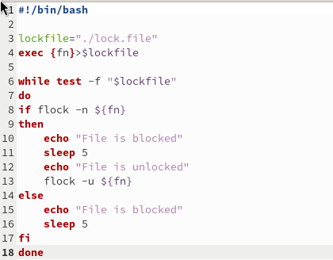
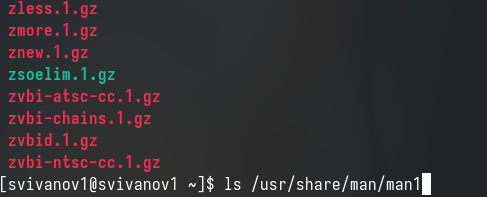
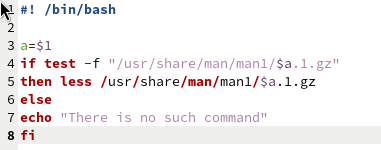
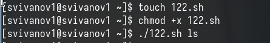
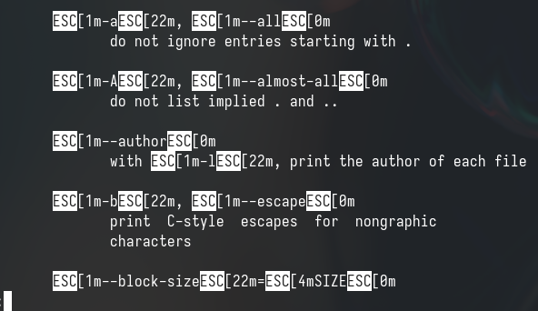
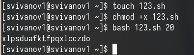
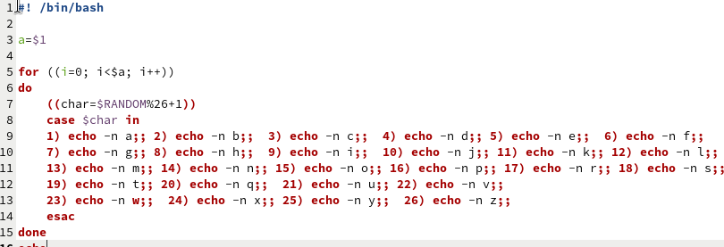

---
## Front matter
lang: ru-RU
title: Лабораторная работа № 14
subtitle: Операционные системы
author:
  - Иванов Сергей Владимирович, НПИбд-01-23
institute:
  - Российский университет дружбы народов, Москва, Россия
date: 4 мая 2024

## i18n babel
babel-lang: russian
babel-otherlangs: english

## Formatting pdf
toc: false
slide_level: 2
aspectratio: 169
section-titles: true
theme: metropolis
header-includes:
 - \metroset{progressbar=frametitle,sectionpage=progressbar,numbering=fraction}
 - '\makeatletter'
 - '\beamer@ignorenonframefalse'
 - '\makeatother'

  ## Fonts
mainfont: PT Serif
romanfont: PT Serif
sansfont: PT Sans
monofont: PT Mono
mainfontoptions: Ligatures=TeX
romanfontoptions: Ligatures=TeX
sansfontoptions: Ligatures=TeX,Scale=MatchLowercase
monofontoptions: Scale=MatchLowercase,Scale=0.9
---

## Цель работы

Цель данной лабораторной работы - изучить основы программирования в оболочке ОС UNIX, научиться писать более сложные командные файлы с использованием логических управляющих конструкций и циклов.

# Выполнение работы

## Создание и исполнение файла

Создаю файл для первой программы, пишу ее, проверяю работу

{#fig:001 width=70%}

## Код программы

Командный файл, реализующий упрощённый механизм семафоров

{#fig:002 width=70%}

## Изучение содержимого папки

Реализовываем команду man с помощью командного файла

{#fig:003 width=70%}

## Код программы

Код этой программы

{#fig:004 width=70%}

## Исполнение программы

Проверяю работу командного файла 

{#fig:005 width=70%}

## Результат работы программы

Командный файл работает так же, как и команда man

{#fig:006 width=70%}

## Создание и исполнение файла

Создаю файл для третьей программы, пишу программу и проверяю ее.

{#fig:007 width=70%}

## Создание файла

Код программы, генерирующей случайную последовательность букв латинского алфавита

{#fig:008 width=70%}

# Вывод

## Вывод 

При выполнении данной лабораторной работы я изучил основы программирования в оболочке ОС UNIX, научился писать более сложные командные файлы с использованием логических управляющих конструкций и циклов.

## Список литературы

:::{#refs}

https://esystem.rudn.ru/mod/page/view.php?id=1098933

:::

