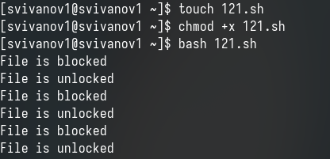
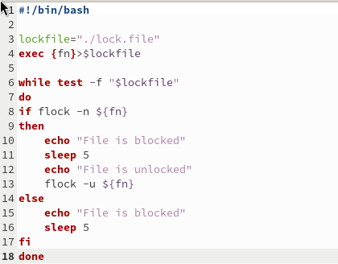
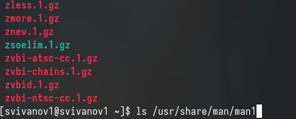
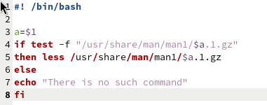
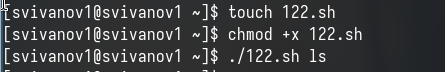
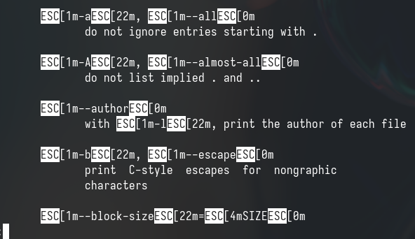
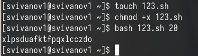
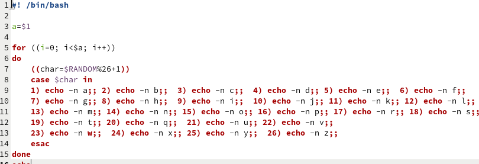

---
## Front matter
title: "Отчет по лабораторной работе №14"
subtitle: "Дисциплина: Операционные системы"
author: "Иванов Сергей Владимирович"

## Generic otions
lang: ru-RU
toc-title: "Содержание"

## Bibliography
bibliography: bib/cite.bib
csl: pandoc/csl/gost-r-7-0-5-2008-numeric.csl

## Pdf output format
toc: true # Table of contents
toc-depth: 2
lof: true # List of figures
fontsize: 12pt
linestretch: 1.5
papersize: a4
documentclass: scrreprt
## I18n polyglossia
polyglossia-lang:
  name: russian
  options:
	- spelling=modern
	- babelshorthands=true
polyglossia-otherlangs:
  name: english
## I18n babel
babel-lag: russia
babel-otherlangs: english
## Fonts
mainfont: PT Serif
romanfont: PT Serif
sansfont: PT Sans
monofont: PT Mono
mainfontoptions: Ligatures=TeX
romanfontoptions: Ligatures=TeX
sansfontoptions: Ligatures=TeX,Scale=MatchLowercase
monofontoptions: Scale=MatchLowercase,Scale=0.9
## Biblatex
biblatex: true
biblio-style: "gost-numeric"
biblatexoptions:
  - parentracker=true
  - backend=biber
  - hyperref=auto
  - language=auto
  - autolang=other*
  - citestyle=gost-numeric
## Pandoc-crossref LaTeX customization
figureTitle: "Рис."
listingTitle: "Листинг"
lofTitle: "Список иллюстраций"
lolTitle: "Листинги"
## Misc options
indent: true
header-includes:
  - \usepackage{indentfirst}
  - \usepackage{float} # keep figures where there are in the text
  - \floatplacement{figure}{H} # keep figures where there are in the text
---

# Цель работы

Цель данной лабораторной работы - изучить основы программирования в оболочке ОС UNIX, научиться писать более сложные командные файлы с использованием логических управляющих конструкций и циклов.

# Задание

1. Написать командный файл, реализующий упрощённый механизм семафоров. Командный файл должен в течение некоторого времени t1 дожидаться освобождения
ресурса, выдавая об этом сообщение, а дождавшись его освобождения, использовать
его в течение некоторого времени t2<>t1, также выдавая информацию о том, что
ресурс используется соответствующим командным файлом (процессом). Запустить
командный файл в одном виртуальном терминале в фоновом режиме, перенаправив
его вывод в другой (> /dev/tty#, где # — номер терминала куда перенаправляется
вывод), в котором также запущен этот файл, но не фоновом, а в привилегированном
режиме. Доработать программу так, чтобы имелась возможность взаимодействия трёх
и более процессов.
2. Реализовать команду man с помощью командного файла. Изучите содержимое каталога /usr/share/man/man1. В нем находятся архивы текстовых файлов, содержащих
справку по большинству установленных в системе программ и команд. Каждый архив
можно открыть командой less сразу же просмотрев содержимое справки. Командный
файл должен получать в виде аргумента командной строки название команды и в виде
результата выдавать справку об этой команде или сообщение об отсутствии справки,
если соответствующего файла нет в каталоге man1.
3. Используя встроенную переменную $RANDOM, напишите командный файл, генерирующий случайную последовательность букв латинского алфавита. Учтите, что $RANDOM
выдаёт псевдослучайные числа в диапазоне от 0 до 32767.

# Выполнение лабораторной работы

Создаю командный файл для первой программы, пишу ее, проверяю ее работу (рис. 1).

{#fig:001 width=70%}

Командный файл, реализующий упрощённый механизм семафоров. Командный файл должен в течение некоторого времени t1 дожидаться освобождения
ресурса, выдавая об этом сообщение, а дождавшись его освобождения, использовать его в течение некоторого времени t2<>t1, также выдавая информацию о том, что ресурс используется соответствующим командным файлом (процессом). Запустить командный файл в одном виртуальном терминале в фоновом режиме, перенаправив его вывод в другой (> /dev/tty#, где # — номер терминала куда перенаправляется вывод), в котором также запущен этот файл, но не фоновом, а в привилегированном режиме. Доработать программу так, чтобы имелась возможность взаимодействия трёх и более процессов (рис. 2).

{#fig:002 width=70%}

```sh
#!/bin/bash

lockfile="./lock.file"
exec {fn}>$lockfile

while test -f "$lockfile"
do
if flock -n ${fn}
then
    echo "File is blocked"
    sleep 5
    echo "File is unlocked"
    flock -u ${fn}
else
    echo "File is blocked"
    sleep 5
fi
done
```

Чтобы реализовать команду man с помощью командного файла, изучаю содержимое каталога /usr/share/man/man1. В нем находятся архивы текстовых файлов, содержащих справку по большинству установленных в системе программ и команд. Каждый архив можно открыть командой less сразу же просмотрев содержимое справки (рис. 3).

{#fig:003 width=70%}

Командный файл должен получать в виде аргумента командной строки название команды и в виде результата выдавать справку об этой команде или сообщение об отсутствии справки, если соответствующего файла нет в каталоге man1 (рис. 4).

{#fig:004 width=70%}

```sh
#! /bin/bash

a=$1
if test -f "/usr/share/man/man1/$a.1.gz"
then less /usr/share/man/man1/$a.1.gz
else
echo "There is no such command"
fi

```

Проверяю работу командного файла (рис. 5).

{#fig:005 width=70%}

Командный файл работает так же, как и команда man, открывает справку по указанной утилите (рис. 6).

{#fig:006 width=70%}

Создаю файл для кода третьей программы, пишу программу и проверяю ее работу (рис. 7).

{#fig:007 width=70%}

Используя встроенную переменную $RANDOM, пишу командный файл, генерирующий случайную последовательность букв латинского алфавита. Т.к. $RANDOM выдаёт псевдослучайные числа в диапазоне от 0 до 32767, ввожу ограничения так, чтобы была генерация чисел от 1 до 26 (рис. 8).

{#fig:008 width=70%}

```sh
#! /bin/bash

a=$1

for ((i=0; i<$a; i++))
do
    ((char=$RANDOM%26+1))
    case $char in
    1) echo -n a;; 2) echo -n b;;  3) echo -n c;;  4) echo -n d;; 5) echo -n e;;  6) echo -n f;;
    7) echo -n g;; 8) echo -n h;;  9) echo -n i;;  10) echo -n j;; 11) echo -n k;; 12) echo -n l;;
    13) echo -n m;; 14) echo -n n;; 15) echo -n o;; 16) echo -n p;; 17) echo -n r;; 18) echo -n s;;
    19) echo -n t;; 20) echo -n q;;  21) echo -n u;; 22) echo -n v;;
    23) echo -n w;;  24) echo -n x;; 25) echo -n y;;  26) echo -n z;;
    esac
done
echo
```

# Вывод

При выполнении данной лабораторной работы я изучил основы программирования в оболочке ОС UNIX, научился писать более сложные командные файлы с использованием логических управляющих конструкций и циклов.


