---
## Front matter
lang: ru-RU
title: Индивидуальный проект. Этап 1
subtitle: Операционные системы
author:
  - Иванов Сергей Владимирович, НПИбд-01-23
institute:
  - Российский университет дружбы народов, Москва, Россия
date: 1 марта 2024

## i18n babel
babel-lang: russian
babel-otherlangs: english

## Formatting pdf
toc: false
slide_level: 2
aspectratio: 169
section-titles: true
theme: metropolis
header-includes:
 - \metroset{progressbar=frametitle,sectionpage=progressbar,numbering=fraction}
 - '\makeatletter'
 - '\beamer@ignorenonframefalse'
 - '\makeatother'

  ## Fonts
mainfont: PT Serif
romanfont: PT Serif
sansfont: PT Sans
monofont: PT Mono
mainfontoptions: Ligatures=TeX
romanfontoptions: Ligatures=TeX
sansfontoptions: Ligatures=TeX,Scale=MatchLowercase
monofontoptions: Scale=MatchLowercase,Scale=0.9
---

## Цель работы

Научиться размещать страницы на GitHub Pages. Выполнить первый этап индивидуального проекта.

## Задание

1. Установить необходимое программное обеспечение.
2. Скачать шаблон темы сайта.
3. Разместить его на хостинге git.
4. Установить параметр для URLs сайта.
5. Разместить заготовку сайта на Github pages.

# Выполнение работы

## Установка hugo

Скачиваем архив hugo с GitHub.

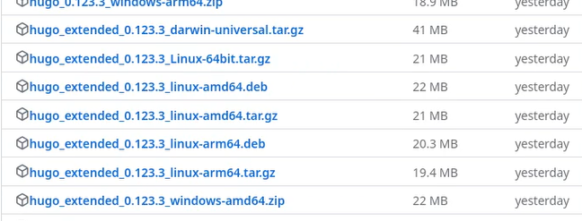{#fig:001 width=70%}

## Установка hugo

Распакуем архив, создаем папку bin и перемещаем в неё hugo

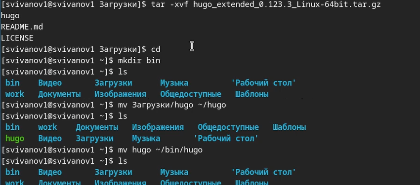{#fig:002 width=70%}

## Создание шаблона

Создаем репозиторий на основе шаблона theme-academic-cv и называем его blog.

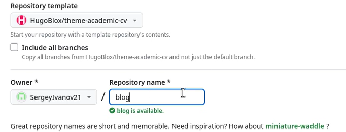{#fig:003 width=70%}

## Клонирование шаблона

Клонируем созданный репозиторий в папку work

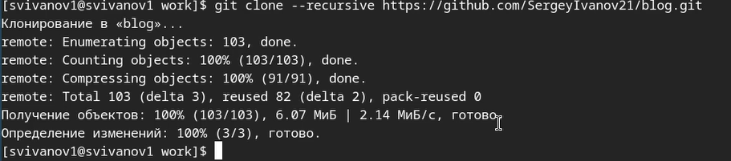{#fig:004 width=70%}

## Установка go

Перейдем в папку work и произведем установку go 'sudo yum install go'

{#fig:005 width=70%}

## Удаление public

Удалим папку public в файлах шаблона.

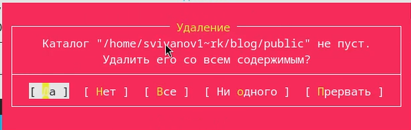{#fig:006 width=70%}

## Создание локального сайта

Получим локальный сайт 
- hugo server

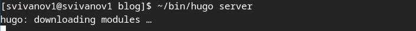{#fig:007 width=70%}

## Создание локального сайта

Ссылка на локальный сайт

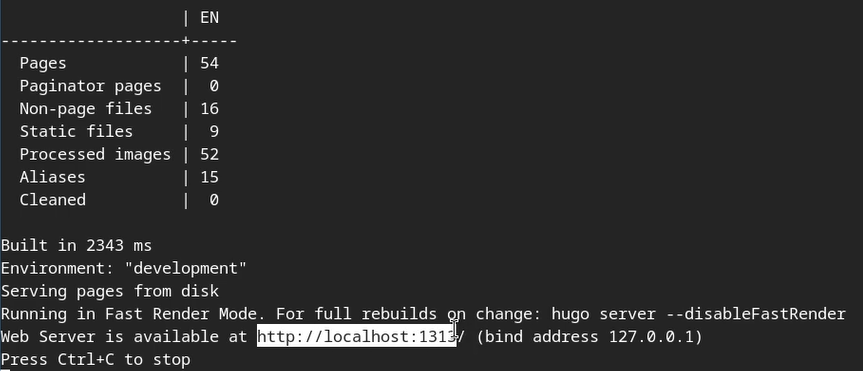{#fig:008 width=70%}

## Локальный сайт

Проверяем локальный сайт

{#fig:009 width=70%}

## Создание репозитория для публикации

Создаем репозиторий для публикации сайта и называем его специальным именем.

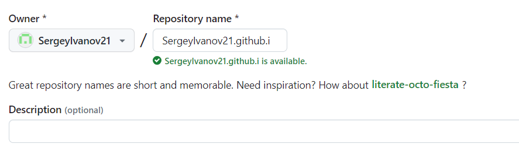{#fig:010 width=70%}

## Клонирование репозитория

Клонируем новый репозиторий в папку work 

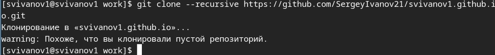{#fig:011 width=70%}

## Подключение ветки main

Переходим в папку нового репозитория и переключаемся на ветку main.

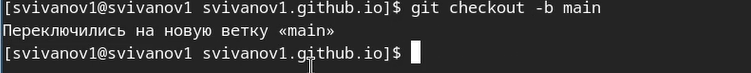{#fig:012 width=70%}

## Файл README.md

Создаем файл README.md и отправляем его на сервер.

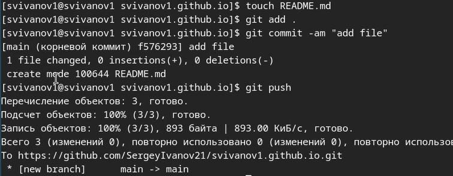{#fig:013 width=70%}

## Комментируем public

Находим файл gitignore и комментируем public 

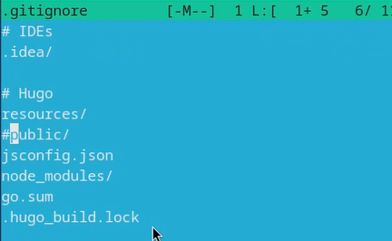{#fig:014 width=70%}

## Подключение подмодуля

Подключаем подмодуль public

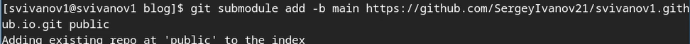{#fig:015 width=70%}

## Компиляция сайта

Компилируем сайт
- ~/bin/hugo 

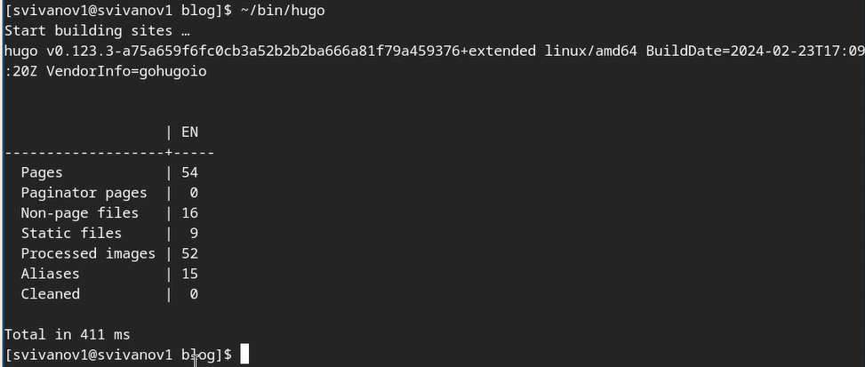{#fig:016 width=70%}

## Отправление файлов на сервер

Добавим комментарий и отправим файлы на сервер. (рис. 16). 

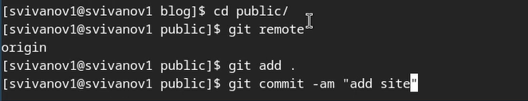{#fig:017 width=70%}

## Проверка сайта

Проверяем ссылку на сайт и заходим на него. Как мы видим, он работает. (рис. 17).

{#fig:018 width=70%}

# Вывод

## Вывод 

В результате выполнения работы я научился размещать страницы на GitHub Pages, а так же выполнил первый этап индивидуального проекта. 

