---
## Front matter
title: "Отчет по индивидуальному проекту №1"
subtitle: "Дисциплина: Операционные системы"
author: "Иванов Сергей Владимирович"

## Generic otions
lang: ru-RU
toc-title: "Содержание"

## Bibliography
bibliography: bib/cite.bib
csl: pandoc/csl/gost-r-7-0-5-2008-numeric.csl

## Pdf output format
toc: true # Table of contents
toc-depth: 2
lof: true # List of figures
fontsize: 12pt
linestretch: 1.5
papersize: a4
documentclass: scrreprt
## I18n polyglossia
polyglossia-lang:
  name: russian
  options:
	- spelling=modern
	- babelshorthands=true
polyglossia-otherlangs:
  name: english
## I18n babel
babel-lang: russian
babel-otherlangs: english
## Fonts
mainfont: PT Serif
romanfont: PT Serif
sansfont: PT Sans
monofont: PT Mono
mainfontoptions: Ligatures=TeX
romanfontoptions: Ligatures=TeX
sansfontoptions: Ligatures=TeX,Scale=MatchLowercase
monofontoptions: Scale=MatchLowercase,Scale=0.9
## Biblatex
biblatex: true
biblio-style: "gost-numeric"
biblatexoptions:
  - parentracker=true
  - backend=biber
  - hyperref=auto
  - language=auto
  - autolang=other*
  - citestyle=gost-numeric
## Pandoc-crossref LaTeX customization
figureTitle: "Рис."
listingTitle: "Листинг"
lofTitle: "Список иллюстраций"
lolTitle: "Листинги"
## Misc options
indent: true
header-includes:
  - \usepackage{indentfirst}
  - \usepackage{float} # keep figures where there are in the text
  - \floatplacement{figure}{H} # keep figures where there are in the text
---

# Цель работы

Научиться размещать страницы на GitHub Pages. Выполнить первый этап индивидуального проекта.

# Задание

1. Установить необходимое программное обеспечение.
2. Скачать шаблон темы сайта.
3. Разместить его на хостинге git.
4. Установить параметр для URLs сайта.
5. Разместить заготовку сайта на Github pages.

# Выполнение 

Скачиваем архив hugo с GitHub. (рис. 1).

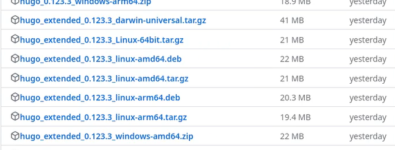{#fig:001 width=70%}

Распакуем архив, создаем папку bin и перемещаем в неё hugo (рис. 2).

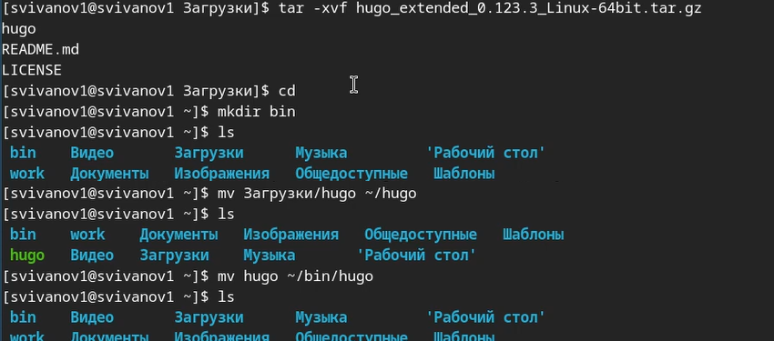{#fig:002 width=70%}

Создаем репозиторий на основе шаблона theme-academic-cv и называем его blog. (рис. 3).

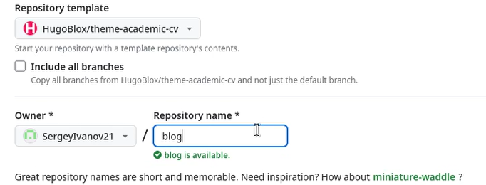{#fig:003 width=70%}

Клонируем созданный репозиторий в папку work (рис. 4).

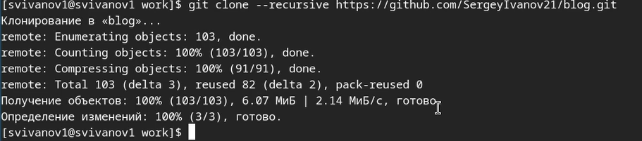{#fig:004 width=70%}

Перейдем в папку work и произведем установку go 'sudo yum install go' (рис. 5). 

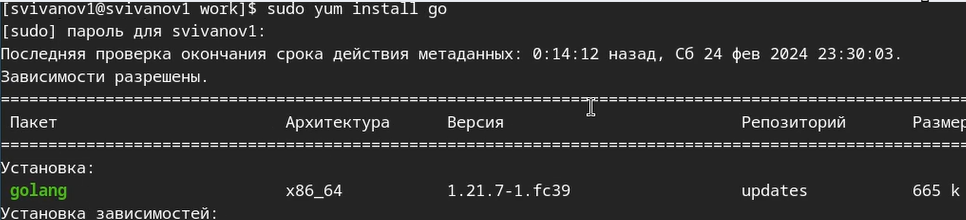{#fig:005 width=70%}

Удалим папку public в файлах шаблона. (рис. 6)

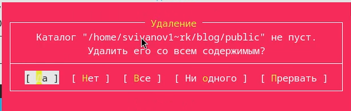{#fig:006 width=70%}

Перейдем в папку blog и получим локальный сайт 'hugo server' (рис. 7). 

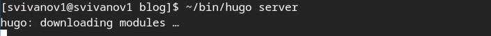{#fig:007 width=70%}

Ссылка на локальный сайт (рис. 8). 

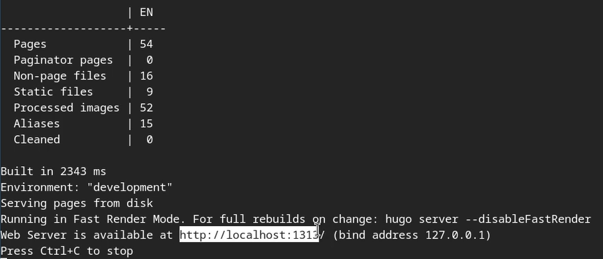{#fig:008 width=70%}

Проверяем локальный сайт (рис. 9).

{#fig:009 width=70%}

Создаем репозиторий для публикации сайта и называем его специальным именем. (рис. 10).

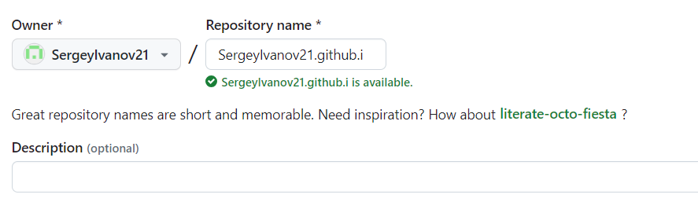{#fig:010 width=70%}

Клонируем новый репозиторий в папку work (рис. 11).

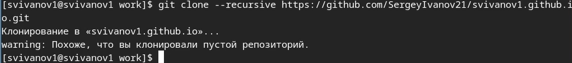{#fig:011 width=70%}

Переходим в папку нового репозитория и переключаемся на ветку main. (рис. 12). 

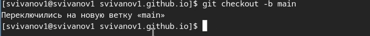{#fig:012 width=70%}

Создаем файл README.md и отправляем его на сервер. (рис. 13). 

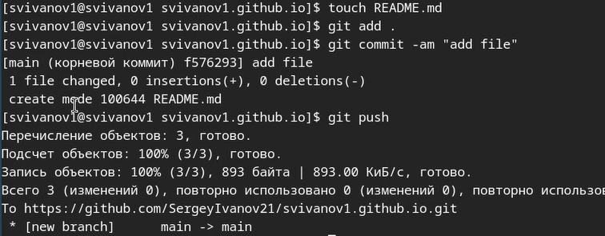{#fig:013 width=70%}

Находим файл gitignore и комментируем public (рис. 14). 

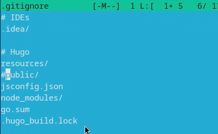{#fig:014 width=70%}

Подключаем подмодуль public (рис. 15).

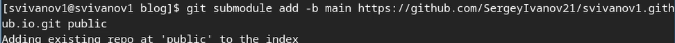{#fig:015 width=70%}

Пишем команду '~/bin/hugo' и компилируем сайт (рис. 16). 

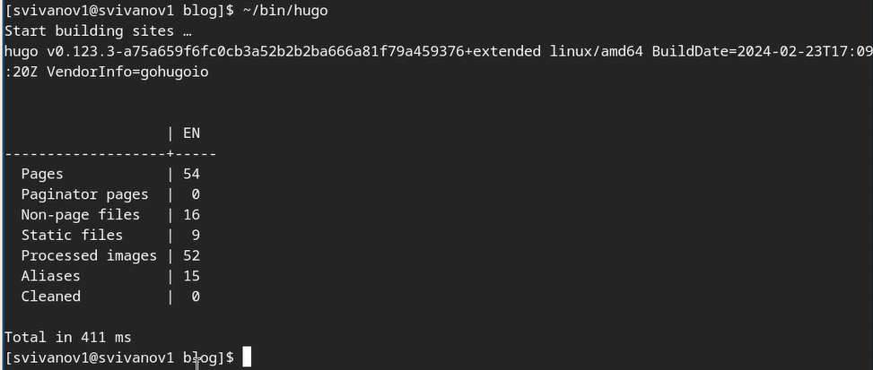{#fig:016 width=70%}

Добавим комментарий и отправим файлы на сервер. (рис. 17). 

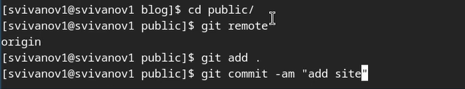{#fig:017 width=70%}

Проверяем ссылку на сайт и заходим на него. Как мы видим, он работает. (рис. 18).

{#fig:018 width=70%}

# Выводы

В результате выполнения работы я научился размещать страницы на GitHub Pages, а так же выполнил первый этап индивидуального проекта. 

