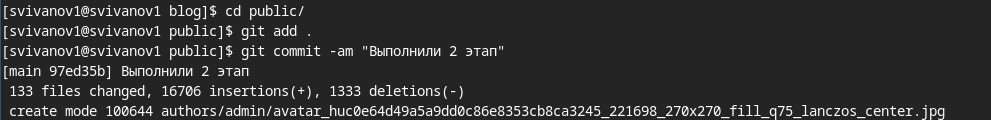

---
## Front matter
lang: ru-RU
title: Индивидуальный проект. Этап 2
subtitle: Операционные системы
author:
  - Иванов Сергей Владимирович, НПИбд-01-23
institute:
  - Российский университет дружбы народов, Москва, Россия
date: 5 марта 2024

## i18n babel
babel-lang: russian
babel-otherlangs: english

## Formatting pdf
toc: false
slide_level: 2
aspectratio: 169
section-titles: true
theme: metropolis
header-includes:
 - \metroset{progressbar=frametitle,sectionpage=progressbar,numbering=fraction}
 - '\makeatletter'
 - '\beamer@ignorenonframefalse'
 - '\makeatother'

  ## Fonts
mainfont: PT Serif
romanfont: PT Serif
sansfont: PT Sans
monofont: PT Mono
mainfontoptions: Ligatures=TeX
romanfontoptions: Ligatures=TeX
sansfontoptions: Ligatures=TeX,Scale=MatchLowercase
monofontoptions: Scale=MatchLowercase,Scale=0.9
---

## Цель работы

Продолжить выполнение индивидуального проекта. Заполнить данные о себе на сайте в соответствии с требованиями.

## Задание

1. Разместить фотографию владельца сайта.
2. Разместить краткое описание владельца сайта (Biography).
3. Добавить информацию об интересах (Interests).
4. Добавить информацию от образовании (Education).
5. Сделать пост по прошедшей неделе.
6. Добавить пост на тему по выбору:

   Управление версиями. Git.
   
   Непрерывная интеграция и непрерывное развертывание (CI/CD).

# Выполнение работы

## Разместим фотографию

Помещаем её в необходимую папку и переименовываем, а старую удаляем. 

{#fig:001 width=70%}

## Краткая биография

Добавим краткую биографию о себе 

{#fig:002 width=70%}

## Добавление роли

Добавим свою роль (студент) 

{#fig:003 width=70%}

## Добавление места обучения

Добавим информацию об учебном заведении 

{#fig:004 width=70%}

## Интересы

Напишем о своих интересах 

{#fig:005 width=70%}

## Образование

Добавим информацию об образовании.

{#fig:006 width=70%}

## Добавление ссылок

Добавляем ссылку на свой GitHub 

{#fig:007 width=70%}

## Биография

Напишем описание владельца сайта 

{#fig:008 width=70%}

## Локальный сайт

Посмотрим, как это выглядит на локальном сайте. 

{#fig:009 width=70%}

## Создаем папку для поста

Сделаем пост о прошедшей неделе. Создадим папку week.

{#fig:010 width=70%}

## Создание поста

Редактируем файл index в этой папке. Пишем в нее сам текст нашего поста

{#fig:011 width=70%}

## Пост на тему git

Сделаем пост по теме управление версиями git. 

{#fig:012 width=70%}

## Локальный сайт

Посмотрим на эти посты на локальном сайте и убедимся что все хорошо.

{#fig:013 width=70%}

## Компиляция сайта

Пишем команду '~/bin/hugo' и компилируем сайт 

{#fig:014 width=70%}

## Отправка на сервер

Отправляем файлы папки blog на GitHub. 

{#fig:015 width=70%}

## Отправка на сервер

Отправляем файлы папки public на GitHub.

{#fig:016 width=70%}

## Проверка ссылки на сайт

Проверяем ссылку на сайт и заходим на него. Как мы видим, он работает. 

{#fig:017 width=70%}

# Вывод

## Вывод 

В результате выполнения данной работы я продолжил выполнение индивидуального проекта. Заполнил данные о себе на сайте в соответствии с требованиями.

