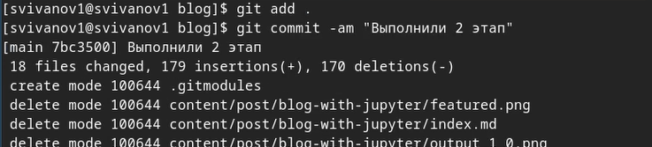

---
## Front matter
title: "Отчет по индивидуальному проекту №2"
subtitle: "Дисциплина: Операционные системы"
author: "Иванов Сергей Владимирович"

## Generic otions
lang: ru-RU
toc-title: "Содержание"

## Bibliography
bibliography: bib/cite.bib
csl: pandoc/csl/gost-r-7-0-5-2008-numeric.csl

## Pdf output format
toc: true # Table of contents
toc-depth: 2
lof: true # List of figures
fontsize: 12pt
linestretch: 1.5
papersize: a4
documentclass: scrreprt
## I18n polyglossia
polyglossia-lang:
  name: russian
  options:
	- spelling=modern
	- babelshorthands=true
polyglossia-otherlangs:
  name: english
## I18n babel
babel-lang: russian
babel-otherlangs: english
## Fonts
mainfont: PT Serif
romanfont: PT Serif
sansfont: PT Sans
monofont: PT Mono
mainfontoptions: Ligatures=TeX
romanfontoptions: Ligatures=TeX
sansfontoptions: Ligatures=TeX,Scale=MatchLowercase
monofontoptions: Scale=MatchLowercase,Scale=0.9
## Biblatex
biblatex: true
biblio-style: "gost-numeric"
biblatexoptions:
  - parentracker=true
  - backend=biber
  - hyperref=auto
  - language=auto
  - autolang=other*
  - citestyle=gost-numeric
## Pandoc-crossref LaTeX customization
figureTitle: "Рис."
listingTitle: "Листинг"
lofTitle: "Список иллюстраций"
lolTitle: "Листинги"
## Misc options
indent: true
header-includes:
  - \usepackage{indentfirst}
  - \usepackage{float} # keep figures where there are in the text
  - \floatplacement{figure}{H} # keep figures where there are in the text
---

# Цель работы

Продолжить выполнение индивидуального проекта. Заполнить данные о себе на сайте в соответствии с требованиями.

# Задание

1. Разместить фотографию владельца сайта.
2. Разместить краткое описание владельца сайта (Biography).
3. Добавить информацию об интересах (Interests).
4. Добавить информацию от образовании (Education).
5. Сделать пост по прошедшей неделе.
6. Добавить пост на тему по выбору:
 1. Управление версиями. Git.
 2. Непрерывная интеграция и непрерывное развертывание (CI/CD).

# Выполнение 

Разместим фотографию. Для этого помещаем его в необходимую папку и переименовываем, а старую удаляем. (рис. 1).

{#fig:001 width=70%}

Добавим краткую биолграфию о себе (рис. 2).

{#fig:002 width=70%}

Добавим свою роль (студент) (рис. 3).

{#fig:003 width=70%}

Добавим информацию об учебном заведении (рис. 4).

{#fig:004 width=70%}

Напишем о своих интересах (рис. 5). 

{#fig:005 width=70%}

Добавим информацию об образовании. (рис. 6)

{#fig:006 width=70%}

Добавляем ссылку на свой GitHub (рис. 7). 

{#fig:007 width=70%}

Напишем описание владельца сайта (рис. 8). 

{#fig:008 width=70%}

Посмотрим, как это выглядит на локальном сайте. Видим, что все изменилось (рис. 9).

{#fig:009 width=70%}

Сделаем пост о прошедшей неделе. Создадим папку week. (рис. 10).

{#fig:010 width=70%}

Редактируем файл index в этой папке. Пишем в нее сам текст нашего поста. (рис. 11).

{#fig:011 width=70%}

Сделаем пост по теме управление версиями git. Аналогично создаю папку git и редактирую файл index. (рис. 12). 

{#fig:012 width=70%}

Посмотрим на эти посты на локальном сайте и убедимся что все хорошо. (рис. 13). 

{#fig:013 width=70%}

Пишем команду '~/bin/hugo' и компилируем сайт (рис. 14). 

{#fig:014 width=70%}

Отправляем файлы папки blog на GitHub. (рис. 15). 

{#fig:015 width=70%}

Отправляем файлы папки public на GitHub (рис. 16).

{#fig:016 width=70%}

Проверяем ссылку на сайт и заходим на него. Как мы видим, он работает. (рис. 17).

{#fig:017 width=70%}

# Выводы

В результате выполнения данной работы я продолжил выполнение индивидуального проекта. Заполнил данные о себе на сайте в соответствии с требованиями.

