---
## Front matter
lang: ru-RU
title: Индивидуальный проект. Этап 3
subtitle: Операционные системы
author:
  - Иванов Сергей Владимирович, НПИбд-01-23
institute:
  - Российский университет дружбы народов, Москва, Россия
date: 25 марта 2024

## i18n babel
babel-lang: russian
babel-otherlangs: english

## Formatting pdf
toc: false
slide_level: 2
aspectratio: 169
section-titles: true
theme: metropolis
header-includes:
 - \metroset{progressbar=frametitle,sectionpage=progressbar,numbering=fraction}
 - '\makeatletter'
 - '\beamer@ignorenonframefalse'
 - '\makeatother'

  ## Fonts
mainfont: PT Serif
romanfont: PT Serif
sansfont: PT Sans
monofont: PT Mono
mainfontoptions: Ligatures=TeX
romanfontoptions: Ligatures=TeX
sansfontoptions: Ligatures=TeX,Scale=MatchLowercase
monofontoptions: Scale=MatchLowercase,Scale=0.9
---

## Цель работы

Продолжить выполнение индивидуального проекта. Заполнить данные о себе на сайте в соответствии с требованиями.

## Задание

Добавить к сайту достижения.
Список достижений.
Добавить информацию о навыках (Skills).
Добавить информацию об опыте (Experience).
Добавить информацию о достижениях (Accomplishments).
Сделать пост по прошедшей неделе.
Добавить пост на тему по выбору

# Выполнение работы

## Запуск локального сайта

Запускаем локальный сайт 

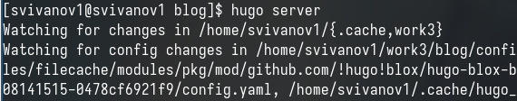{#fig:001 width=70%}

## Файл index

Находим файл index.md который нужно редактировать 

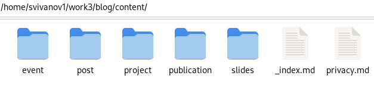{#fig:002 width=70%}

## Добавление навыков

Добавляем информацию о навыках 

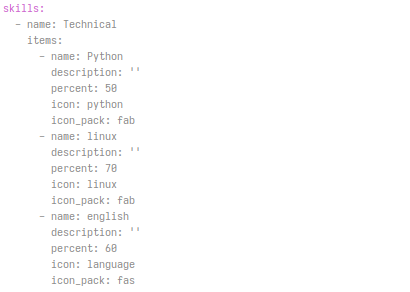{#fig:003 width=70%}

## Локальный сайт

Посмотрим как это выглядит на локальном сайте 

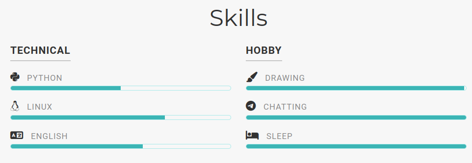{#fig:004 width=70%}

## Добавление опыта

Добавляем информацию об опыте  

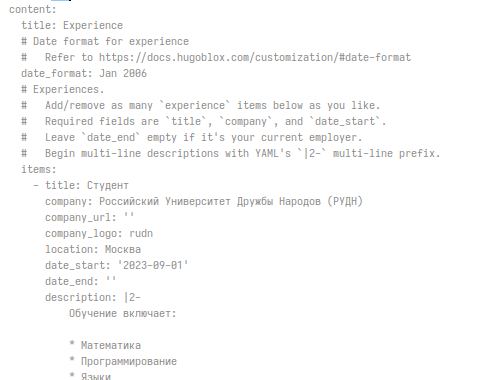{#fig:005 width=70%}

## Локальный сайт

Посмотрим как это выглядит на локальном сайте 

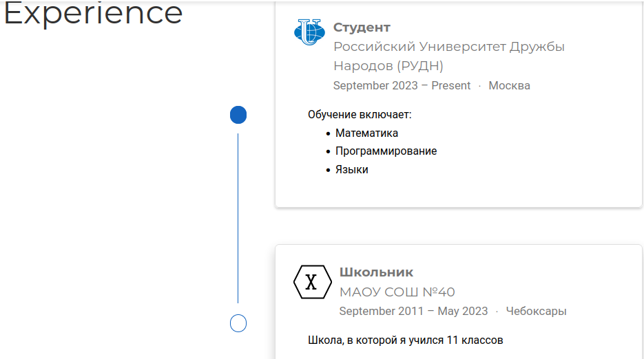{#fig:006 width=70%}

## Добавление достижений

Добавляем информацию о достижения 

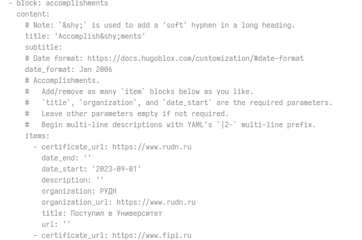{#fig:007 width=70%}

## Локальный сайт

Посмотрим как это выглядит на локальном сайте

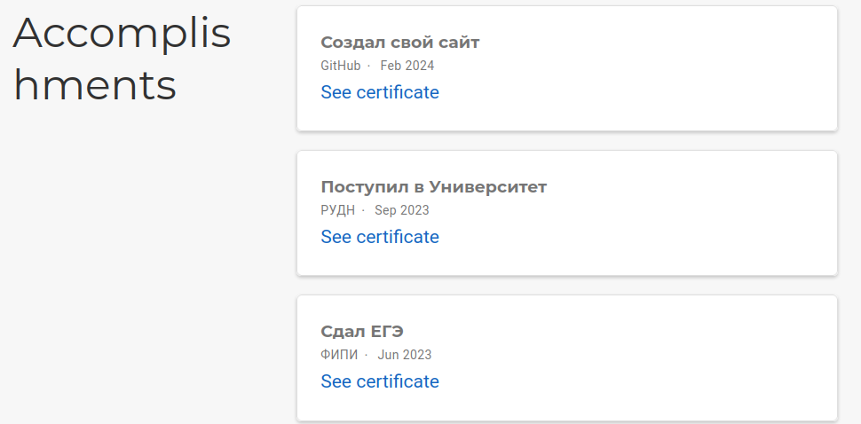{#fig:008 width=70%}

## Пишем пост

Напишем пост о прошедшей неделе. Создаем папку и пишем пост в файл index.md 

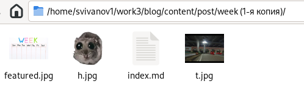{#fig:009 width=70%}

## Локальный сайт

Посмотрим пост на локальном сайте. 

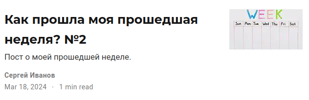{#fig:010 width=70%}

## Пост на тему Markdown

Напишем пост на тему по выбору. Я выбрал Markdown. Аналогично создаем папку и пишем пост в файл index.md

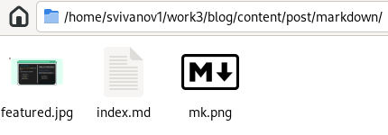{#fig:011 width=70%}

## Локальный сайт

Посмотрим пост на локальном сайте. 

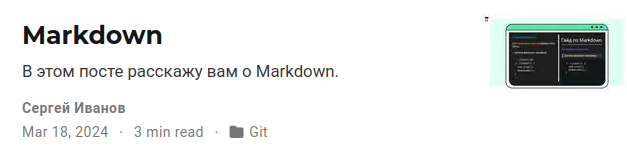{#fig:012 width=70%}

## Отправляем blog на git

Отправляем файлы папки blog на GitHub. 

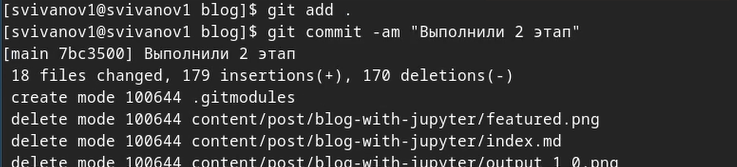{#fig:013 width=70%}

## Отправляем public на git

Отправляем файлы папки public на GitHub 

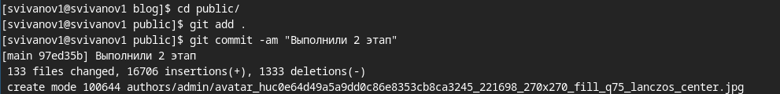{#fig:014 width=70%}

# Вывод

## Вывод 

В результате выполнения данной работы я продолжил выполнение индивидуального проекта. Заполнил данные о себе на сайте в соответствии с требованиями.

