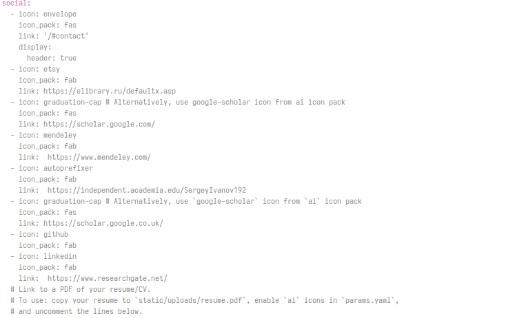
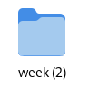
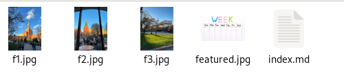
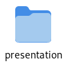
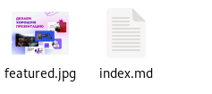
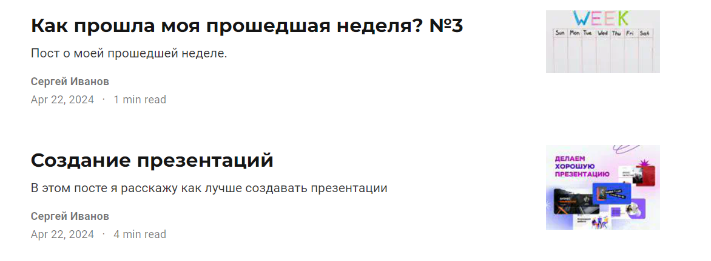
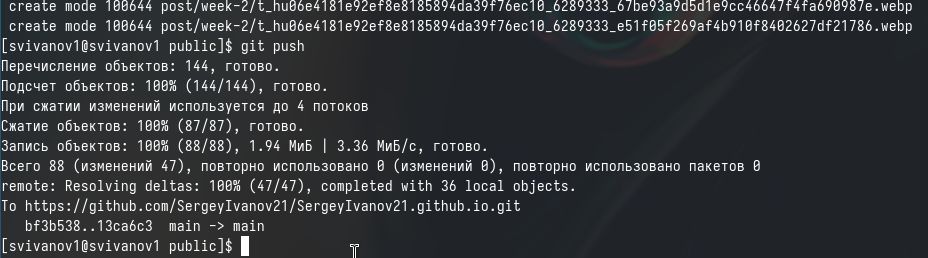

---
## Front matter
title: "Отчет по индивидуальному проекту №4"
subtitle: "Дисциплина: Операционные системы"
author: "Иванов Сергей Владимирович"

## Generic otions
lang: ru-RU
toc-title: "Содержание"

## Bibliography
bibliography: bib/cite.bib
csl: pandoc/csl/gost-r-7-0-5-2008-numeric.csl

## Pdf output format
toc: true # Table of contents
toc-depth: 2
lof: true # List of figures
fontsize: 12pt
linestretch: 1.5
papersize: a4
documentclass: scrreprt
## I18n polyglossia
polyglossia-lang:
  name: russian
  options:
	- spelling=modern
	- babelshorthands=true
polyglossia-otherlangs:
  name: english
## I18n babel
babel-lang: russian
babel-otherlangs: english
## Fonts
mainfont: PT Serif
romanfont: PT Serif
sansfont: PT Sans
monofont: PT Mono
mainfontoptions: Ligatures=TeX
romanfontoptions: Ligatures=TeX
sansfontoptions: Ligatures=TeX,Scale=MatchLowercase
monofontoptions: Scale=MatchLowercase,Scale=0.9
## Biblatex
biblatex: true
biblio-style: "gost-numeric"
biblatexoptions:
  - parentracker=true
  - backend=biber
  - hyperref=auto
  - language=auto
  - autolang=other*
  - citestyle=gost-numeric
## Pandoc-crossref LaTeX customization
figureTitle: "Рис."
listingTitle: "Листинг"
lofTitle: "Список иллюстраций"
lolTitle: "Листинги"
## Misc options
indent: true
header-includes:
  - \usepackage{indentfirst}
  - \usepackage{float} # keep figures where there are in the text
  - \floatplacement{figure}{H} # keep figures where there are in the text
---

# Цель работы

Продолжить выполнение индивидуального проекта. Заполнить данные о себе на сайте в соответствии с требованиями.

# Задание

1. Зарегетрироваться на сайтах
2. Добавить ссылки на эти сайты
3. Написать пост по прошедшей неделе
4. Пост по выбору

# Выполнение 

Я зарегестрировался на сайтах и добавил ссылки в файл index.md (рис. 1).

{#fig:001 width=70%}

Посмотрим как они выглядят на локальном сайте (рис. 2).

{#fig:002 width=70%}

Создаю папку для поста по прошедшей неделе (рис. 3).

{#fig:003 width=70%}

Пишем пост в файле index.md и добавляем картинки в папку (рис. 4).

{#fig:004 width=70%}

Аналогично создаю папку для поста по выбору (создание презентаций) (рис. 5). 

{#fig:005 width=70%}

Пишем пост в файле index.md и добавляем картинки в папку (рис. 6).

{#fig:006 width=70%}

Посмотрим как выглядят посты на локальном сайте (рис. 7). 

{#fig:007 width=70%}

Отправляем изменения на GitHub (рис. 8).

{#fig:008 width=70%}

# Выводы

В результате выполнения данной работы я продолжил выполнение индивидуального проекта. Заполнил данные о себе на сайте в соответствии с требованиями.

