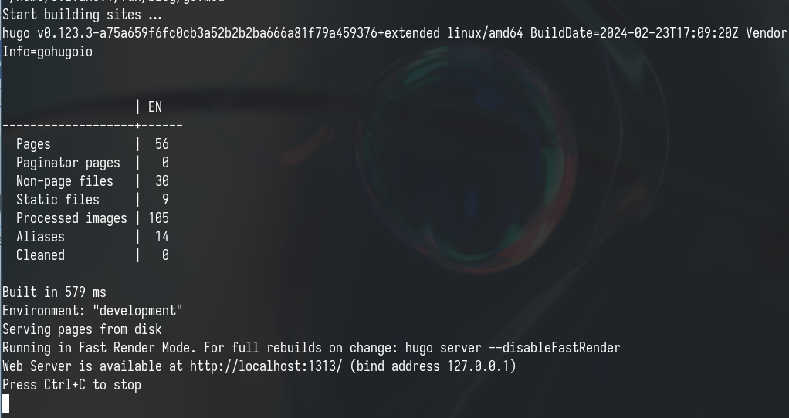
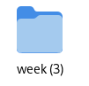
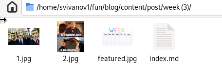
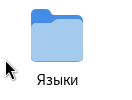
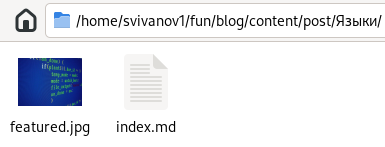
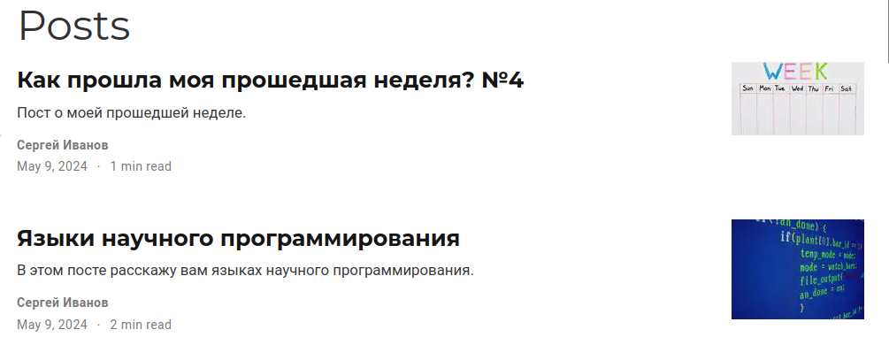
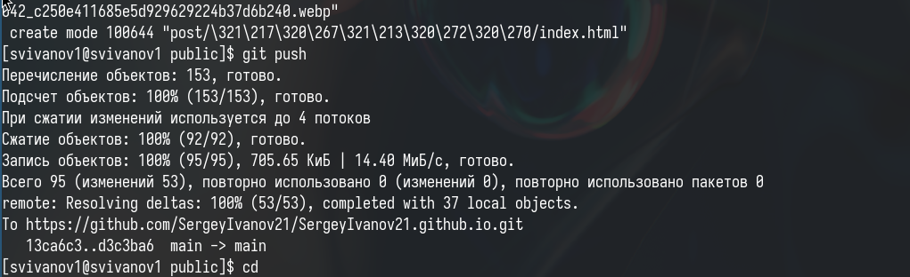

---
## Front matter
lang: ru-RU
title: Индивидуальный проект. Этап 6
subtitle: Операционные системы
author:
  - Иванов Сергей Владимирович, НПИбд-01-23
institute:
  - Российский университет дружбы народов, Москва, Россия
date: 9 мая 2024

## i18n babel
babel-lang: russian
babel-otherlangs: english

## Formatting pdf
toc: false
slide_level: 2
aspectratio: 169
section-titles: true
theme: metropolis
header-includes:
 - \metroset{progressbar=frametitle,sectionpage=progressbar,numbering=fraction}
 - '\makeatletter'
 - '\beamer@ignorenonframefalse'
 - '\makeatother'

  ## Fonts
mainfont: PT Serif
romanfont: PT Serif
sansfont: PT Sans
monofont: PT Mono
mainfontoptions: Ligatures=TeX
romanfontoptions: Ligatures=TeX
sansfontoptions: Ligatures=TeX,Scale=MatchLowercase
monofontoptions: Scale=MatchLowercase,Scale=0.9
---

## Цель работы

Продолжить выполнение индивидуального проекта. Заполнить данные о себе на сайте в соответствии с требованиями.

## Задание

1. Зарегетрироваться на сайтах
2. Добавить ссылки на эти сайты
3. Написать пост по прошедшей неделе
4. Пост по выбору

# Выполнение работы

## Локальный сайт

Получаю ссылку на локальный сайт чтобы сразу просматривать изменения

{#fig:001 width=70%}

## Папка для поста

Создаю папку для поста о прошедшей неделе 

{#fig:002 width=70%}

## Пишем пост

Пишем пост в файле index.md и добавляем картинки в папку 

{#fig:003 width=70%}

## Папка для поста

Аналогично создаю папку для поста по выбору (языки научного программирования) 

{#fig:004 width=70%}

## Пишем пост

Пишем пост в файле index.md и добавляем картинки в папку

{#fig:005 width=70%}

## Локальный сайт

Посмотрим как выглядят посты на локальном сайте 

{#fig:006 width=70%}

## Отправка изменений

Отправляем изменения на GitHub 

{#fig:007 width=70%}

# Вывод

## Вывод 

В результате выполнения данной работы я продолжил выполнение индивидуального проекта. Заполнил данные о себе на сайте в соответствии с требованиями.

